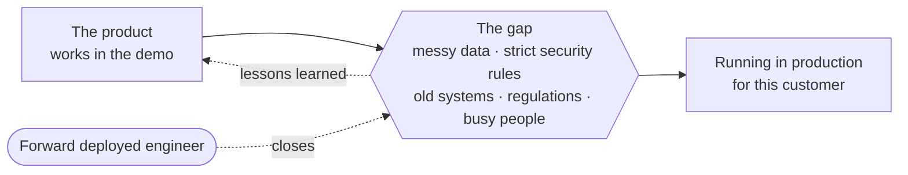
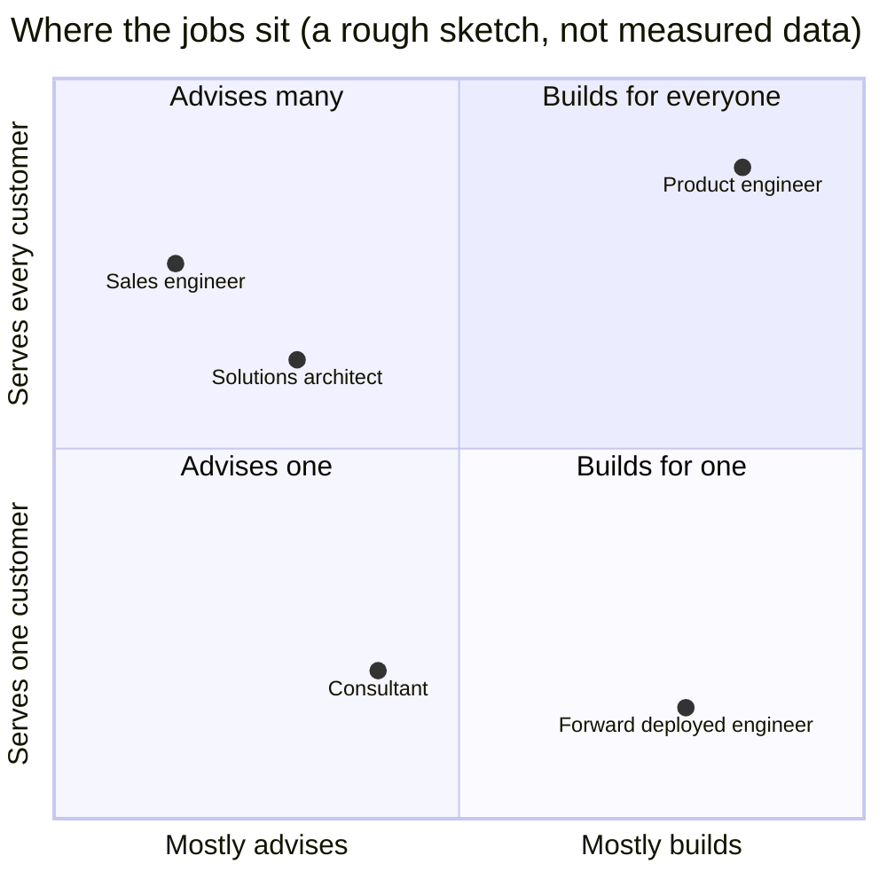
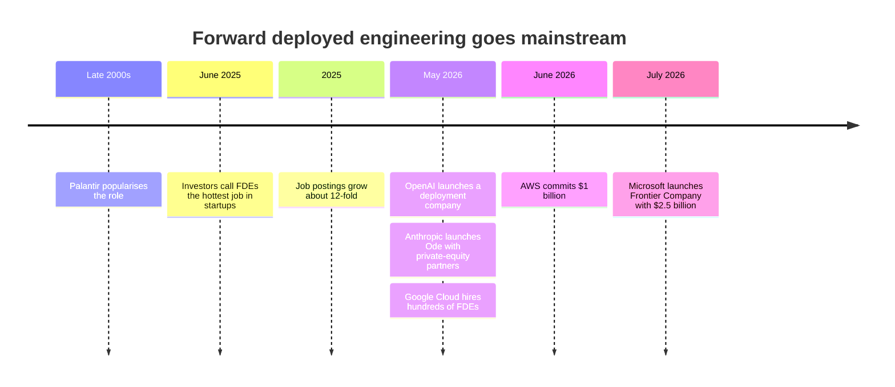
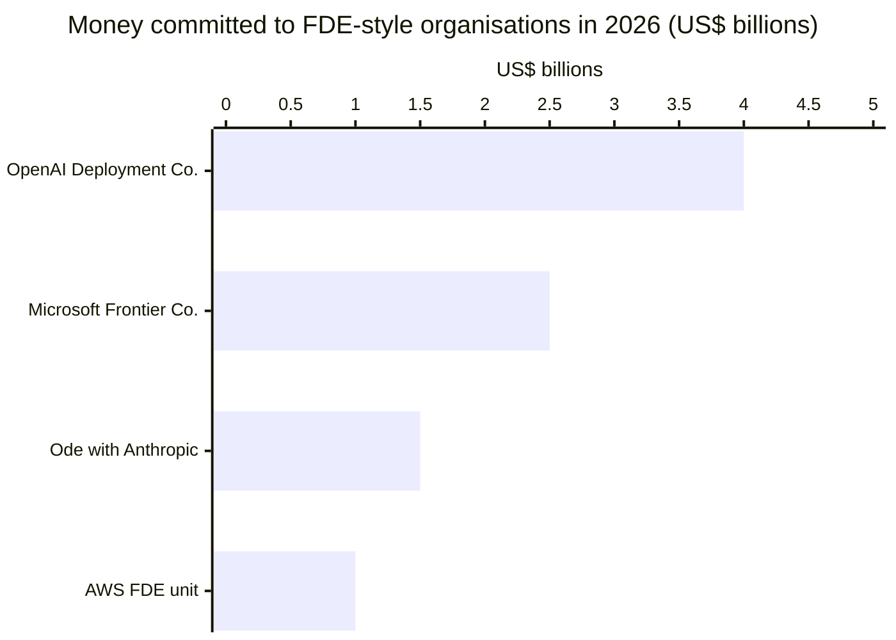
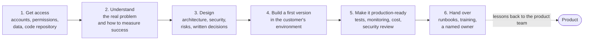
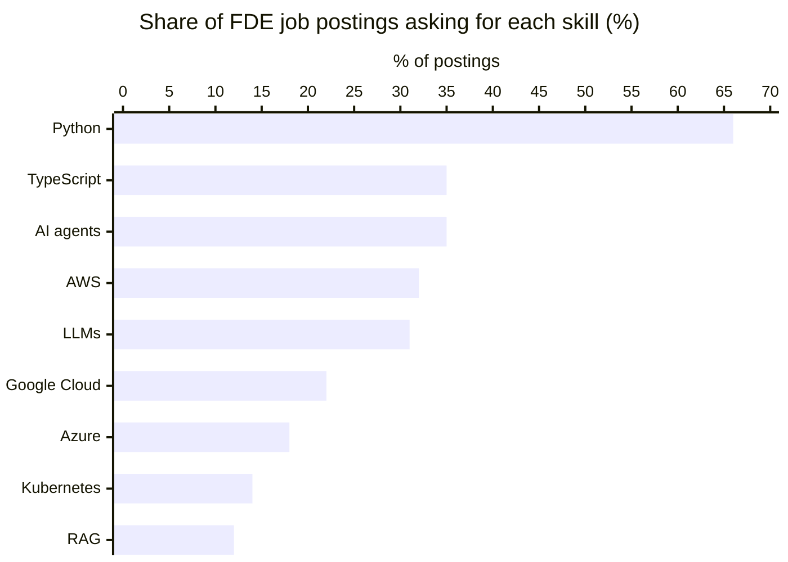
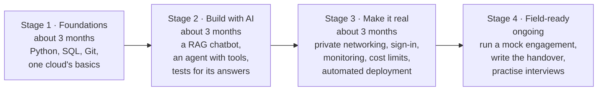
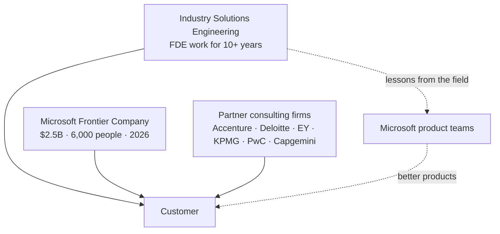
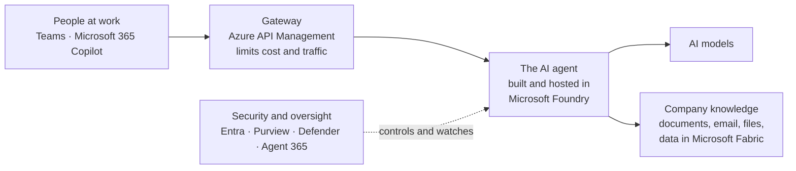
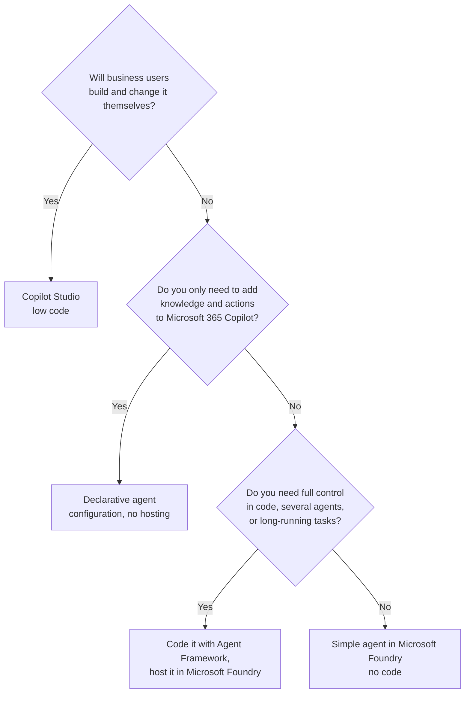

# 🚀 Awesome Microsoft FDE

> A beginner-friendly guide to becoming a **Forward Deployed Engineer (FDE)**. Part 1 explains the role and the skills in plain language and applies to any company. Part 2 shows how it's done on Microsoft's cloud.

**Who this is for:** software engineers, data people, consultants and students who keep hearing "forward deployed engineer" and want to know what it is, whether it suits them, and how to get there.

**How to use it:** read Part 1 top to bottom (about 15 minutes). Then pick the parts of Part 2 you need. Every acronym is spelled out the first time it appears and listed in the [glossary](#-glossary). Sources are numbered footnotes at the bottom, so the text stays readable. The fully sourced technical detail lives in [`docs/`](#-go-deeper).

*Facts checked on 7 October 2026. This field moves fast, so check dates before relying on anything.*

---

## 📑 Contents

**Part 1: The role (applies everywhere)**

1. [What is a forward deployed engineer?](#1-what-is-a-forward-deployed-engineer)
2. [How it differs from similar jobs](#2-how-it-differs-from-similar-jobs)
3. [Why everyone is hiring FDEs now](#3-why-everyone-is-hiring-fdes-now)
4. [What the work looks like, start to finish](#4-what-the-work-looks-like-start-to-finish)
5. [The six skill areas](#5-the-six-skill-areas)
6. [A learning path](#6-a-learning-path)
7. [The honest downsides](#7-the-honest-downsides)

**Part 2: Doing it on Microsoft**

8. [Who does FDE work at Microsoft](#8-who-does-fde-work-at-microsoft)
9. [The Microsoft toolbox, translated](#9-the-microsoft-toolbox-translated)
10. [Choosing where to build an AI agent](#10-choosing-where-to-build-an-ai-agent)
11. [Microsoft certifications worth having](#11-microsoft-certifications-worth-having)

**Part 3: Practise and go deeper**

12. [Practise: four interview scenarios](#12-practise-four-interview-scenarios)
13. [Templates](#13-templates)
14. [Go deeper](#-go-deeper)
15. [Glossary](#-glossary)

---

# Part 1: The role

## 1. What is a forward deployed engineer?

A forward deployed engineer is **a software engineer who works inside a customer's organisation to make a product solve that customer's real problem**, and then tells the product team what they learned.[^wiki]

Most software is built once and used by many customers. But real organisations are messy: their data is scattered across old systems, security teams lock things down, networks are restricted, and regulations apply. The product works in the demo, then hits all of this. That distance between "works in the demo" and "works here, every day" is often called **the gap**, and closing it is the FDE's job.

**Where the name comes from.** "Forward deployed" is military language for being stationed close to the action. The data-analytics company Palantir made the job title popular in the late 2000s.[^wiki] Palantir sums up the difference between its two kinds of engineers like this: a product engineer works on **one capability for many customers**, while a forward deployed engineer works with **one customer, using many capabilities**.[^palantir]

## 2. How it differs from similar jobs

| | Product engineer | Solutions architect | Consultant | **Forward deployed engineer** |
|---|---|---|---|---|
| Works for | Every customer at once | Customers, during the sale | One client, under a contract | **One customer at a time** |
| Main output | Product features | Designs and advice | Reports and delivered projects | **Working software running at the customer** |
| Writes production code? | Yes | Rarely | Sometimes | **Yes, every day** |
| Changes the product? | Yes | Sometimes | No | **Yes, by feeding lessons back** |
| Has a sales target? | No | Often | Billable-hours target | **Usually not**[^bloomberry] |

The last two rows matter most. An FDE **builds real software** (not slides) **and feeds what they learn back into the product** (unlike a consultant). Job postings from Microsoft and Anthropic both list this feedback loop as a duty.[^ise-swe][^anthropic-job]

## 3. Why everyone is hiring FDEs now

AI models became very capable very quickly, but most companies struggle to turn them into something that runs safely every day on their own data. AI vendors found that sending engineers to sit with the customer is the fastest way to get there. Investors call this "services-led growth": the vendor accepts lower profit margins in exchange for customers who stay.[^a16z]

- Job postings with "forward deployed engineer" in the title grew about **12-fold** (up 1,165%) in 2025 compared with 2024.[^bloomberry]
- In 2026, the biggest AI and cloud companies all launched dedicated FDE organisations:

These numbers aren't like for like: OpenAI's and Anthropic's figures are money raised from outside investors, while Microsoft's and AWS's are their own internal spending. Google didn't publish a figure.[^openai][^ode][^msft-frontier][^aws][^google]

## 4. What the work looks like, start to finish

A single customer engagement usually runs for **6 to 13 weeks**. AWS, for example, runs 45-day sprints with teams of five or six engineers.[^aws] The steps are the same whatever the platform:

| Step | What you actually do | What you leave behind |
|---|---|---|
| 1. Get access | Chase accounts and permissions, and find the data. This often takes longer than people expect | A list of who granted what |
| 2. Understand | Interview people. Keep asking "why?" until you reach a business number, such as hours saved or errors avoided | A one-page problem statement and success measure |
| 3. Design | Decide how it will work and how it stays secure. Write each important decision down | Architecture diagram and decision records |
| 4. Build | Ship something small that works on real data, quickly, and show it every week | Working code in the customer's systems |
| 5. Harden | Add tests, including tests of the AI's answers. Add monitoring, cost controls and security fixes | A system the customer's security team signs off |
| 6. Hand over | Teach the customer's team to run it without you | Runbooks, a test baseline and a backlog of next steps |

**The rule of thumb:** you're done when the system runs in the customer's environment, has tests that prove it works, and someone at the customer owns it. Merging code isn't the finish line.

## 5. The six skill areas

FDEs are generalists. You don't need to be an expert in all six areas, but you need to be dangerous in each.

| Skill area | Why it matters | Where a beginner starts |
|---|---|---|
| **1. Software engineering** | You ship production code, often alone | Python, Git, writing tests, calling web APIs |
| **2. Data** | Almost every project starts with "where is the data and is it any good?" | SQL, cleaning data, building simple data pipelines |
| **3. Cloud and networking** | Customer systems run in the cloud behind strict network rules | One cloud's basics: accounts, virtual networks, private connections, infrastructure-as-code (setting up servers from scripts instead of by hand) |
| **4. Security and identity** | Security review is where most projects stall | Who or what is allowed to do what: sign-in, permissions, secrets, data protection |
| **5. AI applications** | Most FDE work today is getting AI into production | The five AI ideas below |
| **6. Consulting skills** | You work with executives, security teams and end users | Asking good questions, writing clearly, running a workshop, handing over |

**Five AI ideas to understand first** (each one is spelled out in the [glossary](#-glossary)):

1. **Large language model (LLM):** the AI model that reads and writes text, such as GPT or Claude.
2. **Retrieval-augmented generation (RAG):** the AI looks up the company's own documents before it answers, so it answers from facts rather than memory.
3. **Agent:** an AI model that can take actions with tools (search, send an email, update a record), not just chat.
4. **Evaluation:** automated tests for AI answers. Is it correct? Is it based on the documents? Is it safe?
5. **Model Context Protocol (MCP):** an open standard for plugging tools and data into AI agents, a bit like USB for AI.

**What employers ask for.** In an analysis of 1,000 FDE job postings, Python was by far the most requested skill:[^bloomberry]

Most postings want 3–5 years of experience (60%), but 12% are open to people with 0–2 years. The median advertised salary was about US$174,000.[^bloomberry] Posted pay varies a lot by employer: one Microsoft FDE posting lists US$85,000–168,000, while Anthropic lists US$200,000–300,000 for New York.[^msft-job][^anthropic-job]

## 6. A learning path

| Stage | Prove it with this project |
|---|---|
| 1. Foundations | Load a public dataset into a database, clean it with SQL and Python, and publish it with automated tests |
| 2. Build with AI | Build a chatbot that answers questions about a set of PDFs and cites its sources. Write 50 test questions and measure how often it's right |
| 3. Make it real | Deploy the chatbot so it has no public internet exposure, users sign in, every request is logged, and spending has a cap. Deploy it from a script, not by clicking |
| 4. Field-ready | Treat a friend or colleague as "the customer". Run a discovery interview, build for two weeks, and hand over with a runbook they can follow without you |

## 7. The honest downsides

- **Travel and pressure.** Postings commonly ask for 25–50% travel, and deadlines are short.[^ise-swe][^deloitte][^wiki]
- **"Consulting with a better title?"** Some academics see the title as a rebrand of older roles.[^wiki] One industry newsletter argues the job is drifting towards consulting now that AI labs hire FDEs into separate companies.[^pragmatic]
- **Lock-in.** When a vendor's engineer designs your system, it tends to use that vendor's products. One Microsoft analyst put it bluntly: free deployment help is how the vendor wins future cloud spending.[^foley]

💬 *Our view:* the role is real when you ship production code **and** the product gets better because of what you learned. If neither happens, it's consulting.

---

# Part 2: Doing it on Microsoft

## 8. Who does FDE work at Microsoft

Microsoft has done this work for over a decade. It reorganised it publicly in 2026.

| Team | What it is |
|---|---|
| **Industry Solutions Engineering (ISE)** | The engineering group whose job postings say it "has operated Microsoft's Forward Deployed Engineering function for over a decade". Small teams embed with customers, build alongside them and pass patterns back to Microsoft's product teams. It works with an AI-assisted method called Hypervelocity Engineering (HVE), which is published as open source.[^ise-swe][^hve] |
| **Microsoft Frontier Company** | A new business announced in July 2026: US$2.5 billion and 6,000 industry and engineering experts placed inside customer organisations to deliver measurable business results. Early customers include the London Stock Exchange Group, Unilever, Land O'Lakes and Novo Nordisk.[^msft-frontier] |
| **Partners** | Consulting firms with Microsoft FDE practices, including Accenture, Capgemini, Deloitte, EY, KPMG and PwC.[^msft-frontier][^accenture][^deloitte] |

⚠️ Microsoft hasn't said how ISE and Frontier Company relate. If you apply, ask the recruiter which team the role sits in.[^foley]

**A real example.** Novo Nordisk worked with Microsoft's Forward Deployed Engineering team to build an AI agent over its clinical-trial data. Its researchers went from evaluating 5–10 ideas per quarter to more than 50.[^fy26]

## 9. The Microsoft toolbox, translated

Microsoft's product names change often. This table maps each of the six skill areas to the Microsoft product you'll meet, in plain words.

| Skill area | Microsoft product | What it is, in one sentence |
|---|---|---|
| Data | **Microsoft Fabric** | One place to store, clean and analyse company data, with Power BI for reports |
| Cloud | **Azure** | Microsoft's cloud: servers, networks, databases, storage |
| Cloud | **Azure API Management** | A gateway in front of AI models that controls who can call them and how much they can spend |
| AI applications | **Microsoft Foundry** | Where you choose AI models, build agents, host them and test their answers |
| AI applications | **Microsoft Agent Framework** | Microsoft's open-source code library for building agents in Python or C# |
| AI applications | **Copilot Studio** | A low-code tool for building agents that live in Teams and Microsoft 365 |
| AI applications | **Microsoft 365 Copilot** | The AI assistant inside Word, Outlook and Teams, which you can extend with your own agents |
| Security | **Microsoft Entra** | Sign-in and permissions for people and, now, for AI agents too |
| Security | **Microsoft Purview** | Finds and protects sensitive data so AI doesn't leak it |
| Security | **Microsoft Defender** | Detects attacks, including attacks on AI systems |
| Security | **Agent 365** | A register of every AI agent in the company, so IT can see and control them |
| Software engineering | **GitHub Copilot** | An AI coding assistant; ISE's HVE method is built on it |

How these fit together in a typical project:

## 10. Choosing where to build an AI agent

The most common early design question. Start at the top:

Special cases, such as sites with no internet connection, agents already built elsewhere, and strict private networking, are covered in the [technical reference](docs/microsoft-technical-reference.md#-the-applied-ai-playbook).

## 11. Microsoft certifications worth having

Certifications don't make you an FDE, but they give a structured syllabus. Microsoft replaced several exams in 2026, so check the official page before booking.[^certs]

| Order | Exam | What it proves |
|---|---|---|
| 1 | **AI-901** Azure AI Fundamentals | You understand basic AI concepts and Microsoft's AI tools |
| 2 | **AZ-104** Azure Administrator | You can run Azure: networks, identity, storage |
| 3 | **DP-700** Fabric Data Engineer | You can build data pipelines in Microsoft Fabric |
| 4 | **AI-103** Azure AI Apps and Agents Developer | You can build AI apps and agents in Microsoft Foundry |
| 5 | **AZ-305** Azure Solutions Architect | You can design complete solutions (requires AZ-104) |
| Optional | **SC-500** Cloud and AI Security Engineer | You can secure cloud and AI workloads |
| Optional | **AB-620** AI Agent Builder | You can build advanced agents in Copilot Studio |

The full list, with retirement dates and sources, is in the [technical reference](docs/microsoft-technical-reference.md#-certification-path-post-2026-reset).

---

# Part 3: Practise and go deeper

## 12. Practise: four interview scenarios

Talk through each one out loud, using the six steps from [section 4](#4-what-the-work-looks-like-start-to-finish).

1. **The locked-down company.** You can't create new accounts or apps, nothing can touch the public internet, and you have four weeks to ship a chatbot over internal documents. *What do you ask for on day one? How do you keep it private?*
2. **The wrong answers.** The customer's AI assistant gave a confidently wrong answer to an executive. *How do you find out whether the problem was the search or the AI? How do you stop it happening again?*
3. **Low code or full code?** The architecture board asks why you chose Copilot Studio over Microsoft Foundry, or the other way round. *Cover cost, who maintains it, and the skills the customer's team has.*
4. **Too many agents.** A company discovers 300 AI agents built by different teams, and nobody knows what they can access. *How do you take inventory, assign owners and control access?*

Microsoft's interview loop, as candidates report it, has a recruiter screen, an online test, coding screens, and an onsite with coding, system design and a behavioural round.[^interviews] More scenarios and rapid-fire questions are in [interview prep](docs/interview-prep.md).

## 13. Templates

Copy-paste starting points for the documents an FDE writes, in [`/templates`](./templates):

| Template | Use it in step |
|---|---|
| [`data-audit.md`](./templates/data-audit.md): where the data is, and whether it's any good | 2. Understand |
| [`ai-use-case-canvas.md`](./templates/ai-use-case-canvas.md): the problem, users, success measure and risks on one page | 2. Understand |
| [`adr.md`](./templates/adr.md): an architecture decision record, one page per important decision | 3. Design |
| [`copilot-instructions.md`](./templates/copilot-instructions.md): instructions for GitHub Copilot in the customer's code repository | 4. Build |
| [`go-live-readiness.md`](./templates/go-live-readiness.md): the checklist before real users arrive | 5. Harden |

## 📚 Go deeper

| Document | What's in it |
|---|---|
| [The FDE role and market](docs/fde-role-and-market.md) | Palantir's origins, the 2026 investments company by company, job-posting statistics, critiques and Microsoft's FDE teams, all fully sourced |
| [Microsoft technical reference](docs/microsoft-technical-reference.md) | The detailed seven-phase curriculum (data, cloud architecture, security, AI, delivery method, consulting, tooling), which features are generally available versus in preview, disconnected deployments, and the full certification table |
| [Interview prep](docs/interview-prep.md) | The reported interview loop, seven case studies and rapid-fire questions |
| [Reading list](docs/reading-list.md) | Every primary source, grouped by topic |

## 📖 Glossary

| Term | Plain meaning |
|---|---|
| **FDE** | Forward deployed engineer: a software engineer who works inside a customer's organisation to make a product work for them |
| **The gap** | The distance between a product working in a demo and working in a real customer's environment. Also called "the Delta" |
| **Delta / Echo** | Palantir's internal names for forward deployed engineers (Delta) and the domain experts who find the problem worth solving (Echo) |
| **AI** | Artificial intelligence |
| **LLM** | Large language model: an AI model that reads and writes text |
| **RAG** | Retrieval-augmented generation: the AI looks up relevant documents before answering |
| **Agent** | An AI model that can use tools to take actions, not just chat |
| **MCP** | Model Context Protocol: an open standard for connecting tools and data to AI agents |
| **A2A** | Agent-to-agent: a standard for AI agents to talk to each other |
| **Evaluation (evals)** | Automated tests that score AI answers for correctness, grounding and safety |
| **API** | Application programming interface: a way for one program to call another |
| **SQL** | Structured Query Language: the standard language for querying databases |
| **Infrastructure-as-code (IaC)** | Setting up cloud resources from scripts instead of clicking in a portal |
| **CI/CD** | Continuous integration / continuous delivery: automatically testing and deploying code on every change |
| **Production** | The live system real users depend on, as opposed to a demo or test copy |
| **Runbook** | Step-by-step instructions for operating and fixing a system |
| **Tenant** | A company's own private space in Microsoft's cloud, with its own users and rules |
| **ISE** | Industry Solutions Engineering: Microsoft's long-running FDE team |
| **HVE** | Hypervelocity Engineering: ISE's method for building with AI coding assistants throughout a project |
| **SI** | Systems integrator: a consulting firm that builds and connects systems for clients |
| **AWS** | Amazon Web Services, Amazon's cloud |
| **Copilot** | Microsoft's brand for its AI assistants (Microsoft 365 Copilot, GitHub Copilot, Copilot Studio) |

The [technical reference](docs/microsoft-technical-reference.md#-glossary) has a glossary of Microsoft-specific terms.

## 🤝 Contributing

See [CONTRIBUTING.md](./CONTRIBUTING.md). Keep this README readable for a beginner. Put detailed, fast-changing facts in `docs/`, and cite sources there.

Inspired by [pierpaolo28/Awesome-FDE-Roadmap](https://github.com/pierpaolo28/Awesome-FDE-Roadmap).

## License

MIT. See [LICENSE](./LICENSE).

---

## Sources

[^wiki]: [Wikipedia: Forward deployed engineer](https://en.wikipedia.org/wiki/Forward_deployed_engineer): definition, Palantir's use of the title by 2009, the criticisms, and the 2026 announcements.
[^palantir]: [Palantir: Dev versus Delta](https://blog.palantir.com/dev-versus-delta-demystifying-engineering-roles-at-palantir-ad44c2a6e87).
[^bloomberry]: [Bloomberry: I analyzed 1,000 forward deployed engineer jobs](https://bloomberry.com/blog/i-analyzed-1000-forward-deployed-engineer-jobs-what-i-learned/) (January 2026, using Revealera job data): growth, skills, experience levels, salary and quota figures.
[^a16z]: [Andreessen Horowitz: Trading Margin for Moat](https://a16z.com/services-led-growth/) (June 2025).
[^openai]: [VKTR: OpenAI launches $4B deployment unit](https://www.vktr.com/ai-news/openai-launches-4b-deployment-unit/) and [OpenAI's announcement](https://openai.com/index/openai-launches-the-deployment-company/) (May 2026).
[^ode]: [TechCrunch: Anthropic and Blackstone's Ode](https://techcrunch.com/2026/07/15/anthropic-blackstone-bet-the-next-trillion-dollar-ai-business-is-implementation-not-models/) (July 2026).
[^google]: [The Decoder: Google is hiring hundreds of engineers to help customers adopt its AI](https://the-decoder.com/google-is-hiring-hundreds-of-engineers-to-help-customers-adopt-its-ai/) (May 2026).
[^aws]: [CIO Dive: AWS creates forward deployed engineering hub](https://www.ciodive.com/news/aws-creates-forward-deployed-engineering-hub/824109/) (June 2026): US$1B, teams of 5–6, 45-day sprints.
[^msft-frontier]: [Microsoft: Microsoft Frontier Company](https://blogs.microsoft.com/blog/2026/07/02/microsoft-frontier-company-ai-engineering-that-amplifies-and-protects-your-intelligence/) (2 July 2026).
[^fy26]: [Microsoft: Looking back on FY26](https://blogs.microsoft.com/blog/2026/07/28/looking-back-on-microsofts-fy26-from-ai-experimentation-to-frontier-transformation/) (July 2026): the Novo Nordisk example.
[^ise-swe]: Microsoft ISE job postings: [Principal Software Engineer](https://jobs.anitab.org/companies/microsoft/jobs/79366247-principal-software-engineer-ise) and [Principal Technical Program Manager, Forward Deployed Engineering](https://jobs.anitab.org/companies/microsoft/jobs/81414702-principal-technical-program-manager-forward-deployed-engineering) (2026).
[^hve]: [Microsoft HVE Core](https://microsoft.github.io/hve-core/) and the [ISE Code-With Engineering Playbook](https://microsoft.github.io/code-with-engineering-playbook/ISE/).
[^msft-job]: [Microsoft "Software Engineer – Forward Deployed Engineer" posting](https://zapply.jobs/jobs/26fc61ca-ad9a-4c72-9158-9b034a0bb550/) (job-board copy, October 2026).
[^anthropic-job]: [Anthropic: Forward Deployed Engineer, Applied AI](https://jobs.generalcatalyst.com/companies/anthropic/jobs/70192292-forward-deployed-engineer-applied-ai).
[^deloitte]: [Deloitte: Forward Deployed Engineer, Microsoft AI & Data](https://apply.deloitte.com/en_US/careers/JobDetail/Forward-Deployed-Engineer-Microsoft-AI-Data/350591).
[^accenture]: [Accenture launches a Microsoft forward deployed engineering practice](https://newsroom.accenture.com/news/2026/accenture-launches-microsoft-forward-deployed-engineering-practice-to-help-organizations-scale-ai-across-the-enterprise) (March 2026).
[^pragmatic]: [The Pragmatic Engineer: Forward deployed engineering heats up again](https://blog.pragmaticengineer.com/the-pulse-forward-deployed-engineering-heats-up-again/) (May 2026).
[^foley]: [Directions on Microsoft (Mary Jo Foley): Microsoft launches its own forward deployed engineering unit](https://www.directionsonmicrosoft.com/microsoft-launches-its-own-forward-deployed-engineering-unit-the-frontier-company/?type=All) (July 2026). This is analysis, not a Microsoft statement.
[^certs]: [Microsoft Learn: credentials](https://learn.microsoft.com/credentials/). Exam details and sources are in the [technical reference](docs/microsoft-technical-reference.md#-certification-path-post-2026-reset).
[^interviews]: [fdeinterviews.com: Microsoft](https://fdeinterviews.com/company/microsoft). Candidate reports, not an official description.
