# 🚀 Awesome Microsoft FDE

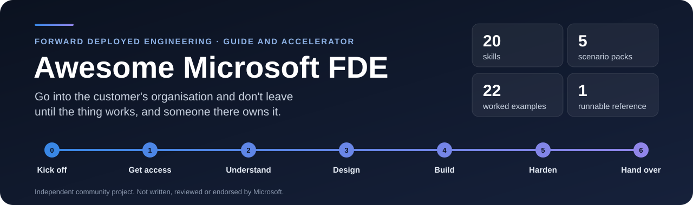

[](https://github.com/mjtpena/awesome-microsoft-fde/actions/workflows/docs.yml) [](https://github.com/mjtpena/awesome-microsoft-fde/actions/workflows/reference-evals.yml) [](LICENSE)

> An opinionated guide **and a working kit** for **Forward Deployed Engineers (FDEs)**: the engineers who go into a customer's organisation and don't leave until the thing works. Part 1 covers the role and applies anywhere. Part 2 shows how it's done on Microsoft's cloud. Part 3 is the kit: a skill for every document you'll write, one engagement worked from kickoff to handover, and runnable code with its tests.

**This guide takes sides.** Facts carry numbered footnotes. Everything without a footnote is our opinion, formed from field work, and you're free to disagree. A guide that lists every option equally is a bookmark folder, and this one tries not to be.

**Who it's for:** engineers, data people, consultants and students who want to know what the job really is and how to get good at it, and FDEs who want a head start on their next engagement. Every acronym is spelled out the first time it appears and listed in the [glossary](#-glossary).

> [!IMPORTANT]
> **Not an official Microsoft resource.** This is an independent community guide. It isn't written, reviewed, endorsed or sponsored by Microsoft or any of its forward deployed engineering teams. See the [disclaimer](#disclaimer).

*Facts checked on 7 October 2026.*

---

## 🧰 What's in the box

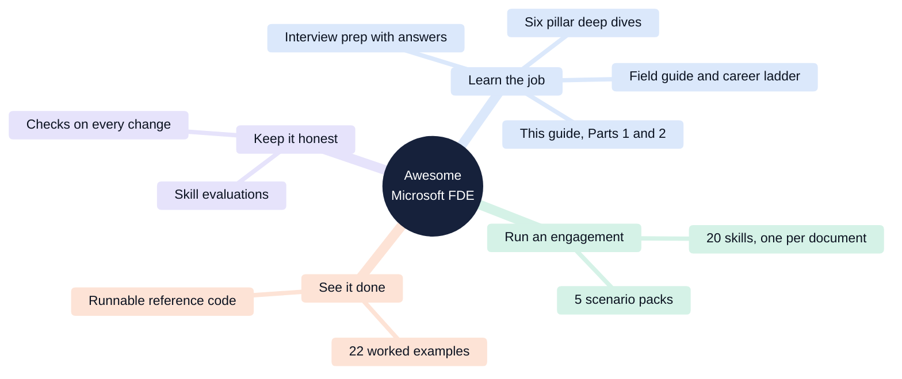

| You want to… | Start with | What you get |
|---|---|---|
| **Understand the job** | [Part 1](#part-1-the-role) and [the six pillars](docs/pillars/) | What an FDE does, how an engagement runs, what to learn and in what order |
| **Do it on Microsoft** | [Part 2](#part-2-doing-it-on-microsoft) and the [technical reference](docs/microsoft-technical-reference.md) | Who does this work at Microsoft, its products in plain words, where to build an agent, which certifications matter |
| **Run your next engagement** | [Skills and scenario packs](#12-skills-and-scenario-packs) | 20 skills that each end in a template for one document (charter, access request, threat model, evaluation plan, runbook and more), and 5 packs that say which ones your kind of engagement needs |
| **See what "done" looks like** | [One engagement, worked end to end](#13-one-engagement-worked-end-to-end) | 22 filled-in documents from a fictional 10-week engagement, including the week-3 scope reset and the week-6 incident |
| **Start from working code** | [The reference implementation](#14-the-reference-implementation) | A small knowledge assistant that runs offline, an evaluation gate that fails the build below the bar, and the Azure infrastructure as code |
| **Trust what you copy** | [How the kit is tested](#15-how-the-kit-is-tested) | Every example is graded against its skill's template, and the reference code's tests and evaluation gate run whenever it changes |
| **Get hired** | [Practise](#16-practise-four-interview-scenarios) and [interview prep](docs/interview-prep.md) | Four interview scenarios here, seven case studies with outline answers there |

**Try it in a few minutes.** Put the skills where your AI coding agent reads them, or run the reference assistant on your laptop. Offline, it needs no Azure account, no keys and no model.

```bash
# The skills, into your agent's skills folder (needs Node.js)
npx degit mjtpena/awesome-microsoft-fde/skills .claude/skills

# The reference assistant, offline (needs Python 3.11 or later)
git clone https://github.com/mjtpena/awesome-microsoft-fde.git
cd awesome-microsoft-fde/reference/knowledge-assistant
python -m venv .venv && source .venv/bin/activate
pip install -e ".[dev]"
python evals/run_evals.py     # the evaluation gate: 27 test cases, exits non-zero below the bar
python -m harbourline ask --offline "What is the excess for a windscreen replacement?"
```

---

## 🔥 What we believe

1. **An FDE ships production code inside the customer's walls.** If you're mostly making slides, you're a consultant. That's fine, but it's a different job.
2. **The hard part is rarely the AI.** It's access, data, security review and getting someone to own the result. Plan for those first.
3. **Security review is a design input, not a final gate.** Meet the security team in week one, not week ten.
4. **Your first deliverable should run on real data within two weeks.** A demo on fake data proves nothing to the people who'll use it.
5. **If you can't measure it, you can't ship it.** Write the tests for the AI's answers before you tune the prompt.
6. **Default to the simplest platform that works.** Low code if business users will own it, code only when you need control. Most teams reach for code too early.
7. **Preview features are a loan against your go-live date.** Use them only with a written fallback.
8. **You've succeeded when the customer runs it without you.** If they call you after handover for routine work, the handover failed.
9. **Feed what you learn back to the product.** That loop is what makes this engineering and not staffing.
10. **Learn Python and SQL before you learn any vendor's product names.** Product names change every year. The fundamentals don't.

---

## 📑 Contents

**Part 1: The role (applies everywhere)**

1. [What a forward deployed engineer actually does](#1-what-a-forward-deployed-engineer-actually-does)
2. [How it differs from similar jobs](#2-how-it-differs-from-similar-jobs)
3. [Why everyone is hiring FDEs now](#3-why-everyone-is-hiring-fdes-now)
4. [An engagement, start to finish](#4-an-engagement-start-to-finish)
5. [The six pillars](#5-the-six-pillars)
6. [A learning path](#6-a-learning-path)
7. [Should you do this job?](#7-should-you-do-this-job)

**Part 2: Doing it on Microsoft**

8. [Who does FDE work at Microsoft](#8-who-does-fde-work-at-microsoft)
9. [The Microsoft toolbox, translated](#9-the-microsoft-toolbox-translated)
10. [Choosing where to build an AI agent](#10-choosing-where-to-build-an-ai-agent)
11. [Certifications: which ones, and how much they matter](#11-certifications-which-ones-and-how-much-they-matter)

**Part 3: The kit**

12. [Skills and scenario packs](#12-skills-and-scenario-packs)
13. [One engagement, worked end to end](#13-one-engagement-worked-end-to-end)
14. [The reference implementation](#14-the-reference-implementation)
15. [How the kit is tested](#15-how-the-kit-is-tested)

**Part 4: Practise and go deeper**

16. [Practise: four interview scenarios](#16-practise-four-interview-scenarios)
17. [Go deeper](#-go-deeper)
18. [Glossary](#-glossary)

---

# Part 1: The role

## 1. What a forward deployed engineer actually does

A forward deployed engineer is **a software engineer who works inside a customer's organisation to make a product solve that customer's real problem**, then tells the product team what they learned.[^wiki]

Products work in demos. Real organisations have data scattered across old systems, security teams who say no by default, locked-down networks, regulators and busy people. The distance between "works in the demo" and "works here, every day" is **the gap**. Closing it is the whole job.


The data-analytics company Palantir made the title popular in the late 2000s.[^wiki] Its own one-line definition is still the best: a product engineer works on **one capability for many customers**; a forward deployed engineer works with **one customer, using many capabilities**.[^palantir]

**Our take:** most of an FDE's week isn't coding. In our experience it's roughly a third building, a third unblocking (access, data, security, approvals) and a third talking (discovery, demos, decisions). That's our estimate, not a measurement ([help us measure it](https://github.com/mjtpena/awesome-microsoft-fde/issues/new?template=field-survey.yml)), but job postings point the same way: "working directly with customers" is the most common responsibility listed (55% of postings), ahead of building AI systems (37%).[^bloomberry] People who only want the building third hate this job.

## 2. How it differs from similar jobs

| | Product engineer | Solutions architect | Consultant | **Forward deployed engineer** |
|---|---|---|---|---|
| Works for | Every customer at once | Customers, during the sale | One client, under a contract | **One customer at a time** |
| Main output | Product features | Designs and advice | Reports and delivered projects | **Working software running at the customer** |
| Writes production code? | Yes | Rarely | Sometimes | **Yes, every day** |
| Changes the product? | Yes | Sometimes | No | **Yes, by feeding lessons back** |
| Has a sales target? | No | Often | Billable-hours target | **Usually not**[^bloomberry] |

Microsoft's and Anthropic's FDE postings both list feeding lessons back to the product as a duty.[^ise-swe][^anthropic-job] **That loop is the test.** If your employer has no route from your field notes into the product backlog, you're in a consulting job with a new title.

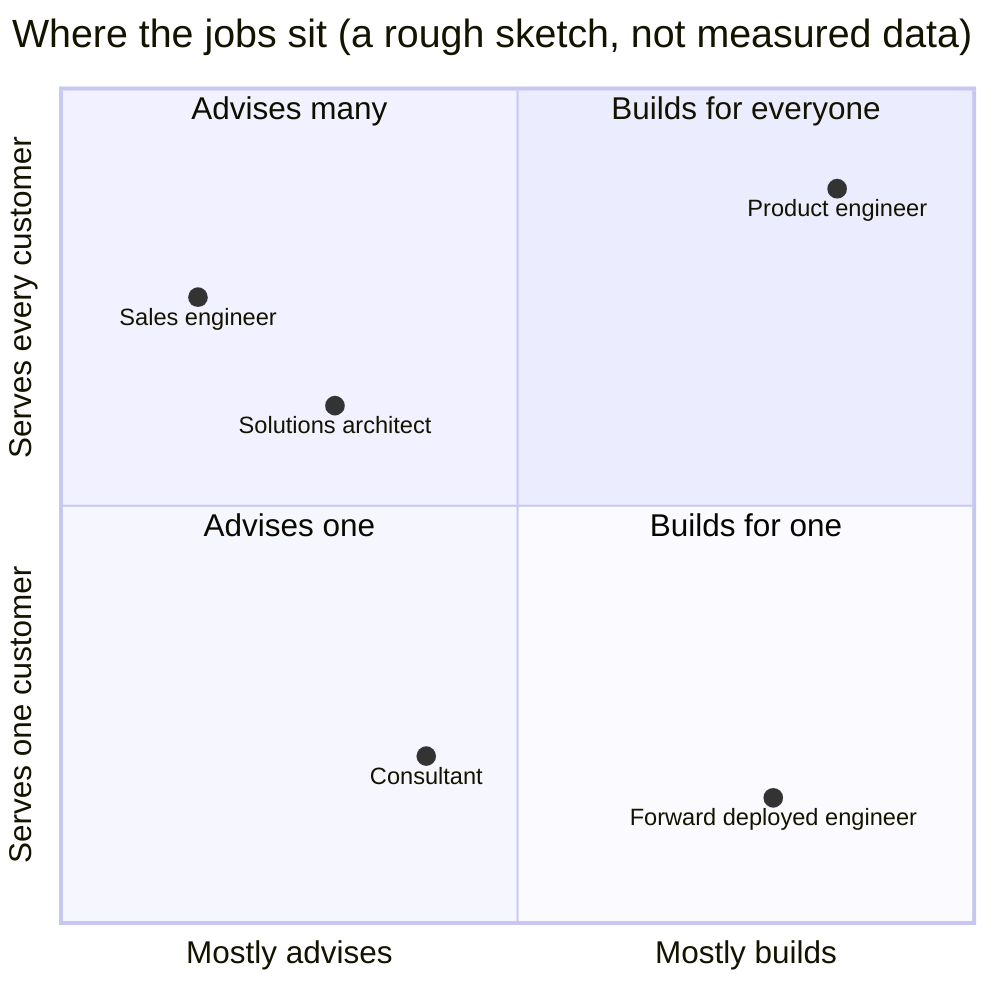

## 3. Why everyone is hiring FDEs now

AI models got very capable very fast. Companies still can't turn them into systems that run safely every day on their own data, and the vendors worked out that sending engineers is the fastest fix. Investors call this "services-led growth": accept lower margins now in exchange for customers who stay.[^a16z]

- Job postings with "forward deployed engineer" in the title grew almost **13-fold** (up 1,165%) in 2025 compared with 2024.[^bloomberry]
- In 2026, every major AI lab and cloud provider launched a dedicated FDE organisation:


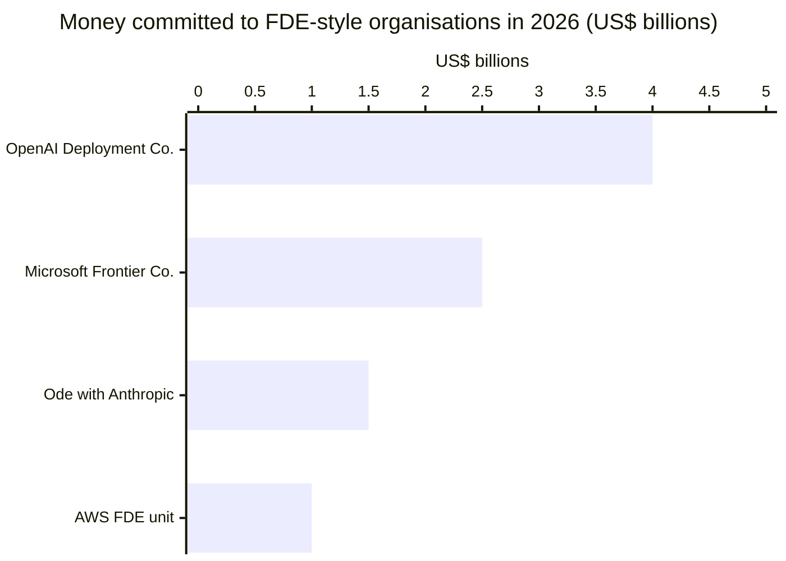

These figures aren't like for like. OpenAI's and Anthropic's are money raised from outside investors; Microsoft's and AWS's are internal spending. Google didn't publish a figure.[^openai][^ode][^msft-frontier][^aws][^google]

**Our take:** the hiring wave is real, but it won't last at this pace. As platforms mature, routine deployments get automated and the job moves towards the hard cases: regulated industries, legacy data and sensitive workloads. Build depth in those and you'll stay employable when the hype fades.

## 4. An engagement, start to finish

In our experience, an engagement runs **6 to 13 weeks**. AWS runs 45-day sprints with teams of five or six engineers.[^aws] We think shorter is better: if you can't show value in six weeks, the scope is wrong.


| Step | What you do | Where people go wrong |
|---|---|---|
| 1. Get access | Request every account, permission and dataset on day one, in one document | Waiting until week two to discover nobody can approve access to production data |
| 2. Understand | Keep asking "why?" until you reach a number the sponsor cares about | Accepting "we want an AI agent" as a requirement |
| 3. Design | Write down each important decision and its alternatives. Bring security in now | Designing alone, then presenting a finished design to a security team that rejects it |
| 4. Build | Ship something small on real data and demo it every week | Polishing a demo on fake data |
| 5. Harden | Tests for the AI's answers, monitoring, a cost cap, security sign-off | Treating evaluation as a final step instead of a daily habit |
| 6. Hand over | Train the people who'll run it and name one owner | Handing over a Word document nobody reads |

**When are you done?** The system runs in the customer's environment, tests prove it works, and a named person at the customer owns it. A merged pull request doesn't count.

Every step has a ready-made skill (see [skills and scenario packs](#12-skills-and-scenario-packs)). To see all of it done once, read [one engagement, worked end to end](#13-one-engagement-worked-end-to-end): every document filled in, including the week-3 scope reset and the week-6 incident.

Two things the table leaves out, because nobody plans for them: **cutting scope** when the data says the original ask won't work, and **reviewing an incident** when the AI gets something wrong in front of an executive. Both happen on most engagements. Both have a skill ([`scope-reset`](skills/scope-reset/SKILL.md), [`incident-review`](skills/incident-review/SKILL.md)).

## 5. The six pillars

FDEs are generalists. You don't need to be an expert in all six pillars, but you need to be dangerous in each and genuinely deep in one or two. Each pillar has its own deep-dive page.

| Pillar | Our stance in one line | Deep dive |
|---|---|---|
| **1. Software engineering** | Production habits (tests, logging, deployment from code) matter more than clever algorithms | [Software engineering](docs/pillars/01-software-engineering.md) |
| **2. Data** | Every AI project is a data project in disguise, so audit the data before you promise anything | [Data](docs/pillars/02-data.md) |
| **3. Cloud and networking** | Learn private networking properly; it's where most deployments break | [Cloud and networking](docs/pillars/03-cloud-and-networking.md) |
| **4. Security and identity** | Give every agent its own identity and the least access it needs | [Security and identity](docs/pillars/04-security-and-identity.md) |
| **5. AI applications** | Retrieval quality and evaluation matter more than model choice | [AI applications](docs/pillars/05-ai-applications.md) |
| **6. Consulting and delivery** | Discovery and handover decide success more than the build does | [Consulting and delivery](docs/pillars/06-consulting-and-delivery.md) |

**Five AI ideas to understand first** (all in the [glossary](#-glossary)):

1. **Large language model (LLM):** the AI model that reads and writes text, such as GPT or Claude.
2. **Retrieval-augmented generation (RAG):** the AI looks up the company's own documents before answering, so it answers from facts rather than memory.
3. **Agent:** an AI model that can take actions with tools (search, send an email, update a record), not just chat.
4. **Evaluation:** automated tests for AI answers. Is it correct? Is it based on the documents? Is it safe?
5. **Model Context Protocol (MCP):** an open standard for plugging tools and data into AI agents, a bit like USB for AI.

**What employers ask for.** In an analysis of 1,000 FDE job postings, Python dominated:[^bloomberry]

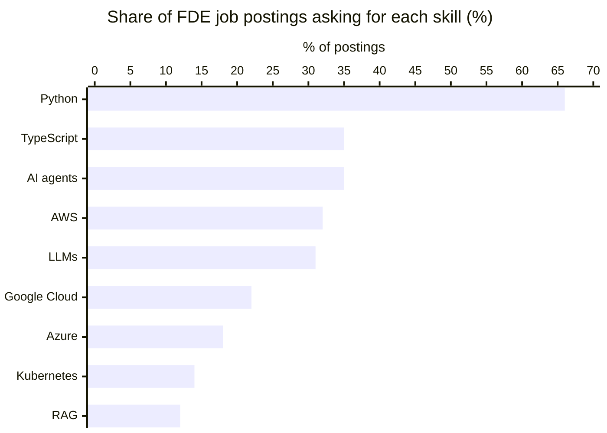

Most postings want 3–5 years of experience (60%), but 12% accept 0–2 years. The median advertised salary was about US$174,000.[^bloomberry] Pay varies a lot by employer: one Microsoft FDE posting lists US$85,000–168,000, while Anthropic lists US$200,000–300,000 in New York.[^msft-job][^anthropic-job]

**Our take:** Azure appears in only 18% of postings. That's an opening, not a warning. Fewer FDEs know Microsoft's stack deeply, and Microsoft's customers (governments, banks, healthcare) are exactly where the hard deployments are.

## 6. A learning path

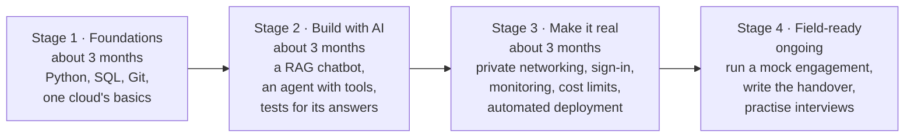

| Stage | Prove it with this project | Pillars |
|---|---|---|
| 1. Foundations | Load a public dataset into a database, clean it with SQL and Python, and publish it with automated tests | 1, 2 |
| 2. Build with AI | A chatbot that answers questions about a set of PDFs and cites its sources. Write 50 test questions and measure how often it's right | 5 |
| 3. Make it real | Deploy that chatbot with no public internet exposure, user sign-in, logging of every request and a spending cap, all from a script | 3, 4 |
| 4. Field-ready | Treat a friend as "the customer". Run discovery, build for two weeks, hand over with a runbook they can follow without you | 6 |

Stuck on Stage 2 or 3? The [reference implementation](reference/knowledge-assistant/README.md) is a small, tested knowledge assistant with an evaluation gate in CI and the Azure infrastructure as code. Read it, break it, then build your own.

**Our take:** skip Stage 3 and you'll fail your first real engagement. Tutorials stop at Stage 2, and customers start at Stage 3.

## 7. Should you do this job?

**Do it if** you like variety, learn fast in unfamiliar places, can explain technical trade-offs to executives, and get satisfaction from people using what you built.

**Avoid it if** you want deep focus on one codebase, hate ambiguity, or can't travel. Postings commonly ask for 25–50% travel.[^ise-swe][^deloitte]

The fair criticisms:

- **"Consulting with a better title."** Some academics see the title as a rebrand of older roles.[^wiki] One industry newsletter argues the job is drifting towards consulting now that AI labs hire FDEs into separate companies.[^pragmatic] This is real, so check for the product feedback loop before you accept an offer.
- **Lock-in.** When a vendor's engineer designs your system, it uses the vendor's products. One analyst called free deployment help the vendor's "customer acquisition cost".[^foley] If you work for a vendor, be honest with customers about this. They'll trust you more.

---

# Part 2: Doing it on Microsoft

## 8. Who does FDE work at Microsoft

Microsoft has done this work for over a decade. It reorganised it publicly in 2026.

| Team | What it is |
|---|---|
| **Industry Solutions Engineering (ISE)** | The engineering group whose postings say it "has operated Microsoft's Forward Deployed Engineering function for over a decade". Small teams embed with customers and pass patterns back to Microsoft's product teams, using an AI-assisted method called Hypervelocity Engineering (HVE) that's published as open source.[^ise-swe][^hve] |
| **Microsoft Frontier Company** | Announced July 2026: US$2.5 billion and 6,000 industry and engineering experts placed inside customer organisations. Early customers include the London Stock Exchange Group, Unilever, Land O'Lakes and Novo Nordisk.[^msft-frontier] |
| **Partners** | Consulting firms with Microsoft FDE practices, including Accenture, Capgemini, Deloitte, EY, KPMG and PwC.[^msft-frontier][^accenture][^deloitte] |

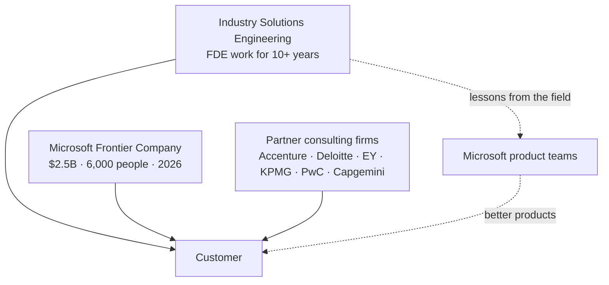

Microsoft hasn't said how ISE and Frontier Company relate.[^foley] **Our take:** if you want the engineering version of the job, ask in the interview how field findings reach the product teams, and ask for an example from the last quarter.

**A real example.** Novo Nordisk worked with Microsoft's Forward Deployed Engineering team to build an AI agent over its clinical-trial data. Its researchers went from evaluating 5–10 ideas per quarter to more than 50.[^fy26]

## 9. The Microsoft toolbox, translated

Microsoft renames products often, so learn what each one does rather than what it's called this year.

| Pillar | Microsoft product | What it is, in one sentence |
|---|---|---|
| Data | **Microsoft Fabric** | One place to store, clean and analyse company data, with Power BI for reports |
| Cloud | **Azure** | Microsoft's cloud: servers, networks, databases, storage |
| Cloud | **Azure API Management** | A gateway in front of AI models that controls who can call them and how much they can spend |
| AI | **Microsoft Foundry** | Where you choose AI models, build agents, host them and test their answers |
| AI | **Microsoft Agent Framework** | Microsoft's open-source code library for building agents in Python or C# |
| AI | **Copilot Studio** | A low-code tool for building agents that live in Teams and Microsoft 365 |
| AI | **Microsoft 365 Copilot** | The AI assistant inside Word, Outlook and Teams, which you can extend with your own agents |
| Security | **Microsoft Entra** | Sign-in and permissions for people and, now, for AI agents too |
| Security | **Microsoft Purview** | Finds and protects sensitive data so AI doesn't leak it |
| Security | **Microsoft Defender** | Detects attacks, including attacks on AI systems |
| Security | **Agent 365** | A register of every AI agent in the company, so IT can see and control them |
| Software engineering | **GitHub Copilot** | An AI coding assistant. ISE's HVE method is built on it |

How they fit together in a typical project:

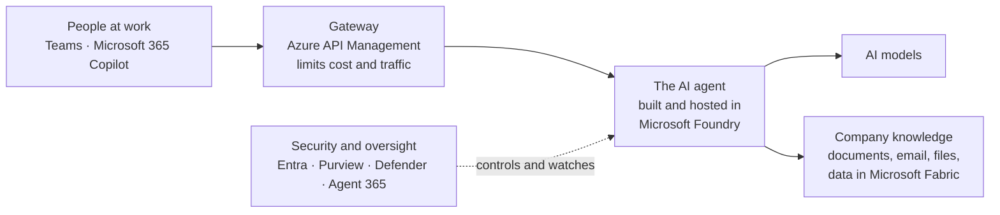

**Our take:** put a gateway (Azure API Management) in front of every model from day one, even for a prototype. Adding cost limits and logging later is much harder than starting with them.

## 10. Choosing where to build an AI agent

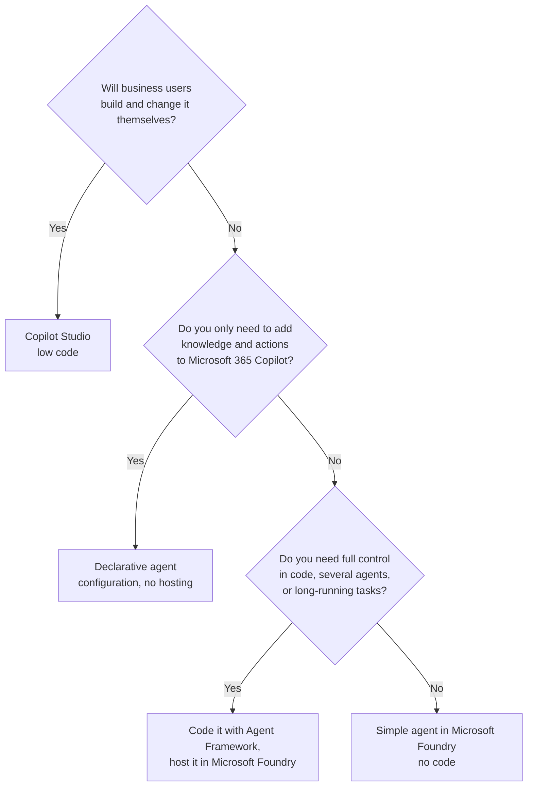

**Our take:** start at the bottom-right box (a simple Foundry agent) or with Copilot Studio, and move to code only when you hit a wall you can name. Writing code first feels productive but leaves the customer with something only engineers can maintain. Special cases (no internet, agents built elsewhere, strict private networking) are in the [technical reference](docs/microsoft-technical-reference.md#-the-applied-ai-playbook).

## 11. Certifications: which ones, and how much they matter

**Our take:** certifications get you past a recruiter's filter; they don't get you the job. A public repository with a deployed, tested, secured project beats three certificates. Take two or three as a syllabus, not a trophy shelf. Microsoft replaced several exams in 2026, so check before booking.[^certs]

A path that works for most FDEs:

1. **AZ-104** Azure Administrator: networks, identity and storage. Covers pillar 3 well.
2. **AI-103** Azure AI Apps and Agents Developer: building AI apps and agents in Foundry. The most relevant one.
3. **One for your deep pillar:** DP-700 (Fabric data engineering), SC-500 (cloud and AI security) or AB-620 (Copilot Studio agents, if your customers are low-code).

Take **AI-901** (Azure AI Fundamentals) first only if you're new to AI. Leave **AZ-305** (Azure Solutions Architect, which requires AZ-104) for senior roles.

Full list with retirement dates: [technical reference](docs/microsoft-technical-reference.md#-certification-path-post-2026-reset).

---

# Part 3: The kit

Everything in Part 3 is something you can copy into a real engagement, or run. It's organised around the six steps from [section 4](#4-an-engagement-start-to-finish).

## 12. Skills and scenario packs

A **skill** is one Markdown file (`SKILL.md`, in its own folder in [`/skills`](./skills)) that says when to use it, the rules, the steps, and ends with a template for one document to write into the customer's repository. The files follow the open [Agent Skills](https://agentskills.io/) format, so you can follow them yourself or hand them to an AI agent such as GitHub Copilot or Claude Code. They're plain Markdown, so any chat assistant can use them too.

There are 20 skills, one for each document an engagement needs, from the kickoff charter to the handover:

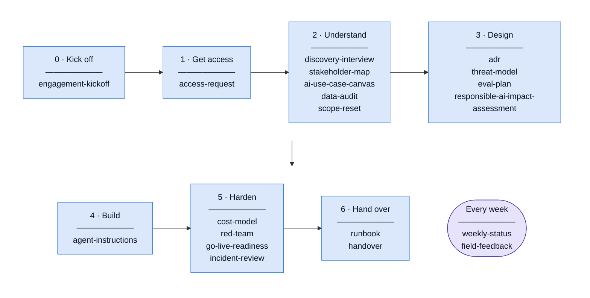

Each skill is tagged with the [pillars](#5-the-six-pillars) it serves, and a skill can serve more than one. Count them and belief 2 shows up in the files: 11 of the 20 serve consulting and delivery, more than serve AI applications.

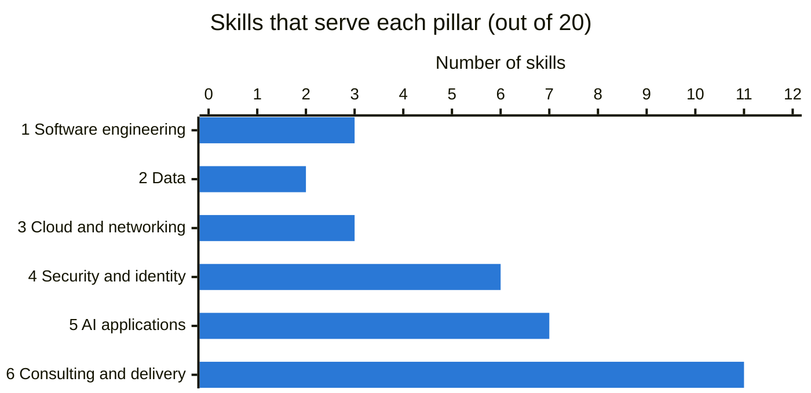

**Scenario packs** are opinionated starting kits for the five engagements you'll meet most often. Each one names the skills you need, what to add to each for that scenario, the default design, the discovery questions and the top risks. Packs combine: a bank's knowledge assistant uses the knowledge-assistant and regulated packs together.

| Scenario pack | The engagement | Hardest pillar |
|---|---|---|
| [Knowledge assistant](skills/scenario-knowledge-assistant/SKILL.md) | Answer questions from company documents (RAG) | 2 Data, 5 AI |
| [Action-taking agent](skills/scenario-action-agent/SKILL.md) | An agent that updates records, sends messages or triggers workflows | 4 Security |
| [Data and analytics agent](skills/scenario-data-agent/SKILL.md) | Natural-language questions over business data | 2 Data |
| [Regulated, private-only](skills/scenario-regulated-private/SKILL.md) | Banks, government, health: private networking and strict review | 3 Networking, 4 Security |
| [Disconnected or sovereign](skills/scenario-disconnected-sovereign/SKILL.md) | Sites with limited or no internet connection | 3 Networking |

Install them into your agent's skills folder with one command (needs Node.js), or see the [skills index](skills/README.md#install) for a release download and Windows instructions:

```bash
npx degit mjtpena/awesome-microsoft-fde/skills .claude/skills
```

Start with the [skills index](skills/README.md): it has the full table, which skills each pack uses, and what stays internal rather than going into the customer's repository. Before you update an installed copy, read the [changelog](CHANGELOG.md).

**Our take:** start from the pack, not the skill list. Deleting a section that doesn't apply takes a minute; noticing that you never thought about it takes an incident.

## 13. One engagement, worked end to end

Templates show you what to write. The [worked examples](examples/README.md) show what a good one looks like. They follow one fictional engagement, the **Harbourline Insurance** policy assistant, from day 0 to handover, with every skill filled in: 22 documents that agree with one shared fact sheet and with each other.

Harbourline has about 900 claims handlers. Discovery found them spending a median of 22 minutes per complex claim finding the right policy, and 1 in 12 audited claim decisions cited a superseded version. The assistant answers handlers' questions in Teams from the current policies only, cites its source, and changes nothing. Everything in it is invented: the company, the people and the numbers.

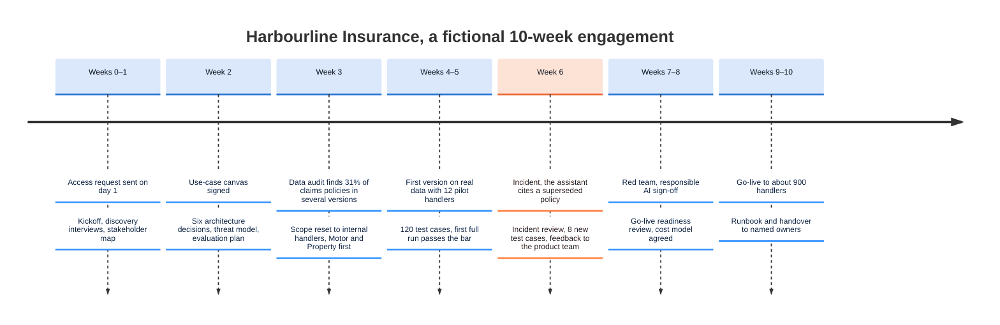

The week-6 incident is the part to read first. The assistant quoted an old excess amount to a team leader, who forwarded it to the sponsor. It looked like the model making things up. It was retrieval: an old copy of the policy sat in a file share's published folder with no status, and the indexing rule treated it as current. The evaluation scores show the dip below the 85% release bar (the orange line) and the recovery:

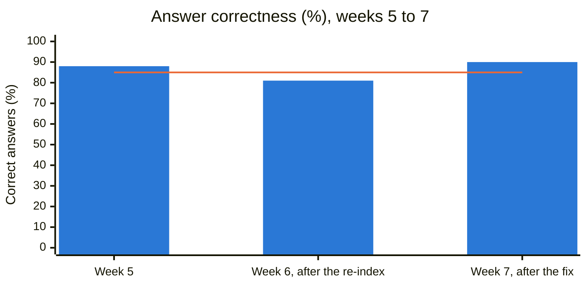

Start with the [incident review](examples/knowledge-assistant/incident-review.md), the [scope reset](examples/knowledge-assistant/scope-reset.md) and the [threat model](examples/knowledge-assistant/threat-model.md), or read all 22 [in engagement order](examples/README.md#the-examples).

## 14. The reference implementation

The [reference implementation](reference/knowledge-assistant/README.md) is the Harbourline assistant as a small codebase you can run, read and break. It's teaching code, not production code, and it says what it leaves out.

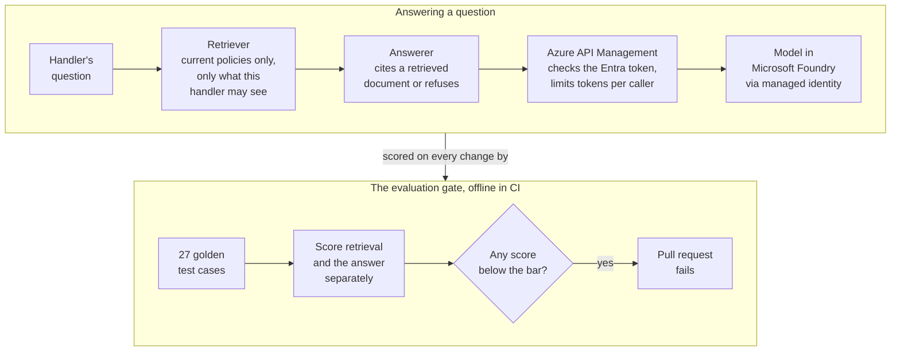

| What it shows | Where |
|---|---|
| **Tests for the AI's answers before tuning** (belief 5). 27 golden cases, scored on retrieval and on the answer separately, with a release bar | [`evals/`](reference/knowledge-assistant/evals/) |
| **A gateway in front of every model from day one.** The app never holds model access; Azure API Management checks the caller's Microsoft Entra token, limits tokens per caller and records usage | [`infra/apim-policy.xml`](reference/knowledge-assistant/infra/apim-policy.xml) |
| **Index only the current version.** A document with no status is held back, not let in: the lesson of the week-6 incident | [`corpus.py`](reference/knowledge-assistant/src/harbourline/corpus.py) |
| **Permission trimming in retrieval, not in the prompt.** A handler's search never returns the pricing draft, so no clever question can leak it; a pricing user can see it | [`retrieval.py`](reference/knowledge-assistant/src/harbourline/retrieval.py) |
| **No keys.** Every call uses Entra tokens; keys are switched off on Azure AI Search, the Foundry account and Application Insights | [`infra/`](reference/knowledge-assistant/infra/) |

It runs offline with no Azure account. When you want the real thing, one command (`azd up`, from the Azure Developer CLI) creates the Azure resources, written in Bicep, and loads the search index, so the same gate can run against a real model. Those resources bill by the hour, so read the [cost warning](reference/knowledge-assistant/README.md#cost-warning) first.

**Why scoring retrieval separately matters.** Put the week-6 bug back (let a document with no status into the index) and rerun the gate. Retrieval still finds the right policy every time, so a hit-rate check alone would pass. The old copy comes back too, and the answers start quoting it:

| Metric | Release bar | As shipped | With the week-6 bug |
|---|---|---|---|
| Retrieval hit rate (right document in the top 5) | ≥ 90% | ✅ 100% | ✅ 100% |
| Citation accuracy | ≥ 90% | ✅ 100% | ❌ 80% |
| Fact match | ≥ 85% | ✅ 95% | ❌ 80% |
| Refusal accuracy on must-refuse questions | 100% | ✅ 100% | ✅ 100% |
| Forbidden documents retrieved | 0 | ✅ 0 | ❌ 3 |
| Forbidden content in answers | 0 | ✅ 0 | ❌ 3 |

The gate fails, and the incident is caught before a pilot user sees it. Try it yourself with the [break-it exercise](reference/knowledge-assistant/README.md#how-the-evaluation-gate-works).

## 15. How the kit is tested

The guide tells you to test an AI system with fixed cases and a bar on every change. The kit is held to the same rule. Skills are meant to be handed to AI agents, so a template that drifts, or an example that no longer follows it, counts as broken even if it reads well.

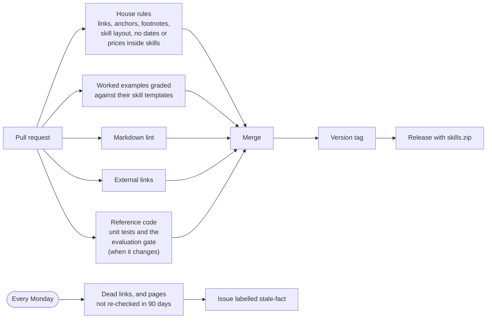

- **[Skill evaluations](skill-evals/README.md)** explain how to run any skill through your own agent and grade the result: a structure check that a script runs, and a six-question rubric for judgement.
- **[Contributing](CONTRIBUTING.md)** lists every check and the command to run it locally.
- **[Releases](CHANGELOG.md)** are versioned. A major version means a template changed in a way that affects documents you've already filled in.

---

# Part 4: Practise and go deeper

## 16. Practise: four interview scenarios

Talk through each out loud using the six steps from [section 4](#4-an-engagement-start-to-finish). Interviewers care more about your first three questions than your final architecture.

1. **The locked-down company.** No new accounts or apps, nothing touches the public internet, four weeks to ship a chatbot over internal documents. *What do you ask for on day one? How do you keep it private?*
2. **The wrong answers.** The customer's AI assistant gave a confidently wrong answer to an executive. *How do you find out whether search or the AI caused it? How do you stop it happening again?*
3. **Low code or full code?** The architecture board asks why you chose Copilot Studio over Microsoft Foundry, or the reverse. *Cover cost, who maintains it, and the customer team's skills.*
4. **Too many agents.** A company finds 300 AI agents built by different teams, and nobody knows what they can access. *How do you take inventory, assign owners and control access?*

Candidates report Microsoft's loop as a recruiter screen, an online test, coding screens, then an onsite with coding, system design and a behavioural round.[^interviews] [Interview prep](docs/interview-prep.md) has outline answers for each of these, three more cases and rapid-fire questions with answers. For scenario 2, the Harbourline [incident review](examples/knowledge-assistant/incident-review.md) is a full worked answer.

## 📚 Go deeper

| Document | What's in it |
|---|---|
| [Pillar deep dives](docs/pillars/) | Six in-depth pages, one per pillar: concepts, our stance, the Microsoft specifics, common mistakes, projects and interview questions |
| [The FDE role and market](docs/fde-role-and-market.md) | Palantir's origins, the 2026 investments company by company, job-posting statistics, critiques and Microsoft's FDE teams, all fully sourced |
| [Microsoft technical reference](docs/microsoft-technical-reference.md) | The detailed seven-phase curriculum, which features are generally available versus in preview, disconnected deployments and the full certification table |
| [Interview prep](docs/interview-prep.md) | The reported interview loop, seven case studies and rapid-fire questions |
| [The field guide](docs/field-guide.md) | What actually goes wrong: the first 30 days, working on a locked-down customer desktop, political failure modes, scope creep, adoption, leaving well and avoiding burnout |
| [From FDE to principal](docs/career-ladder.md) | How the job changes with seniority, what a principal actually does, anti-patterns of senior FDEs and building evidence for promotion |
| [Reading list](docs/reading-list.md) | Every primary source, grouped by topic |
| [Worked examples](examples/README.md) | One fictional engagement from kickoff to handover, with every skill filled in, so you can see what "done" looks like |
| [Reference implementation](reference/knowledge-assistant/README.md) | The same engagement as runnable code: a small knowledge assistant, its evaluation gate and the Azure infrastructure |
| [Skill evaluations](skill-evals/README.md) | How the skills themselves are tested, and how to run one through your own agent and grade the output |
| [Changelog](CHANGELOG.md) | What changed in each release, and what to check before you update a skill you've already copied |

## 📖 Glossary

| Term | Plain meaning |
|---|---|
| **FDE** | Forward deployed engineer: a software engineer who works inside a customer's organisation to make a product work for them |
| **The gap** | The distance between a product working in a demo and working in a real customer's environment. Also called "the Delta" |
| **Delta / Echo** | Palantir's internal names for forward deployed engineers (Delta) and the domain experts who find the problem worth solving (Echo) |
| **Pillar** | One of the six skill areas in this guide |
| **Skill** | One Markdown file that tells a person or an AI agent how to produce one engagement document, ending in its template |
| **Scenario pack** | A starting kit for one common kind of engagement: which skills to use, what to add to each, and the top risks |
| **Worked example** | A skill's template filled in for the fictional Harbourline engagement, to show the level of detail to aim for |
| **AI** | Artificial intelligence |
| **LLM** | Large language model: an AI model that reads and writes text |
| **RAG** | Retrieval-augmented generation: the AI looks up relevant documents before answering |
| **Agent** | An AI model that can use tools to take actions, not just chat |
| **MCP** | Model Context Protocol: an open standard for connecting tools and data to AI agents |
| **A2A** | Agent-to-agent: a standard for AI agents to talk to each other |
| **Evaluation (evals)** | Automated tests that score AI answers for correctness, grounding and safety |
| **Attack success rate** | In a red-team exercise, the share of attacks that got the AI to do something it shouldn't |
| **Blameless review** | A review of a failure that looks for what in the system allowed it, not for someone to blame |
| **Golden set** | A fixed list of test questions with agreed good answers, used to score an AI system every time it changes |
| **Evaluation gate** | An automated check that scores the golden set on every change and fails it if any score falls below the agreed release bar |
| **Permission trimming** | Filtering search results so each user only ever retrieves documents they're allowed to see |
| **Token** | A small chunk of text, roughly part of a word. AI models are priced and rate-limited by the tokens they read and write |
| **API** | Application programming interface: a way for one program to call another |
| **SQL** | Structured Query Language: the standard language for querying databases |
| **Infrastructure-as-code (IaC)** | Setting up cloud resources from scripts instead of clicking in a portal |
| **Bicep** | Microsoft's language for writing Azure infrastructure as code |
| **CLI** | Command-line interface: a program you run by typing commands, such as the Azure Developer CLI (`azd`) |
| **Managed identity** | An identity Azure gives a resource so it can sign in to other services without a password or key |
| **CI/CD** | Continuous integration / continuous delivery: automatically testing and deploying code on every change |
| **Pull request** | A proposed change to a code repository, reviewed and tested before it's merged |
| **Production** | The live system real users depend on, as opposed to a demo or test copy |
| **Red team** | People or tools that attack a system on purpose, before real attackers do, to find its weaknesses |
| **Runbook** | Step-by-step instructions for operating and fixing a system |
| **ADR** | Architecture decision record: a one-page note of a decision, the options and why |
| **RACI** | Responsible, Accountable, Consulted, Informed: a table of who does what after handover |
| **Tenant** | A company's own private space in Microsoft's cloud, with its own users and rules |
| **ISE** | Industry Solutions Engineering: Microsoft's long-running FDE team |
| **HVE** | Hypervelocity Engineering: ISE's method for building with AI coding assistants throughout a project |
| **SI** | Systems integrator: a consulting firm that builds and connects systems for clients |
| **AWS** | Amazon Web Services, Amazon's cloud |
| **Copilot** | Microsoft's brand for its AI assistants (Microsoft 365 Copilot, GitHub Copilot, Copilot Studio) |

The [technical reference](docs/microsoft-technical-reference.md#-glossary) has a glossary of Microsoft-specific terms.

## 🤝 Contributing

See [CONTRIBUTING.md](./CONTRIBUTING.md). Opinions are welcome: label them as opinions and argue for them. Facts need a source.

Inspired by [pierpaolo28/Awesome-FDE-Roadmap](https://github.com/pierpaolo28/Awesome-FDE-Roadmap).

## Disclaimer

This is an independent, community-maintained project. It is **not affiliated with, endorsed by or sponsored by Microsoft Corporation**, and nothing here is official Microsoft guidance, policy or a description of how Microsoft's own teams work.

- **Opinions are ours.** Everything marked as opinion reflects the contributors' field experience, not Microsoft's position.
- **Facts go out of date.** Products, features, prices and licensing change often. Always check [Microsoft Learn](https://learn.microsoft.com/) and the customer's own agreements before relying on anything here.
- **No warranty.** The skills are starting points, provided as-is under the [license](./LICENSE). You're responsible for how you use them in a customer engagement.
- **Trademarks.** Microsoft, Azure, Microsoft 365, Copilot, Fabric, Entra and other product names are trademarks of the Microsoft group of companies. Other names are the property of their owners. They're used here only to identify the products being discussed.

## License

MIT. See [LICENSE](./LICENSE).

---

## Sources

[^wiki]: [Wikipedia: Forward deployed engineer](https://en.wikipedia.org/wiki/Forward_deployed_engineer): definition, Palantir's use of the title by 2009, the criticisms, and the 2026 announcements.
[^palantir]: [Palantir: Dev versus Delta](https://blog.palantir.com/dev-versus-delta-demystifying-engineering-roles-at-palantir-ad44c2a6e87).
[^bloomberry]: [Bloomberry: I analyzed 1,000 forward deployed engineer jobs](https://bloomberry.com/blog/i-analyzed-1000-forward-deployed-engineer-jobs-what-i-learned/) (January 2026, using Revealera job data): growth, skills, experience levels, salary and quota figures.
[^a16z]: [Andreessen Horowitz: Trading Margin for Moat](https://a16z.com/services-led-growth/) (June 2025).
[^openai]: [VKTR: OpenAI launches $4B deployment unit](https://www.vktr.com/ai-news/openai-launches-4b-deployment-unit/) and [OpenAI's announcement](https://openai.com/index/openai-launches-the-deployment-company/) (May 2026).
[^ode]: [TechCrunch: Anthropic and Blackstone's Ode](https://techcrunch.com/2026/07/15/anthropic-blackstone-bet-the-next-trillion-dollar-ai-business-is-implementation-not-models/) (July 2026).
[^google]: [The Decoder: Google is hiring hundreds of engineers to help customers adopt its AI](https://the-decoder.com/google-is-hiring-hundreds-of-engineers-to-help-customers-adopt-its-ai/) (May 2026).
[^aws]: [CIO Dive: AWS creates forward deployed engineering hub](https://www.ciodive.com/news/aws-creates-forward-deployed-engineering-hub/824109/) (June 2026): US$1B, teams of 5–6, 45-day sprints.
[^msft-frontier]: [Microsoft: Microsoft Frontier Company](https://blogs.microsoft.com/blog/2026/07/02/microsoft-frontier-company-ai-engineering-that-amplifies-and-protects-your-intelligence/) (2 July 2026).
[^fy26]: [Microsoft: Looking back on FY26](https://blogs.microsoft.com/blog/2026/07/28/looking-back-on-microsofts-fy26-from-ai-experimentation-to-frontier-transformation/) (July 2026): the Novo Nordisk example.
[^ise-swe]: Microsoft ISE job postings: [Principal Software Engineer](https://jobs.anitab.org/companies/microsoft/jobs/79366247-principal-software-engineer-ise) ([archived](https://web.archive.org/web/20260614170608/https://jobs.anitab.org/companies/microsoft/jobs/79366247-principal-software-engineer-ise)) and [Principal Technical Program Manager, Forward Deployed Engineering](https://jobs.anitab.org/companies/microsoft/jobs/81414702-principal-technical-program-manager-forward-deployed-engineering) ([archived](https://web.archive.org/web/20260613192559/https://jobs.anitab.org/companies/microsoft/jobs/81414702-principal-technical-program-manager-forward-deployed-engineering)) (2026).
[^hve]: [Microsoft HVE Core](https://microsoft.github.io/hve-core/) and the [ISE Code-With Engineering Playbook](https://microsoft.github.io/code-with-engineering-playbook/ISE/).
[^msft-job]: [Microsoft "Software Engineer – Forward Deployed Engineer" posting](https://zapply.jobs/jobs/26fc61ca-ad9a-4c72-9158-9b034a0bb550/) (job-board copy, October 2026).
[^anthropic-job]: [Anthropic: Forward Deployed Engineer, Applied AI](https://jobs.generalcatalyst.com/companies/anthropic/jobs/70192292-forward-deployed-engineer-applied-ai).
[^deloitte]: [Deloitte: Forward Deployed Engineer, Microsoft AI & Data](https://apply.deloitte.com/en_US/careers/JobDetail/Forward-Deployed-Engineer-Microsoft-AI-Data/350591).
[^accenture]: [Accenture launches a Microsoft forward deployed engineering practice](https://newsroom.accenture.com/news/2026/accenture-launches-microsoft-forward-deployed-engineering-practice-to-help-organizations-scale-ai-across-the-enterprise) (March 2026).
[^pragmatic]: [The Pragmatic Engineer: Forward deployed engineering heats up again](https://blog.pragmaticengineer.com/the-pulse-forward-deployed-engineering-heats-up-again/) (May 2026).
[^foley]: [Directions on Microsoft (Mary Jo Foley): Microsoft launches its own forward deployed engineering unit](https://www.directionsonmicrosoft.com/microsoft-launches-its-own-forward-deployed-engineering-unit-the-frontier-company/?type=All) (July 2026). This is analysis, not a Microsoft statement.
[^certs]: [Microsoft Learn: credentials](https://learn.microsoft.com/credentials/). Exam details and sources are in the [technical reference](docs/microsoft-technical-reference.md#-certification-path-post-2026-reset).
[^interviews]: [fdeinterviews.com: Microsoft](https://fdeinterviews.com/company/microsoft). Candidate reports, not an official description.
