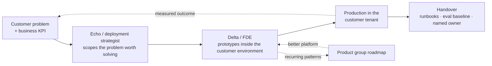
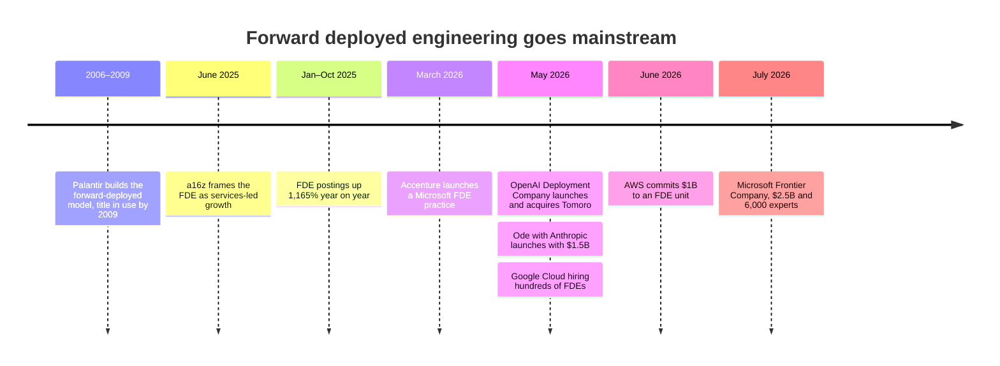
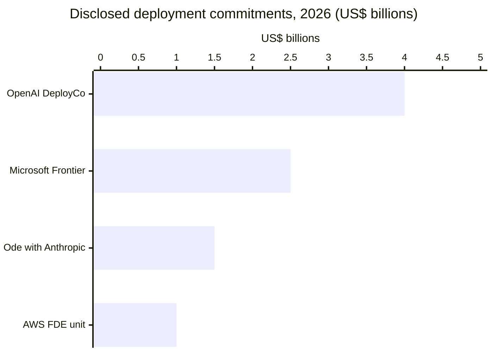
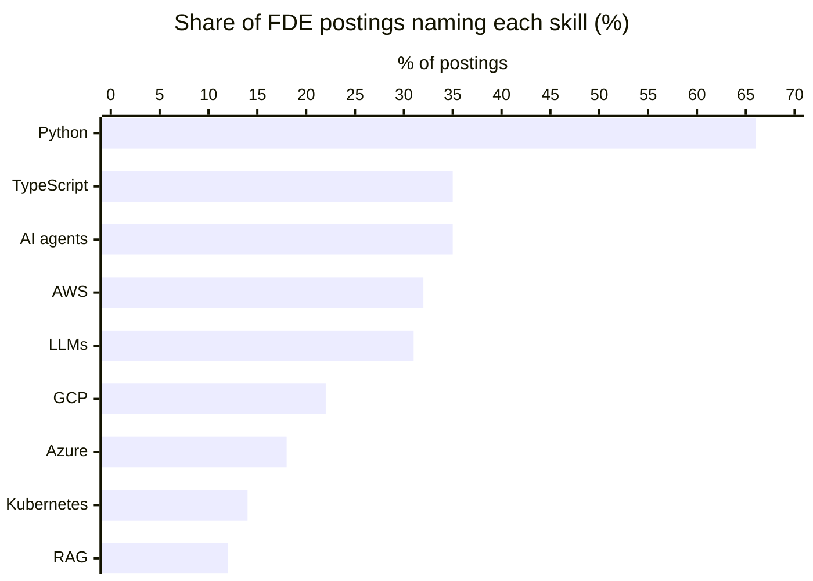
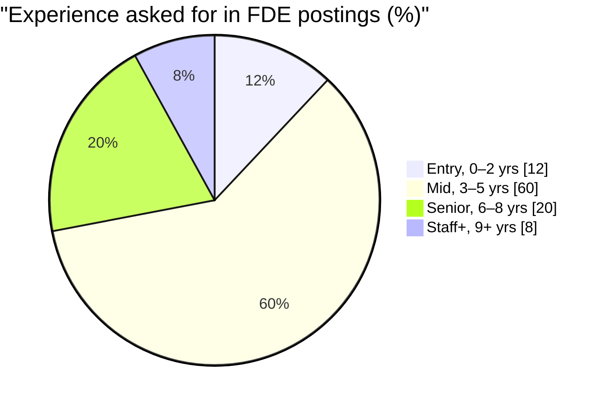
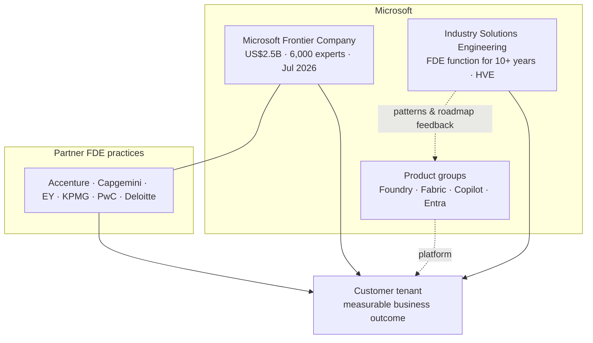

# The FDE Role & Market: Detailed Research

> Part of the [Awesome Microsoft FDE](../README.md) guide. Origins of the role, the 2025–2026 hiring wave, what job postings ask for, critiques, and Microsoft's FDE organisations.
> New to the topic? Start with the [README](../README.md) first: it explains the ideas in plain language. This page is the detailed, fully sourced reference.

**Last verified:** 7 October 2026.

## How to read this page

| Marker | Meaning |
|---|---|
| ✅ **GA** | Generally available, per the linked source |
| 🧪 **Preview** | Public or private preview: no SLA, may change |
| 🔜 **Announced** | Announced or on the roadmap, not yet shipped |
| 💬 **Field guidance** | Opinion and practitioner judgement, not a sourced fact |
| ⚠️ **Watch out** | Gotcha, breaking change, or conflicting sources |
| 🗓 **Changed since Build** | Status moved after Build 2026; older blogs will be wrong |

Every factual claim links to its source. Microsoft Learn and Microsoft blogs are preferred, and third-party sources are named as such. Text marked 💬 is opinion.

---

## 🧭 What an FDE Actually Is

### Definition

A forward-deployed engineer is a customer-facing software engineer who implements a product inside a client organisation, often working alongside the client's staff for a set period. The name comes from the US military term for forward basing. The role overlaps with solutions architects, sales engineers, professional-services engineers, systems integrators and IT consultants ([Wikipedia](https://en.wikipedia.org/wiki/Forward_deployed_engineer)).

### Origins: Palantir's Deltas and Echoes

- Palantir popularised the role and was using the title by 2009 ([Wikipedia](https://en.wikipedia.org/wiki/Forward_deployed_engineer)). Third-party profiles credit Shyam Sankar, who joined as employee #13 in 2006, with creating the model ([Gold House](https://goldhouse.org/people/shyam-sankar/)).
- Inside Palantir, forward-deployed software engineers are called **Deltas**. The name comes from early business-development teams being named after NATO-alphabet letters. Deltas sit in Business Development and deploy and customise Palantir's platforms to reach technical outcomes for customers. Palantir sums up the split as: a Dev's focus is **one capability for many customers**; a Delta's is **one customer, many capabilities** ([Palantir blog](https://blog.palantir.com/dev-versus-delta-demystifying-engineering-roles-at-palantir-ad44c2a6e87)).
- Deltas work with **Echoes** (deployment strategists): embedded people with domain depth who find the problem worth solving, which the Delta then prototypes fast ([third-party analysis](https://shivanathd.substack.com/p/the-difference-between-a-forward)).
- ⚠️ Not to be confused with **"The Delta"** used later on this page, which is the original roadmap's name for the product-to-reality gap.

The operating loop that makes the role different from consulting is the **feedback path back into the product** 💬:

### FDE vs adjacent roles 💬

| | FDE | Solutions architect | SI / consultant | Product SWE |
|---|---|---|---|---|
| Writes production code in the customer's environment | ✅ core of the job | Rarely; designs and advises | Often, billed by the hour | No; ships to all customers |
| Owns the customer outcome | ✅ | Shared with account team | Owns the statement of work | No |
| Feeds patterns back to the product | ✅ explicit duty (e.g. Microsoft ISE postings list "product roadmap feedback" ([posting](https://jobs.anitab.org/companies/microsoft/jobs/79366247-principal-software-engineer-ise), [archived](https://web.archive.org/web/20260614170608/https://jobs.anitab.org/companies/microsoft/jobs/79366247-principal-software-engineer-ise))) | Sometimes | No | Receives it |
| Carries a sales quota | No: 0% of 1,000 analysed postings were quota-carrying ([Bloomberry](https://bloomberry.com/blog/i-analyzed-1000-forward-deployed-engineer-jobs-what-i-learned/)) | Often tied to consumption targets | Utilisation target | No |
| Typical travel | Up to 25–50% in Microsoft and Deloitte postings ([ISE TPM](https://jobs.anitab.org/companies/microsoft/jobs/81414702-principal-technical-program-manager-forward-deployed-engineering), [archived](https://web.archive.org/web/20260613192559/https://jobs.anitab.org/companies/microsoft/jobs/81414702-principal-technical-program-manager-forward-deployed-engineering); [ISE SWE](https://jobs.anitab.org/companies/microsoft/jobs/79366247-principal-software-engineer-ise), [archived](https://web.archive.org/web/20260614170608/https://jobs.anitab.org/companies/microsoft/jobs/79366247-principal-software-engineer-ise); [Deloitte](https://apply.deloitte.com/en_US/careers/JobDetail/Forward-Deployed-Engineer-Microsoft-AI-Data/350591)) | Moderate | High | Low |

### The 2025–2026 deployment-company wave

In June 2025, Andreessen Horowitz framed the FDE as "services-led growth": AI startups trading near-term gross margin for enterprise lock-in, as Salesforce, ServiceNow and Workday once did ([a16z](https://a16z.com/services-led-growth/)). In 2026, the model labs and the hyperscalers all built dedicated deployment organisations.

| Organisation | Launched | Money | People | Engagement model | Source |
|---|---|---|---|---|---|
| **OpenAI Deployment Company** | 11 May 2026 | >US$4B initial capital from 19 investors, led by TPG with Advent, Bain Capital and Brookfield as co-leads. A majority-owned OpenAI unit | ~150 FDEs (UK, Asia, Australia) via the Tomoro acquisition, pending regulatory approval | Embedded FDE teams building and operating production AI | [OpenAI](https://openai.com/index/openai-launches-the-deployment-company/), [VKTR](https://www.vktr.com/ai-news/openai-launches-4b-deployment-unit/), [Pragmatic Engineer](https://blog.pragmaticengineer.com/the-pulse-forward-deployed-engineering-heats-up-again/) |
| **Ode with Anthropic** | May 2026 | US$1.5B JV with Blackstone, Hellman & Friedman, Goldman Sachs and others | 100 engineers (separate from Anthropic's own Applied AI FDEs) | "Claude-first", works with Anthropic's applied AI team | [TechCrunch](https://techcrunch.com/2026/07/15/anthropic-blackstone-bet-the-next-trillion-dollar-ai-business-is-implementation-not-models/) |
| **Google Cloud** | 12–13 May 2026 | Not disclosed | Hiring hundreds | Engineers who embed with customers and build agents. CRO Matt Renner: "more technical resources (vs just an ocean of salespeople)". Hiring reportedly cut to as few as two interviews in two days | [The Decoder](https://the-decoder.com/google-is-hiring-hundreds-of-engineers-to-help-customers-adopt-its-ai/), [Pragmatic Engineer](https://blog.pragmaticengineer.com/the-pulse-forward-deployed-engineering-heats-up-again/) |
| **AWS** | 30 Jun 2026 | US$1B | "Thousands" | Pods of 5–6 engineers, 45-day sprints, agents left running | [CIO Dive](https://www.ciodive.com/news/aws-creates-forward-deployed-engineering-hub/824109/) |
| **Microsoft Frontier Company** | 2 Jul 2026 | US$2.5B | 6,000 industry and engineering experts | Co-design, deploy and continuously improve against measurable business outcomes | [Microsoft](https://blogs.microsoft.com/blog/2026/07/02/microsoft-frontier-company-ai-engineering-that-amplifies-and-protects-your-intelligence/) |

⚠️ These figures aren't like for like. OpenAI's and Anthropic's are external capital raised for separate companies; Microsoft's and AWS's are internal investment. Google didn't disclose a figure.

### Same title, different jobs: what each employer's posting asks

| Posting | Builds | Experience | Travel | Posted pay (US) | Source |
|---|---|---|---|---|---|
| Microsoft ISE, Principal Software Engineer | Lighthouse customer engagements; feeds recurring patterns into product roadmaps; HVE | 8+ yrs coding (C, C++, C#, Java, JS, Python) | Up to 50% | Not listed | [Posting](https://jobs.anitab.org/companies/microsoft/jobs/79366247-principal-software-engineer-ise) ([archived](https://web.archive.org/web/20260614170608/https://jobs.anitab.org/companies/microsoft/jobs/79366247-principal-software-engineer-ise)) |
| Microsoft, Software Engineer – Forward Deployed Engineer | Defines success criteria with customers, then builds, deploys and operates production software | Bachelor's + coding; AI/cloud familiarity | Not listed | US$85,400–168,100 | [Aggregator copy](https://zapply.jobs/jobs/26fc61ca-ad9a-4c72-9158-9b034a0bb550/) |
| Anthropic, FDE (Applied AI), New York | Production apps on Claude; MCP servers, sub-agents and agent skills; codifies deployment patterns for Product and Engineering | 3+ yrs in a technical, customer-facing role | ~25% | US$200,000–300,000 | [Posting](https://jobs.generalcatalyst.com/companies/anthropic/jobs/70192292-forward-deployed-engineer-applied-ai) |
| Deloitte, FDE, Microsoft AI & Data | GenAI solutions and agentic workflows on Azure AI Foundry, with human-in-the-loop controls | 3+ yrs; 1+ yr GenAI and 1+ yr Azure AI Foundry | 50% | US$134,500–265,100 | [Posting](https://apply.deloitte.com/en_US/careers/JobDetail/Forward-Deployed-Engineer-Microsoft-AI-Data/350591) |

💬 Two patterns hold across these postings: all of them ask you to **ship production code inside the customer's environment**, and the vendor-side roles (Microsoft ISE, Anthropic) explicitly require **feeding patterns back to the product**. The partner-side role (Deloitte) doesn't, which is the clearest line between an FDE and an SI consultant.

### What the job postings actually ask for

An analysis of 1,000 FDE postings (via the Revealera jobs dataset, updated 25 Jan 2026) found ([Bloomberry](https://bloomberry.com/blog/i-analyzed-1000-forward-deployed-engineer-jobs-what-i-learned/)):

- Postings grew **1,165%** year on year (Jan–Oct 2025 vs the same period in 2024). October 2025 was the highest month on record.
- Median disclosed salary **US$173,816**; 70% mention equity; 58% of hiring companies have 11–200 employees.
- Top responsibilities: working directly with customers (55%), building/deploying AI/ML systems (37%), integrating systems and APIs (32%).

| Target industry | Share of postings |
|---|---|
| Financial services / banking | 24% |
| Government / defence | 18% |
| Healthcare / life sciences | 17% |
| Insurance | 17% |
| Energy / utilities | 13% |

💬 Azure appears in only 18% of postings, behind AWS (32%) and GCP (22%). Most FDE prep material is AWS- or GCP-flavoured, which is why a Microsoft-specific roadmap is worth having. Government/defence at 18% matches the sovereign section of this guide.

### How the week really splits: a field survey (open)

The README estimates an FDE's week as roughly a third building, a third unblocking and a third talking. 💬 That's field experience, not data. To replace it with data, we're collecting answers through a [public survey form](https://github.com/mjtpena/awesome-microsoft-fde/issues/new?template=field-survey.yml): employer type, experience, the percentage split of a typical week and the most common blocker. We'll publish totals here, never individual answers, once at least 30 people have answered.

### The critiques (know them before the interview)

- **Title arbitrage:** academics describe the title as rebranding solutions or integration engineering to signal importance ([Wikipedia](https://en.wikipedia.org/wiki/Forward_deployed_engineer)).
- **Convergence with consulting:** The Pragmatic Engineer argues the role is "about to become indistinguishable from a solutions architect or consultant", now that OpenAI and Anthropic hire FDEs into separate companies. Those FDEs get equity in the spin-out, not the parent lab ([Pragmatic Engineer](https://blog.pragmaticengineer.com/the-pulse-forward-deployed-engineering-heats-up-again/)).
- **Labour-intensive economics:** the model deliberately gives up gross margin ([a16z](https://a16z.com/services-led-growth/)) and doesn't scale like self-serve software ([Pragmatic Engineer](https://blog.pragmaticengineer.com/the-pulse-forward-deployed-engineering-heats-up-again/)).
- **Travel and time pressure** are the most cited downsides for engineers ([Wikipedia](https://en.wikipedia.org/wiki/Forward_deployed_engineer)).
- **Vendor lock-in (the Microsoft-specific version):** Mary Jo Foley at Directions on Microsoft compares subsidised deployment to Azure migration offers: "Free deployment is the customer acquisition cost and the consumption meters are the payback." Her warning to customers: "An embedded Frontier engineer co-designing your AI systems isn't just engineering help. That's Microsoft's roadmap being installed as your architecture." She also flags the risk of Microsoft cutting out its SI partners ([Directions on Microsoft](https://www.directionsonmicrosoft.com/microsoft-launches-its-own-forward-deployed-engineering-unit-the-frontier-company/?type=All)).

💬 The defence that holds up: an FDE ships production code inside the customer's guardrails **and** changes the product. If neither happens, it's consulting.

---

## 🛸 The Microsoft FDE Persona

### Who does FDE work in the Microsoft ecosystem

| Organisation | What it is | Source |
|---|---|---|
| **Industry Solutions Engineering (ISE)** | A global engineering org that "has operated Microsoft's Forward Deployed Engineering function for over a decade". Small multidisciplinary teams embed with customers, co-engineer solutions, run lighthouse engagements and feed recurring patterns into product roadmaps. Work is done with **Hypervelocity Engineering (HVE)**, the method behind [HVE Core](https://microsoft.github.io/hve-core/) and [Phase 5](microsoft-technical-reference.md#phase-5-hyper-velocity-engineering-hve--rpi). Senior postings ask for 8+ years of coding and travel of up to 50% | [ISE posting](https://jobs.anitab.org/companies/microsoft/jobs/79366247-principal-software-engineer-ise) ([archived](https://web.archive.org/web/20260614170608/https://jobs.anitab.org/companies/microsoft/jobs/79366247-principal-software-engineer-ise)), [ISE FDE TPM posting](https://jobs.anitab.org/companies/microsoft/jobs/81414702-principal-technical-program-manager-forward-deployed-engineering) ([archived](https://web.archive.org/web/20260613192559/https://jobs.anitab.org/companies/microsoft/jobs/81414702-principal-technical-program-manager-forward-deployed-engineering)), [Code-With playbook](https://microsoft.github.io/code-with-engineering-playbook/ISE/) |
| **Microsoft Frontier Company** | New operating business announced 2 Jul 2026 by Judson Althoff (CEO, Commercial Business), with Rodrigo Kede Lima as President. US$2.5B and 6,000 industry and engineering experts embedded at customers. Combines industry knowledge, change management and AI engineering; customer "IQ" (data, IP, workflows) isn't used to train models in ways that commoditise it. Early customers: LSEG, Land O'Lakes, Unilever, Novo Nordisk. Microsoft says it "goes beyond what has been labeled as Forward Deployed Engineering" | [Microsoft](https://blogs.microsoft.com/blog/2026/07/02/microsoft-frontier-company-ai-engineering-that-amplifies-and-protects-your-intelligence/), [TechCrunch](https://techcrunch.com/2026/07/02/microsoft-launches-its-own-ai-deployment-company-with-2-5-billion-commitment/) |
| **Forward Deployed Engineering team / AI Acceleration Studio** | Named in Microsoft's FY26 recap: Novo Nordisk worked with "Microsoft's AI Acceleration Studio within the Forward Deployed Engineering team" to build a governed reasoning agent on Azure over 200,000+ patient-years of clinical-trial data. Capacity to evaluate opportunities went from 5–10 ideas a quarter to 50+ | [Microsoft FY26 recap](https://blogs.microsoft.com/blog/2026/07/28/looking-back-on-microsofts-fy26-from-ai-experimentation-to-frontier-transformation/) |
| **FDE-titled engineering roles** | Postings titled "Software Engineer – Forward Deployed Engineer" (Washington, Oct 2026): partner with customers to define success criteria, then build, deploy and operate production software from prototype to production. Posted pay range US$85,400–168,100 (US standard) | [Job aggregator copy](https://zapply.jobs/jobs/26fc61ca-ad9a-4c72-9158-9b034a0bb550/) of the Microsoft posting |
| **Partner FDE practices** | Frontier Company partners: Accenture, Capgemini, EY, KPMG, PwC. Accenture launched a Microsoft FDE practice on 18 Mar 2026 (Microsoft brings the platform; Accenture leads change management and process redesign). Deloitte's "Forward Deployed Engineer, Microsoft AI & Data" asks for 1+ year of hands-on Azure AI Foundry, 50% travel, US$134,500–265,100 | [Microsoft](https://blogs.microsoft.com/blog/2026/07/02/microsoft-frontier-company-ai-engineering-that-amplifies-and-protects-your-intelligence/), [Accenture](https://newsroom.accenture.com/news/2026/accenture-launches-microsoft-forward-deployed-engineering-practice-to-help-organizations-scale-ai-across-the-enterprise), [Deloitte](https://apply.deloitte.com/en_US/careers/JobDetail/Forward-Deployed-Engineer-Microsoft-AI-Data/350591) |

⚠️ Microsoft hasn't said publicly how ISE relates to Frontier Company, or where the 6,000 people come from. Directions on Microsoft reads Frontier Company as a make-over of Microsoft Consulting Services and the Cloud Solution Architect programme ([Directions on Microsoft](https://www.directionsonmicrosoft.com/microsoft-launches-its-own-forward-deployed-engineering-unit-the-frontier-company/?type=All)). That's analysis, not a Microsoft statement, so confirm which org you'd join with the recruiter.

### Where the Delta comes from

The original roadmap describes the FDE as part software engineer, part AI/data architect and part strategic consultant. Their job is to close "The Delta", meaning the gap between a core product and a client's messy reality ([source](https://github.com/pierpaolo28/Awesome-FDE-Roadmap)).

💬 On the Microsoft cloud, most of that Delta comes from four places:

| Delta source | What breaks | Microsoft FDE response |
|---|---|---|
| **Tenant reality** | Locked-down Entra tenant, Conditional Access, no app-registration rights, unknown agent sprawl | Managed identities, Entra Agent ID, Agent 365 registry, PIM requests prepared on Day 0 |
| **Data reality** | Legacy SQL Server, SAP, Dataverse, SharePoint oversharing | Fabric Mirroring/Shortcuts, Medallion Lakehouse, Purview DSPM |
| **Network reality** | Private endpoints only, no public egress, hub-spoke firewall | AI Landing Zone, Private Link, APIM AI gateway |
| **Sovereignty reality** | Classified/regulated, intermittently or fully disconnected | Azure Local disconnected operations, Foundry Local, M365 Local, SQL Server on Azure Local |

| | Software Engineer | Microsoft FDE |
|---|---|---|
| User | Anonymous users | CIO, CISO, CDO, agency/Defence executives |
| Environment | Uniform subscription | Customer tenant, landing-zone policy, sovereign or air-gapped |
| Goal | Scale & stability | Time-to-value inside the customer's guardrails |
| Definition of done | Merged PR | 💬 Running in the customer tenant, with an evaluation baseline, handed over |
