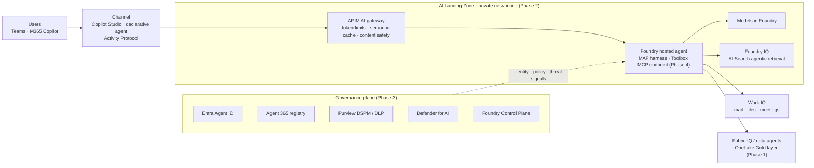
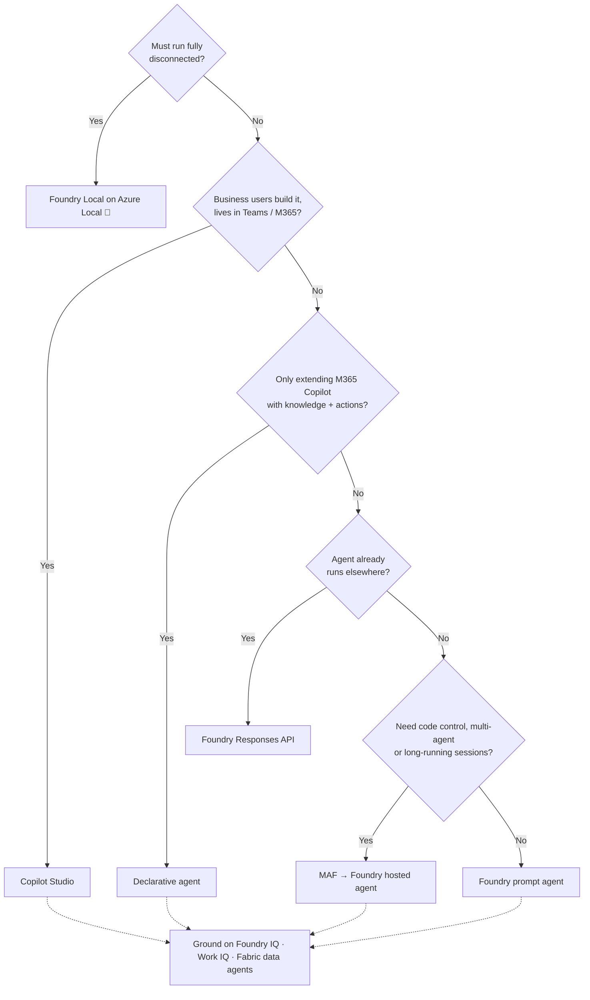
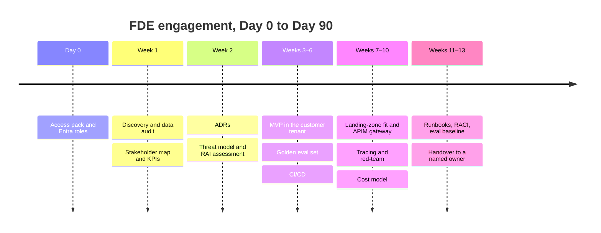

# Microsoft FDE Technical Reference

> Part of the [Awesome Microsoft FDE](../README.md) guide. The Microsoft stack, the seven-phase curriculum, the applied AI playbook, sovereign deployment, engagement lifecycle and certifications.
> New to the topic? Start with the [README](../README.md) first: it explains the ideas in plain language. This page is the detailed, fully sourced reference.
>
> Not official Microsoft documentation. See the [disclaimer](../README.md#disclaimer); for anything that matters, confirm against Microsoft Learn.

**Last verified:** 9 October 2026.

## How to read this page

| Marker | Meaning |
|---|---|
| ✅ **GA** | Generally available, per the linked source |
| 🧪 **Preview** | Public or private preview: no SLA, may change |
| 🔜 **Announced** | Announced or on the roadmap, not yet shipped |
| 💬 **Field guidance** | Opinion and practitioner judgement, not a sourced fact |
| ⚠️ **Watch out** | Gotcha, breaking change, or conflicting sources |
| 🗓 **Changed since Build** | Status moved after Build 2026; older blogs will be wrong |

Every factual claim links to its source. Microsoft Learn and Microsoft blogs are preferred, and third-party sources are named as such. Text marked 💬 is opinion.

---

## 🛠 The Microsoft FDE Stack (Oct 2026)

| Layer | Core tools | Status / source |
|---|---|---|
| **Languages** | Python, C#/.NET, TypeScript, T-SQL, KQL, DAX, Bicep, PowerShell | MAF docs offer C#, Python and Go pivots ([Learn](https://learn.microsoft.com/en-us/agent-framework/hosting/foundry-hosted-agent)) |
| **Data** | Microsoft Fabric (OneLake, Lakehouse, Warehouse, Real-Time Intelligence, Data Factory, Power BI), Fabric IQ | Fabric IQ ✅ GA announced at Build 2026 ([Fabric blog](https://www.microsoft.com/en-us/microsoft-fabric/blog/2026/06/25/fabcon-europe-2026-the-sessions-were-most-excited-to-bring-to-barcelona/)); Fabric IQ ontology and the Foundry Fabric IQ tool 🧪 preview ([Learn](https://learn.microsoft.com/en-us/azure/foundry/agents/how-to/tools/fabric-iq)) |
| **AI platform** | Microsoft Foundry (models, Agent Service, Toolboxes, Foundry IQ, evaluations), Azure AI Search | See [Phase 4](#phase-4-applied-ai-foundry-agent-framework--copilot) |
| **Agent SDK** | Microsoft Agent Framework (MAF) | ✅ 1.0 GA on 2 Apr 2026 ([MAF blog](https://devblogs.microsoft.com/agent-framework/microsoft-agent-framework-at-build-2026-announce/)) |
| **Copilot extensibility** | Copilot Studio, declarative agents, custom engine agents, M365 Agents Toolkit/SDK | [Learn](https://learn.microsoft.com/en-us/microsoft-365/copilot/extensibility/agents-overview) |
| **Dev velocity** | GitHub Copilot + HVE Core, GitHub Actions, Azure DevOps | [HVE Core](https://microsoft.github.io/hve-core/) |
| **IaC** | Bicep/Terraform with Azure Verified Modules, `azd` | AVM is the default ALZ accelerator starter module ([ALZ-Bicep repo](https://github.com/Azure/ALZ-Bicep)) |
| **Integration / gateway** | Azure API Management AI gateway, Logic Apps, Service Bus, Event Grid | [Learn](https://learn.microsoft.com/en-us/azure/api-management/genai-gateway-capabilities) |
| **Identity & governance** | Entra ID, Entra Agent ID, Microsoft Agent 365, Purview, Defender | Agent ID ✅ GA ([Learn](https://learn.microsoft.com/en-us/entra/agent-id/whats-new-agent-id)); Agent 365 ✅ GA 1 May 2026 ([Learn](https://learn.microsoft.com/en-us/microsoft-agent-365/overview)) |
| **Fleet ops** | Foundry Control Plane (inventory, compliance, cost across projects) | [Learn](https://learn.microsoft.com/en-us/azure/foundry/control-plane/overview) |
| **M365 grounding for any agent** | Work IQ APIs (A2A, remote MCP, REST) | ✅ GA 16 Jun 2026 ([Microsoft](https://www.microsoft.com/en-us/copilot/blog/2026/06/02/announcing-the-new-work-iq-apis/)) |
| **Observability** | Azure Monitor, Application Insights, OpenTelemetry, Foundry tracing | MAF harness ships OpenTelemetry built in ([InfoQ](https://www.infoq.com/news/2026/08/agent-framework-harness-ga/)) |
| **Sovereign / edge** | Azure Local (incl. disconnected), Azure Arc, Foundry Local, M365 Local | See [Sovereign](#-sovereign-air-gapped--tactical-edge-deployment) |

### How the stack fits together 💬

A typical connected agent engagement, with each box linked to its phase below:

⚠️ The arrow from Teams/M365 into a private landing zone is the hardest part to get through security review. See the M365 publishing caveat in [Phase 2](#phase-2-azure-architecture--ai-landing-zones).

---

## 🎓 The Master Curriculum

### Phase 1: Data Engineering on Microsoft Fabric

Almost every engagement starts with a data audit.

**Core concepts**

- **Shortcuts vs Mirroring:**
  - *Shortcuts* reference selected tables, folders or files and leave the data at its source. They work with open formats only.
  - *Mirroring* adds a whole external database or catalog, either accessing it in place or continuously replicating it into OneLake.
  - If the source uses a proprietary format, mirroring is the only option ([Learn](https://learn.microsoft.com/en-us/fabric/onelake/unify-data)).
- **Shortcut behaviour:** shortcuts act like symbolic links and keep schemas in sync automatically. In a lakehouse `Tables` folder, you can only create them at the top level ([Learn](https://learn.microsoft.com/en-us/fabric/onelake/onelake-shortcuts)).
- **Medallion (Bronze → Silver → Gold):** 💬 Shortcut, Mirror or copy into Bronze. Clean and conform in Silver with Spark notebooks or Dataflow Gen2. Model Gold as a star schema served through Direct Lake.
- **Modelling & Delta hygiene:** 💬 SCD1/SCD2 with `MERGE`, `OPTIMIZE`/V-Order, and `VACUUM` retention traded off against time travel.

**ALM / CI/CD**

- `fabric-cicd` is Microsoft's open-source Python library for code-first Fabric deployments ([repo](https://github.com/microsoft/fabric-cicd)).
- ⚠️ **Breaking change:** `token_credential` is now **required**. The `DefaultAzureCredential` fallback is no longer supported. The Fabric CLI (`fab`) also has a `deploy` command that runs `fabric-cicd` under the hood ([docs](https://microsoft.github.io/fabric-cicd/1.3.0/how_to/getting_started/)).
- Deploy from the directory committed through Fabric Source Control, plus a `parameter.yml` for environment-specific values ([docs](https://microsoft.github.io/fabric-cicd/1.3.0/how_to/getting_started/)).

**What's new from FabCon Europe 2026 (Barcelona, 28 Sep – 1 Oct)**

| Capability | Status | Source |
|---|---|---|
| Fabric IQ in Microsoft Copilot Chat & Cowork | ✅ GA | [Azure blog](https://azure.microsoft.com/en-us/blog/fabcon-and-sqlcon-2026-in-barcelona-building-the-data-foundation-for-microsoft-copilot-and-agents/), [Solv recap](https://solv-systems.com/resources/fabcon-europe-2026-recap) |
| Fabric data agents in Copilot Studio | ✅ GA | [Solv recap](https://solv-systems.com/resources/fabcon-europe-2026-recap) |
| Fabric IQ MCP server | ✅ GA | [Solv recap](https://solv-systems.com/resources/fabcon-europe-2026-recap) |
| Fabric Policies (item creation, workspace settings, external sharing) | 🧪 Preview | [ProcureSQL](https://procuresql.com/blog/2026/10/05/top-10-announcements-from-fabcon-europe-2026/) |
| Deployment plans (ordered, dependency-aware deployments) | 🧪 Preview | [ProcureSQL](https://procuresql.com/blog/2026/10/05/top-10-announcements-from-fabcon-europe-2026/) |
| Observability in Fabric (consolidated workspace monitoring, alerts) | 🧪 Preview | [ProcureSQL](https://procuresql.com/blog/2026/10/05/top-10-announcements-from-fabcon-europe-2026/) |
| F0 SKU + on-demand billing | 🔜 Coming soon | [Solv recap](https://solv-systems.com/resources/fabcon-europe-2026-recap) |
| Fabric Core MCP server; DLP policies to restrict sensitive data; branch workspace & selective branching | ✅ GA | [Sept 2026 feature summary](https://community.fabric.microsoft.com/blog/fbc_fabricupdatesblogs/fabric-september-2026-feature-summary/5325825) |
| OneLake outbound access protection with external shortcuts | ✅ GA | [Sept 2026 feature summary](https://community.fabric.microsoft.com/blog/fbc_fabricupdatesblogs/fabric-september-2026-feature-summary/5325825) |

**Prove it 💬** Mirror an Azure SQL DB, then build an SCD2 Silver dimension. Publish a Direct Lake model on top. Deploy it Dev → Test → Prod with `fabric-cicd` and a deployment plan.

---

### Phase 2: Azure Architecture & AI Landing Zones

- **CAF platform landing zone:** use the ALZ accelerator. Bicep AVM is now its default starter module ([ALZ-Bicep repo](https://github.com/Azure/ALZ-Bicep)).
- ⚠️ **ALZ-Bicep (Classic):** removed from the accelerator on 16 Feb 2026, and the repo will be archived on 16 Feb 2027. Use AVM-based modules for new work ([repo](https://github.com/Azure/ALZ-Bicep)).
- **AI Landing Zones** ([Azure/AI-Landing-Zones](https://github.com/Azure/AI-Landing-Zones)):
  - An application landing zone with two parts: an **Agent Landing Zone** and an **AI Gateway Landing Zone**. You can deploy them together or separately.
  - Implemented in Bicep and Terraform on AVM. It may use preview services.
- **Well-Architected Framework for AI:** covers design principles, grounding-data design, MLOps/GenAIOps, testing/evaluation and responsible AI, plus a Foundry chat baseline in a landing zone ([Learn](https://learn.microsoft.com/en-us/azure/well-architected/ai/)). Low-code workloads such as Copilot Studio are **explicitly out of scope**; Microsoft points to Copilot Studio reference architectures instead ([Learn](https://learn.microsoft.com/en-us/azure/well-architected/ai/get-started), [Architecture Center](https://learn.microsoft.com/en-us/azure/architecture/ai-ml/ai-overview)). An AI workload assessment tool is also available ([Learn](https://learn.microsoft.com/en-us/azure/well-architected/ai/assessment)).
- **APIM as the AI gateway** ([Learn](https://learn.microsoft.com/en-us/azure/api-management/genai-gateway-capabilities)):
  - Governs LLM APIs (OpenAI Chat Completions/Responses, Anthropic Messages on v2 tiers, Google Vertex AI), remote **MCP servers** and **A2A agent APIs**. It extends the existing API gateway rather than being a separate product.
  - Adds a unified OpenAI-compatible model API (🧪 preview) and can integrate directly into Foundry.
  - 🧪 **AI Gateway tier** (new APIM tier, preview in East US 2 and Sweden Central): a managed gateway for models and MCP tools; pricing to be announced ([Learn](https://learn.microsoft.com/en-us/azure/api-management/ai-gateway-overview)).
  - Since Build 2026, the `llm-content-safety` policy also covers MCP tool-call arguments and A2A payloads, with a prompt-shield option ([InfoQ](https://www.infoq.com/news/2026/06/azure-apim-ai-gateway-build/)).
- **Semantic caching:**
  - Uses an external Redis-compatible cache such as Azure Managed Redis ([Learn](https://learn.microsoft.com/en-us/azure/api-management/genai-gateway-capabilities)).
  - ⚠️ APIM connects to Redis by connection string, so access-key authentication must be enabled. Entra auth isn't supported for this link. External caches aren't available in APIM workspaces ([Docs](https://docs.azure.cn/en-us/api-management/api-management-howto-cache-external)).

**Foundry Agent Service networking**

- **Standard Setup with private networking:** a delegated subnet from your VNet, no public egress, BYO Storage/AI Search/Cosmos DB ([Learn](https://learn.microsoft.com/en-us/azure/foundry/agents/how-to/virtual-networks), [options](https://learn.microsoft.com/en-us/azure/foundry/agents/concepts/networking-options)).
- ⚠️ All workspace resources must be in the same region as the VNet (models excepted) ([Microsoft template](https://github.com/microsoft-foundry/foundry-samples/tree/main/infrastructure/infrastructure-setup-terraform/15b-private-network-standard-agent-setup-byovnet/)). The agent subnet choice reportedly can't be changed after deployment, so design IP space first ([summary of Microsoft field guide](https://www.smfclearinghouse.com/blog/2026-07-25-foundry-standard-agents-byovnet-networking-playbook/)).
- ⚠️ The standard private-network template doesn't route **agent tools** through the VNet; Microsoft points to a separate template for that ([Microsoft template](https://github.com/microsoft-foundry/foundry-samples/blob/main/infrastructure/infrastructure-setup-bicep/15-private-network-standard-agent-setup/README.md)).
- ⚠️ **M365/Teams publishing breaks the "fully private" story:** Microsoft 365 doesn't support private connectivity to agents. With public network access disabled, you must use the REST API and `enable_m365_public_endpoint`, which opens only the source-IP-filtered Activity Protocol route ([Learn](https://learn.microsoft.com/en-us/azure/foundry/agents/how-to/publish-copilot-virtual-network)). Publishing also needs Azure Bot Service rights, which Foundry roles don't grant ([Learn](https://learn.microsoft.com/en-us/azure/foundry/agents/how-to/publish-copilot)).
- ⚠️ **Foundry agents published to Microsoft 365 and Teams don't support streaming responses or citations**, and Microsoft 365 and Teams process and store the agent's responses under Microsoft 365's own data-handling and residency terms. Check both before promising cited answers in Teams or a single data boundary ([Learn](https://learn.microsoft.com/en-us/azure/foundry/agents/how-to/publish-copilot-virtual-network)).

**Prove it 💬** Deploy the AI Landing Zone (Bicep or Terraform) with private networking. Put APIM in front of a Foundry model, with token limits and semantic caching.

---

### Phase 3: Identity, Security & Governance for Agents

💬 In Microsoft enterprises, security review is the most common reason projects stall before production. Treat it as part of the build, not a final gate.

| Capability | What an FDE must know | Status / source |
|---|---|---|
| **Entra Agent ID** | Agent identity blueprints, agent identities, sidecar Auth SDK, federation for AWS Bedrock/GCP/n8n, migration from app registrations and Copilot Studio | ✅ GA ([Learn](https://learn.microsoft.com/en-us/entra/agent-id/whats-new-agent-id)) |
| **Microsoft Agent 365** | Control plane to observe, govern and secure agents: registry, lifecycle, Entra/Purview/Defender integration. Licensed **per user, not per agent**: US$15/user/month standalone or in M365 E7 (US$99). License users who delegate to agents, and the owners/sponsors/managers of agents that have their own access | ✅ GA 1 May 2026 for Commercial ([Learn](https://learn.microsoft.com/en-us/microsoft-agent-365/overview), [Licensing FAQ](https://www.microsoft.com/licensing/faqs/122)) |
| ⚠️ **Agent 365 licensing gotcha (Entra)** | Agent-related Entra Identity Governance (access packages, lifecycle workflows) and Network Control for agents need an Agent 365 licence | [Message-center summary](https://m365admin.handsontek.net/microsoft-agent-365-becomes-generally-available-ga/) |
| ⚠️ **Agent 365 licensing gotcha (Defender) 🗓** | **Since 1 Jul 2026**, Defender agent discovery, posture, threat detection and Advanced Hunting for **Copilot Studio and Foundry agents** need an Agent 365 licence. Defender for Cloud Apps / Defender for Cloud alone no longer cover them. Hunting moves from `AIAgentsInfo` to `AgentsInfo` | [Learn](https://learn.microsoft.com/en-us/defender-xdr/security-for-ai/transition-agent-security-to-agent-365) |
| **Defender for AI Services** | Model-level threat protection (jailbreak, data leakage, credential theft) using Prompt Shields + threat intel; alerts flow to Defender XDR. Text tokens only; 30-day trial capped at 75B tokens; not in Azure Government | ✅ GA ([Learn](https://learn.microsoft.com/en-us/azure/defender-for-cloud/ai-threat-protection)) |
| **Purview + Entra network DLP for AI** | Blocks sensitive files/text going to unsanctioned AI apps at the network layer, for users and on-behalf-of agent traffic | ✅ GA (Sep 2026) ([Microsoft Security](https://www.microsoft.com/en-us/security/blog/2026/09/24/whats-new-in-microsoft-security-september-2026/)) |
| **Foundry RBAC** | Roles renamed: Azure AI User/Owner/Account Owner/Project Manager → **Foundry** User/Owner/Account Owner/Project Manager (same IDs). Use **Foundry Agent Consumer** for callers who only invoke agents. Use key-less Entra auth, because keys bypass RBAC | [Learn](https://learn.microsoft.com/en-us/azure/foundry/concepts/rbac-foundry) |
| **Purview DSPM** | The current DSPM replaces "DSPM for AI (classic)". It covers AI apps and agents across M365, Azure, Fabric and third-party SaaS | ✅ ([Learn](https://learn.microsoft.com/en-us/purview/data-security-posture-management-learn-about), [classic](https://learn.microsoft.com/en-us/purview/dspm-for-ai)) |
| **Oversharing assessment** | DSPM for AI automatically runs a weekly risk assessment on the top 100 SharePoint sites by usage | [Learn](https://learn.microsoft.com/en-us/purview/dspm-for-ai) |
| **DSPM for AI licensing** | Requires Microsoft 365 E5 or E5 Compliance (or equivalent add-ons). Auditing must be on; Fabric/Security Copilot monitoring needs enterprise Purview data governance | [Zero Trust workshop](https://microsoft.github.io/zerotrustassessment/docs/workshop-guidance/AI/AI_046), [Learn](https://learn.microsoft.com/en-us/purview/dspm-for-ai-considerations) |
| **AI Red Teaming Agent** | PyRIT integrated into Foundry: automated scans, Attack Success Rate, scorecards. Cloud runs support scheduled post-deployment scans and agentic risk scenarios. Details in [Red teaming](#red-teaming) | 🧪 Preview ([Learn](https://learn.microsoft.com/en-us/azure/foundry/concepts/ai-red-teaming-agent), [cloud runs](https://learn.microsoft.com/en-us/azure/foundry/how-to/develop/run-ai-red-teaming-cloud)) |
| **MAF + Purview** | `agent-framework-purview` middleware enforces Purview DLP on prompts and responses. Needs M365 E5 + pay-as-you-go setup | 🧪 Preview ([PyPI](https://pypi.org/project/agent-framework-purview/)) |

**🇦🇺 Australian public sector**

- Azure in-scope services are IRAP-assessed up to and including **PROTECTED** in Australian regions ([Learn](https://learn.microsoft.com/en-us/azure/compliance/offerings/offering-australia-irap)).
- The 2026 assessments for Azure, Dynamics 365 and Microsoft 365 were done by Neon Cloud. Microsoft reassesses every 24 months, and the reports are on the Service Trust Portal ([Microsoft](https://news.microsoft.com/source/asia/2026/03/26/irap-au-2026/)).
- IRAP is **not a certification** or a pass/fail exercise. It's a risk-based framework, so your own deployment still needs its own risk decision ([Microsoft](https://news.microsoft.com/source/asia/2026/03/26/irap-au-2026/)).

---

### Phase 4: Applied AI: Foundry, Agent Framework & Copilot

#### Microsoft Foundry Agent Service

Foundry offers four ways to build ([Learn](https://learn.microsoft.com/en-us/azure/foundry/agents/overview)):

- **Prompt agents:** no code.
- **Voice prompt agents:** via Voice Live.
- **Hosted agents:** your own code and framework in a container.
- **Responses API:** for agents you already run elsewhere.

It also provides **Toolboxes** (one governed MCP endpoint for tools), tracing/evals, an **agent optimizer**, and publishing to Teams, M365 Copilot and the Entra Agent Registry ([Learn](https://learn.microsoft.com/en-us/azure/foundry/agents/overview)).

| Capability | Status | Source |
|---|---|---|
| Foundry Agent Service (with private networking) | ✅ GA (Mar 2026) | [Foundry What's New](https://devblogs.microsoft.com/foundry/category/whats-new/) |
| Hosted agents: VM-isolated session sandbox, persistent `$HOME` and `/files` (sessions up to 30 days; idle timeout 2–60 min, default 15), own Entra identity, Responses + Invocations protocols | ✅ GA 9 Jul 2026 🗓 | [Jul–Aug update](https://devblogs.microsoft.com/foundry/whats-new-in-microsoft-foundry-july-august-2026/), [Learn: sessions](https://learn.microsoft.com/en-us/azure/foundry/agents/how-to/manage-hosted-sessions), [Learn: MAF hosting](https://learn.microsoft.com/en-us/agent-framework/hosting/foundry-hosted-agent) |
| Toolboxes (curated tools behind one MCP-compatible endpoint, central credentials and governance) | ✅ GA 🗓 | [Jul–Aug update](https://devblogs.microsoft.com/foundry/whats-new-in-microsoft-foundry-july-august-2026/), [Learn](https://learn.microsoft.com/en-us/azure/foundry/agents/concepts/toolbox-overview) |
| Voice Live integration | ✅ GA 🗓 | [Jul–Aug update](https://devblogs.microsoft.com/foundry/whats-new-in-microsoft-foundry-july-august-2026/) |
| Routines (scheduled/event-triggered agent runs) | ✅ GA (Sep 2026) 🗓 | [Foundry blog](https://devblogs.microsoft.com/foundry/) |
| Network egress policy for hosted agents | New (Sep 2026) | [Foundry blog](https://devblogs.microsoft.com/foundry/) |
| Publish to Teams & M365 Copilot | ✅ GA (June 2026) | [June update](https://devblogs.microsoft.com/foundry/whats-new-in-microsoft-foundry-june-2026/) |
| Claude in Foundry (Azure-hosted, Global/US data zones; Anthropic operates inference) | ✅ GA 29 Jun 2026 | [Azure blog](https://azure.microsoft.com/en-us/blog/claude-in-microsoft-foundry-is-now-generally-available/) |
| Foundry Toolkit for VS Code | ✅ GA | [Build recap](https://devblogs.microsoft.com/foundry/whats-new-in-microsoft-foundry-build-2026/) |
| Toolbox add-ons: Skills, Work IQ, Fabric IQ, Browser Automation, Tool Search | 🧪 Preview (as of June; check current) | [June update](https://devblogs.microsoft.com/foundry/whats-new-in-microsoft-foundry-june-2026/) |
| Memory (procedural, user, session; TTL) | 🧪 Preview | [June update](https://devblogs.microsoft.com/foundry/whats-new-in-microsoft-foundry-june-2026/) |
| Agent Optimizer: prompt agents via portal wizard (instructions, tool descriptions, model); hosted agents via Foundry Toolkit or `azd ai agent optimize` (adds skills) | 🧪 Preview 🗓 | [Learn](https://learn.microsoft.com/en-us/azure/foundry/agents/concepts/agent-optimizer-overview), [how-to](https://learn.microsoft.com/en-us/azure/foundry/agents/how-to/optimize-agent-targets) |
| ⚠️ Protocol choice: Microsoft says the Responses protocol is mapped automatically to Activity Protocol for one-click M365 publishing ([Foundry blog](https://devblogs.microsoft.com/foundry/introducing-the-new-hosted-agents-in-foundry-agent-service-secure-scalable-compute-built-for-agents/)). With Invocations, you own the schema and conversation state ([Learn](https://learn.microsoft.com/en-us/azure/foundry/agents/how-to/manage-hosted-sessions)). A third-party analysis says publishing and A2A are Responses-only ([analysis](https://dreaming.press/posts/foundry-hosted-agents-responses-vs-invocations-protocol.html)) | Default to Responses | — |
| Agent-to-Agent (A2A) endpoints for Foundry agents | 🧪 Preview (announced June) | [Foundry blog](https://devblogs.microsoft.com/foundry/from-building-agents-to-working-with-them-enterprise-agent-distribution-in-microsoft-foundry/) |
| **Foundry Control Plane:** cross-project inventory of agents/models/tools, compliance, Defender/Purview/Entra signals, cost and token tracking; needs an AI gateway for advanced governance | See Learn | [Learn](https://learn.microsoft.com/en-us/azure/foundry/control-plane/overview), [manage agents](https://learn.microsoft.com/en-us/azure/foundry/control-plane/how-to-manage-agents) |
| Autopilot agents (own Entra Agent ID, email, calendar, Teams presence) | 🧪 Preview | [June update](https://devblogs.microsoft.com/foundry/whats-new-in-microsoft-foundry-june-2026/) |

- **Framework neutrality:** Microsoft says investments in LangGraph, the GitHub Copilot SDK or the Claude Agent SDK carry forward ([Foundry Build blog](https://devblogs.microsoft.com/foundry/agent-service-build2026/)).
- ⚠️ The managed hosted-agents service is GA, but MAF's Python `agent-framework-foundry-hosting` integration is still prerelease ([Learn](https://learn.microsoft.com/en-us/agent-framework/hosting/foundry-hosted-agent)).

#### Microsoft Agent Framework (MAF)

- Open-source SDK and runtime that brings Semantic Kernel and AutoGen together. ✅ 1.0 GA on 2 April 2026 ([MAF blog](https://devblogs.microsoft.com/agent-framework/microsoft-agent-framework-at-build-2026-announce/)).
- **Agent Harness:** context compaction, plan/execute modes, file memory, todo tracking, skills, background sub-agents, tool approval and web search ([MAF blog](https://devblogs.microsoft.com/agent-framework/microsoft-agent-framework-at-build-2026-announce/)).
  - Most are on by default and can be removed individually.
  - Shell, file access, background sub-agents and auto-looping are opt-in and emit warnings ([InfoQ](https://www.infoq.com/news/2026/08/agent-framework-harness-ga/)).
- **Built-in orchestrations:** Sequential, Concurrent, Handoff, Group Chat and Magentic, built on the same workflow primitives (executors, edges, events) ([MAF blog](https://devblogs.microsoft.com/agent-framework/agent-frameworks-orchestration-patterns-reach-1-0/)). All five are ✅ 1.0 in Python and .NET ([MAF blog](https://devblogs.microsoft.com/agent-framework/agent-frameworks-orchestration-patterns-reach-1-0/)).
- **Protocols:**
  - **AG-UI** for agent-to-UI: SSE streaming, human-in-the-loop approvals, shared state, generative UI; CopilotKit provides the React front end ([Learn](https://learn.microsoft.com/en-us/agent-framework/integrations/by-component/ui/ag-ui/)).
  - **A2A:** APIM can import and govern A2A agent APIs ([Learn](https://learn.microsoft.com/en-us/azure/api-management/genai-gateway-capabilities)); AB-620 also tests A2A for Copilot Studio ([Learn](https://learn.microsoft.com/en-us/credentials/certifications/ai-agent-builder-associate/)).

#### Foundry IQ (enterprise knowledge)

- **Foundry IQ knowledge bases are ✅ GA**, with an SLA and the Foundry IQ MCP server. Foundry IQ Serverless and the new knowledge sources (Work IQ, Fabric IQ, Azure SQL, MCP) are 🧪 preview ([Foundry blog](https://devblogs.microsoft.com/foundry/build-smarter-agents-faster-with-foundry-iq/)).
- **Built on Azure AI Search agentic retrieval** ([Learn](https://learn.microsoft.com/en-us/azure/search/agentic-retrieval-overview)):
  - LLM query planning (🧪 preview) into parallel subqueries.
  - Semantic reranking, merged results with source references.
  - Adds latency compared with single-query retrieval.
- **API versions:** use `2026-04-01` for GA knowledge sources and `2026-08-01-preview` for preview sources or LLM-based planning on non-web sources ([Learn](https://learn.microsoft.com/en-us/azure/search/agentic-retrieval-how-to-create-knowledge-base)).

#### Work IQ (M365 context for any agent)

- **Work IQ APIs ✅ GA 16 Jun 2026:** A2A, remote MCP and REST endpoints that ground agents in mail, meetings, files, Teams, people and Planner, permission-trimmed ([Learn](https://learn.microsoft.com/en-us/microsoft-365/copilot/extensibility/work-iq/api-overview), [Microsoft](https://www.microsoft.com/en-us/copilot/blog/2026/06/02/announcing-the-new-work-iq-apis/)).
- Work IQ MCP collapses Microsoft 365 operations into **10 generic tools** ([Learn](https://learn.microsoft.com/en-us/microsoft-365/copilot/extensibility/work-iq/)).
- **Billing:** consumption in Copilot Credits, independent of M365 Copilot licences. Tool API calls cost 0.1 credit each; chat/context calls vary ([Microsoft licensing](https://www.microsoft.com/en-us/licensing/news/work-iq-general-availability)).
- 💬 Choose Work IQ over raw Graph + your own vector store when the agent needs Copilot-quality M365 grounding without building a retrieval pipeline.

#### Copilot Studio & M365 Copilot extensibility

- **Declarative agents** use Copilot's own orchestrator and models with your instructions, knowledge and actions. **Custom engine agents** bring their own orchestrator and models ([Learn](https://learn.microsoft.com/en-us/microsoft-365/copilot/extensibility/agents-overview)).
- The M365 Agents Toolkit (successor to Teams Toolkit) scaffolds agents for M365 Copilot and Teams, integrates with the M365 Agents SDK for self-hosted agents, and ships CI/CD actions for GitHub and Azure DevOps ([M365 dev blog](https://devblogs.microsoft.com/microsoft365dev/introducing-the-microsoft-365-agents-toolkit/)).
- MCP support in declarative agents ✅ GA (Dec 2025) ([M365 dev blog](https://devblogs.microsoft.com/microsoft365dev/build-declarative-agents-for-microsoft-365-copilot-with-mcp/)). Copilot discovers MCP tools dynamically at runtime by default, or you can pin them in the plugin manifest ([Learn](https://learn.microsoft.com/en-us/microsoft-365/copilot/extensibility/overview-plugins)).
- **Fabric data agents ✅ GA** need F2+ (or P1+ with Fabric enabled) and run under the user's Entra identity and data permissions, including row- and column-level security. ⚠️ They also need the tenant settings for cross-geo processing and storing for AI turned on, which a data-residency review must approve ([Learn](https://learn.microsoft.com/en-us/fabric/data-science/concept-data-agent), [create](https://learn.microsoft.com/en-us/fabric/data-science/how-to-create-data-agent)). In Copilot Studio they're now added as a tool (**Fabric IQ Data MCP**), not a connected agent ([Fabric blog](https://community.fabric.microsoft.com/blog/fbc_fabricupdatesblogs/fabric-data-agents-in-microsoft-copilot-studio-generally-available/5362882)).
- **Copilot Studio billing (standard harness)** ([Learn](https://learn.microsoft.com/en-us/microsoft-copilot-studio/requirements-messages-management)):
  - Billed in **Copilot Credits**: classic answer = 1, generative answer = 2, agent action = 5, tenant graph grounding = 10, 100 agent-flow actions = 13.
  - Not charged for M365 Copilot-licensed employees (B2E). Bring-your-own Foundry models are billed separately.
  - ⚠️ With prepaid capacity, custom agents are **disabled** once consumption reaches 125% of capacity; set per-agent monthly limits or a pay-as-you-go meter ([Learn](https://learn.microsoft.com/en-us/microsoft-copilot-studio/requirements-messages-management)).
- ⚠️ **GitHub Copilot harness:** building, testing, evaluating and running these agents all consume Copilot Credits, and **this is not covered by an M365 Copilot licence**. Computer use (CUA) is also always billed ([Learn](https://learn.microsoft.com/en-us/power-platform/admin/manage-usage-github-copilot-harness)). Use the Power Platform admin center controls to cap and monitor credits per environment and per agent ([Learn](https://learn.microsoft.com/en-us/power-platform/admin/manage-usage-github-copilot-harness)).

---

### Phase 5: Hyper Velocity Engineering (HVE / RPI)

HVE Core is Microsoft's open-source set of GitHub Copilot agents, prompts, instructions and skills ([HVE](https://microsoft.github.io/hve-core/)).

- **Install:** use the `ise-hve-essentials.hve-core` VS Code extension (Stable and PreRelease channels), or the Copilot CLI plugin `hve-core@hve-core`, which tracks `main` ([HVE install](https://microsoft.github.io/hve-core/docs/getting-started/install/)). Some agents write artifacts into your project, so check the `.gitignore` guidance in the install docs ([Marketplace](https://marketplace.visualstudio.com/items?itemName=ise-hve-essentials.hve-installer)).
- **Selective adoption:** the `hve-core-installer` skill copies chosen agents, prompts, instructions and skills into your repo and records them in `.hve-tracking.json` (schema v2). Hooks aren't copied ([HVE install](https://microsoft.github.io/hve-core/docs/getting-started/install/)).
- **RPI lifecycle:** Research → Plan → Implement → Review → Follow-up ([HVE RPI](https://microsoft.github.io/hve-core/docs/rpi/)).
  - Research is read-only and runs only when the evidence you already have isn't enough.
  - Its output lands in `.copilot-tracking/research/{date}/{task}-research.md`.
- **Agent groups** ([catalog](https://microsoft.github.io/hve-core/docs/agents/)):

| Group | Use in an FDE engagement 💬 |
|---|---|
| RPI Orchestration (RPI Agent + `rpi-challenger` skill) | Get up to speed on a customer codebase; stress-test decisions |
| Code Review: one human-gated agent dispatching functional, standards, accessibility, security and PR perspectives, with basic/standard/comprehensive depth | Pre-PR review in the customer repo |
| Backlog Management (ADO, GitHub, Jira): read-only `backlog-plan` vs mutating `backlog-execute`, with dry-run | Turn workshop outputs into a backlog |
| Project Planning (9 agents: BRD, PRD, ADR builders, architecture review, meeting analysis, UX/UI) | Produce the documents stakeholders sign off |
| Security Planning (Security Planner, SSSC Planner), RAI Planning | Threat model, supply-chain and RAI assessment drafts |
| Data Science, Design Thinking | Discovery and experiment design |

- ⚠️ **Caveat:** HVE's security, RAI and supply-chain agents are **assistive only**. They don't replace SAST/DAST/pen-testing or qualified human review ([Marketplace](https://marketplace.visualstudio.com/items?itemName=ise-hve-essentials.hve-core-all)).

---

### Phase 6: The Consulting Mindset

💬 Field guidance (not sourced):

- **Discovery:** use five whys to move from "we want an agent" to the business KPI behind it.
- **Stakeholder map:** sponsor (CIO/CDO), likely blocker (CISO / architecture review board), operator (platform team), end users.
- **Commercials:** be able to explain Fabric capacity, Copilot Credits, Agent 365 and Foundry consumption in one slide. Cost questions can kill a project late.
- **Exit criteria:** agree them before the MVP starts: eval thresholds, security sign-off, and the named owner after handover.
- **Handover:** runbooks, RACI, eval baseline, backlog. The engagement only succeeds if the customer can run it without you.

---

### Phase 7: FDE Developer Toolchain (MCP, Copilot cloud agent, azd)

| Tool | What it gives an FDE | Status / source |
|---|---|---|
| **Azure MCP Server 2.0** | All Azure MCP tools in one server; works with GitHub Copilot, VS Code/Visual Studio, Copilot CLI/SDK, Claude Code; Entra auth; tool availability follows your RBAC. Ships as npm/NuGet/PyPI/Docker/`.mcpb` | ✅ GA ([GitHub MCP registry](https://github.com/mcp/com.microsoft/azure), [Learn](https://learn.microsoft.com/en-us/azure/developer/azure-mcp-server/get-started)) |
| **Azure Skills Plugin** | 26+ reusable skills (e.g., `azure-prepare`, `azure-validate`, `azure-deploy`, `azure-diagnostics`, `azure-cost`) on top of the Azure and Foundry MCP servers | [MicrosoftDocs](https://github.com/MicrosoftDocs/azure-dev-docs/blob/main/articles/azure-mcp-server/overview.md) |
| **GitHub Copilot cloud agent** (formerly coding agent) + Azure | `azd coding-agent config` creates a managed identity (Reader by default), federated credential, and `copilot-setup-steps.yml` so issue-assigned PRs can use Azure context | [Learn](https://learn.microsoft.com/en-us/azure/developer/azure-developer-cli/extensions/copilot-coding-agent-extension), [Learn](https://learn.microsoft.com/en-us/azure/developer/azure-mcp-server/how-to/github-copilot-cloud-agent) |
| ⚠️ Copilot cloud agent MCP limits | Tools only (no resources/prompts); no remote MCP servers that use OAuth; tools run **without asking for approval** | [GitHub Docs](https://docs.github.com/copilot/using-github-copilot/coding-agent/extending-copilot-coding-agent-with-mcp) |
| **Instruction files** each coding assistant reads | GitHub Copilot's cloud agent reads `AGENTS.md`, `.github/copilot-instructions.md`, `.github/instructions/**.instructions.md` and `CLAUDE.md`. Claude Code reads `CLAUDE.md`, and reads `AGENTS.md` only when there's no `CLAUDE.md`; to share one file, put `@AGENTS.md` in `CLAUDE.md` to import it. Used by the [`agent-instructions`](../skills/agent-instructions/SKILL.md) skill | [GitHub changelog](https://github.blog/changelog/2025-08-28-copilot-coding-agent-now-supports-agents-md-custom-instructions), [Claude Code docs](https://code.claude.com/docs/en/memory) |
| **Custom agents** (`.agent.md`) | YAML frontmatter: `tools`, `model`, `mcp-servers`, `disable-model-invocation`; prompt up to 30,000 chars. This is the format HVE Core agents plug into | [GitHub Docs](https://docs.github.com/en/copilot/reference/custom-agents-configuration) |
| **`azd ai agent`** | `init` (template / your code / existing project) → `run` locally → `up` → `invoke` / `monitor` → `down`. Infra is Bicep-less by default and can be ejected | [Learn](https://learn.microsoft.com/en-us/azure/foundry/agents/how-to/init-agent-project), [Learn](https://learn.microsoft.com/en-us/azure/developer/azure-developer-cli/extensions/azure-ai-foundry-extension), [Azure SDK blog](https://devblogs.microsoft.com/azure-sdk/azure-developer-cli-azd-march-2026/) |
| **Azure DevOps Remote MCP Server** | Hosted MCP endpoint (`https://mcp.dev.azure.com/{org}`), Entra-backed orgs only; supported in VS Code + Copilot and Foundry | ✅ GA 5 Aug 2026 ([Azure DevOps blog](https://devblogs.microsoft.com/devops/azure-devops-remote-mcp-server-ga/)) |
| **Work IQ MCP / CLI** | Bring M365 context into GitHub Copilot; needs tenant admin consent | [microsoft/work-iq](https://github.com/microsoft/work-iq) |

💬 FDE pattern: HVE Core custom agents for the SDLC, Azure MCP + Copilot cloud agent for Azure-aware PRs, and `azd ai agent` for a repeatable demo-to-deploy loop.

---

## 🧠 The Applied AI Playbook

### Which agent platform? 💬

| Need | Choose | Why |
|---|---|---|
| Business-built agent in Teams/M365, low code | Copilot Studio | Managed SaaS, Power Platform governance |
| Extend M365 Copilot with knowledge and actions, no hosting | Declarative agent | Runs on Copilot's orchestrator |
| Simple Azure agent, no code | Foundry prompt agent | Least to manage ([Learn](https://learn.microsoft.com/en-us/azure/foundry/agents/overview)) |
| Full code control, multi-agent, long-running | MAF → Foundry hosted agent | Harness and managed runtime |
| Agents already running elsewhere | Foundry Responses API | No agent resource needed ([Learn](https://learn.microsoft.com/en-us/azure/foundry/agents/overview)) |
| Grounding on enterprise knowledge | Foundry IQ knowledge base | GA, SLA-backed, reusable |
| Business-data Q&A over Fabric | Fabric data agent → Copilot Studio | GA route since FabCon Europe 2026 |
| Fully disconnected | Foundry Local on Azure Local | 🧪 Preview |

The same choice as a decision tree:

### Multi-agent orchestration (MAF)

| Pattern | Use when ([MAF blog](https://devblogs.microsoft.com/agent-framework/agent-frameworks-orchestration-patterns-reach-1-0/)) |
|---|---|
| Sequential | Each step builds on the last (extract → validate → post) |
| Concurrent | Independent perspectives in parallel, then aggregate |
| Handoff | Triage hands off to a specialist based on context |
| Group Chat | Agents collaborate in a shared, managed conversation |
| Magentic | A manager agent plans and coordinates specialists |

💬 Rules: give every tool a narrow contract. Require approval for anything that writes. Checkpoint long workflows. Emit OpenTelemetry from day one.

### Enterprise RAG blueprint (Azure)

1. **Ingest:** Foundry IQ knowledge sources or AI Search indexers. Layout-aware ingestion is 🧪 preview ([Foundry IQ blog](https://devblogs.microsoft.com/foundry/build-smarter-agents-faster-with-foundry-iq/)).
2. **Security trimming:** Foundry IQ knowledge bases are permission-aware ([Learn](https://learn.microsoft.com/en-us/azure/search/agentic-retrieval-overview)). New encryption, permissions-sync and sensitivity-label controls are 🧪 preview ([Foundry IQ blog](https://devblogs.microsoft.com/foundry/build-smarter-agents-faster-with-foundry-iq/)). 💬 Test with a low-privilege user.
3. **Retrieve:** agentic retrieval for multi-part or conversational questions, single-query retrieval for simple lookups ([Learn](https://learn.microsoft.com/en-us/azure/search/agentic-retrieval-overview)).
4. **Ground & cite:** return source references ([Learn](https://learn.microsoft.com/en-us/azure/search/agentic-retrieval-overview)).
5. **Evaluate:** Groundedness + Relevance (the "RAG triad" with Retrieval), and Document Retrieval when you have ground truth ([Foundry blog](https://devblogs.microsoft.com/foundry/how-to-debug-and-optimize-rag-agents-in-azure-ai-foundry/)). ⚠️ See the Azure AI Search limitation below.

### Evaluation & AgentOps

- **Agent evaluators** act like unit tests and return pass/fail ([Learn](https://learn.microsoft.com/en-us/azure/foundry/concepts/evaluation-evaluators/agent-evaluators)):
  - *System level:* Task Completion, Task Adherence, Customer Satisfaction, Task Navigation Efficiency.
  - *Process level:* tool-call evaluators. Several are 🧪 preview.
  - Microsoft's how-to uses an 85% Task Adherence pass rate as its example release threshold ([Learn](https://learn.microsoft.com/en-us/azure/foundry/observability/how-to/evaluate-agent)).
  - Microsoft's primary pattern is a **rubric evaluator generated from the agent's context**, plus built-in safety evaluators ([Learn](https://learn.microsoft.com/en-us/azure/foundry/observability/how-to/evaluate-agent)).
- ⚠️ **Confirmed limitation:** when an agent calls Azure AI Search, avoid Groundedness, Tool Output Utilization, Tool Call Accuracy, Tool Input Accuracy and Tool Call Success. Instead, put retrieved content into the dataset as `context`, and use the Retrieval / Document Retrieval evaluators for search quality ([Microsoft Q&A citing Learn](https://learn.microsoft.com/en-us/answers/questions/6023266/azure-ai-search-tool-in-foundry-not-producing-tool), [Learn](https://learn.microsoft.com/en-us/azure/foundry/concepts/evaluation-evaluators/agent-evaluators)).
- **Closed loop:** tracing → evaluation → monitoring → Agent Optimizer. Tracing and evaluations reached GA in spring 2026 ([Foundry blog](https://devblogs.microsoft.com/foundry/build-2026-from-observability-to-roi-for-ai-agents-on-any-framework/)).
- **Red teaming:** run the AI Red Teaming Agent before launch, then schedule it post-deployment. See [Red teaming](#red-teaming) below.
- 💬 **Golden set:** 50–200 cases written with the customer.

### Red teaming

Microsoft's guidance is to combine automated tools that surface risks with expert human analysis ([Learn](https://learn.microsoft.com/en-us/azure/foundry/concepts/ai-red-teaming-agent)). The [`red-team`](../skills/red-team/SKILL.md) skill covers planning, running and reporting an exercise.

| Tool | What it does | Status / source |
|---|---|---|
| **PyRIT** (Python Risk Identification Tool for generative AI) | Microsoft's open-source framework for finding risks in generative AI systems, for automated and human-led red teaming. Single-turn and multi-turn attacks (for example Crescendo, TAP, Skeleton Key); targets include Azure, OpenAI, custom HTTP endpoints and web apps; conversations, scores and results stored in SQLite or Azure SQL; CoPyRIT is a web UI for human-led testing | Open source, MIT licence ([GitHub](https://github.com/microsoft/PyRIT), [docs home](https://github.com/microsoft/PyRIT/blob/main/doc/index.md)) |
| ⚠️ **PyRIT has moved** | The repository moved from `Azure/PyRIT` to `microsoft/PyRIT`. The old repository was archived on 27 Mar 2026 and is read-only; update old links and clones | [Archived repo](https://github.com/Azure/PyRIT) |
| **AI Red Teaming Agent** (Foundry) | Uses PyRIT's attack strategies with Foundry's Risk and Safety Evaluations to (1) scan model and agent endpoints with adversarial prompts, (2) score each attack-response pair and compute **Attack Success Rate (ASR)**, the percentage of successful attacks over total attacks, and (3) produce a scorecard by attack complexity and risk category | 🧪 Preview: the local-scan how-to is labelled preview ([Learn](https://learn.microsoft.com/en-us/azure/foundry/how-to/develop/run-scans-ai-red-teaming-agent)); cloud runs use a preview REST API version ([Learn](https://learn.microsoft.com/en-us/azure/foundry/how-to/develop/run-ai-red-teaming-cloud)); no GA announcement found ([Learn: concept](https://learn.microsoft.com/en-us/azure/foundry/concepts/ai-red-teaming-agent)) |

**AI Red Teaming Agent details** ([Learn: concept](https://learn.microsoft.com/en-us/azure/foundry/concepts/ai-red-teaming-agent), [Learn: cloud runs](https://learn.microsoft.com/en-us/azure/foundry/how-to/develop/run-ai-red-teaming-cloud), [Learn: local scans](https://learn.microsoft.com/en-us/azure/foundry/how-to/develop/run-scans-ai-red-teaming-agent)):

- **Risk categories, models and agents (local and cloud):** hateful and unfair content, sexual content, violent content, self-harm-related content, protected materials, code vulnerability, ungrounded attributes.
- **Agent-only categories (cloud only):** prohibited actions, sensitive data leakage, task adherence. Indirect prompt injection (XPIA, cross-domain prompt injection) testing injects attacks into mock tool outputs and measures how often the agent is compromised.
- **Attack strategies** come from PyRIT and are grouped by complexity: *easy* (for example Base64, Flip, Morse), *moderate* (for example Tense, which needs another generative model) and *difficult* (compositions such as Tense plus Base64). Others include Jailbreak (user-injected prompt attacks), Indirect Jailbreak, Multi turn and Crescendo.
- **Cloud runs** add larger combinations of strategies and categories, **scheduled post-deployment runs**, and the agentic categories in a minimally sandboxed environment. They need the **Foundry User** role on the project.
- **Supported targets:** Foundry prompt agents and container agents, with Azure tool calls. Workflow agents, non-Foundry agents, non-Azure tools, and function, browser-automation, connected-agent and computer-use tool calls are **not** supported. Text scenarios only.
- ⚠️ **Regions:** cloud red teaming is available only in East US 2, France Central, Sweden Central, Switzerland West and US North Central (as of the page's 19 Aug 2026 revision). Check before you promise it to a customer in another region.
- ⚠️ **Limitations:** the agent categories use synthetic data and mock tools, so they don't test the customer's real permissions or data; sensitive data leakage and prohibited actions are single-turn and English-only. ASR is scored by generative models and can be non-deterministic, so review results before acting on them.
- **Handling results:** cloud runs redact the adversarial inputs from results, and runs against Foundry hosted agents are transient so harmful data isn't stored. Microsoft recommends a "purple environment": non-production, with production-like resources.

**Planning and practice:**

- Microsoft's planning guide recommends an initial round of **manual** red teaming before systematic measurement, testers with both benign and adversarial mindsets, assigning people to specific harms, and testing on the production UI where possible ([Learn](https://learn.microsoft.com/en-us/azure/foundry/openai/concepts/red-teaming)).
- Microsoft's AI Red Team, from red-teaming 100 generative AI products: generative AI amplifies existing security risks and adds new ones; humans stay at the centre (use tools like PyRIT to scale); defence in depth is key ([Microsoft Security blog](https://www.microsoft.com/en-us/security/blog/2025/01/13/3-takeaways-from-red-teaming-100-generative-ai-products/)).
- 💬 Automated scans give breadth and a number security can sign; the findings that matter in a knowledge assistant usually come from a person asking a real user's question as a low-privilege user. Run both, and turn every successful attack into an evaluation case.

### Responsible AI

- **Principles:** Microsoft's six responsible AI principles are fairness, reliability and safety, privacy and security, inclusiveness, transparency, and accountability. The same page links the **Responsible AI Standard** and its reference guide ([Microsoft](https://www.microsoft.com/en-us/ai/principles-and-approach)).
- **Impact assessment:** Microsoft's responsible AI tools and practices page publishes an **AI Impact Assessment Template** and an **AI Impact Assessment Guide**, alongside the Standard, the Human-AI Experience Toolkit and red-teaming resources ([Microsoft](https://www.microsoft.com/en-us/ai/tools-practices)).
- **In Foundry:** Microsoft's recommendations for trustworthy agents are grounded in the Responsible AI Standard and organised as **Discover** (test for quality, safety and security risks before and after deployment), **Protect** (content filters and guardrails at model and agent level) and **Govern** (tracing, monitoring and compliance integrations) ([Learn](https://learn.microsoft.com/en-us/azure/foundry/responsible-use-of-ai-overview)).
- 💬 Use the customer's own impact assessment template if they have one; otherwise the [`responsible-ai-impact-assessment`](../skills/responsible-ai-impact-assessment/SKILL.md) skill follows the shape of Microsoft's. Find the person who signs it in week one: their lead time, not the writing, is usually what delays go-live.

---

## 🛰 Sovereign, Air-Gapped & Tactical-Edge Deployment

| Component | Status | What changes when disconnected |
|---|---|---|
| **Azure Local disconnected operations (ALDO)** | ✅ Available (Feb 2026) | The control plane runs on-premises. Updates use offline or staged workflows. Identity and monitoring are local ([Learn](https://learn.microsoft.com/en-us/azure/azure-sovereign-clouds/private/azure-local/disconnected-operations-overview), [Microsoft blog](https://blogs.microsoft.com/blog/2026/02/24/microsoft-sovereign-cloud-adds-governance-productivity-and-support-for-large-ai-models-securely-running-even-when-completely-disconnected/)) |
| **Microsoft 365 Local (disconnected)** | ✅ Available (Feb 2026) | Exchange Server, SharePoint Server and Skype for Business Server on Azure Local ([Microsoft blog](https://blogs.microsoft.com/blog/2026/02/24/microsoft-sovereign-cloud-adds-governance-productivity-and-support-for-large-ai-models-securely-running-even-when-completely-disconnected/)) |
| **Foundry Local on Azure Local** | 🧪 Preview | Models come from a local `edgeartifacts` registry filled by expansion packs. cert-manager/trust-manager replace azure-cert-manager. No telemetry goes to Microsoft. Authentication uses local Active Directory ([Learn](https://learn.microsoft.com/en-us/azure/azure-sovereign-clouds/private/foundry-local/disconnected-operations/concept-overview)). Multi-node Kubernetes, air-gapped operation and a vLLM runtime option added in June 2026 ([June update](https://devblogs.microsoft.com/foundry/whats-new-in-microsoft-foundry-june-2026/)). Extension 2607 adds on-cluster model evaluation (works disconnected) and vLLM model parallelism; 2609 adds Kubernetes service-account-token auth for in-cluster inference ([Learn what's new](https://learn.microsoft.com/en-us/azure/azure-sovereign-clouds/private/foundry-local/whats-new)). Note that Foundry Local itself (device runtime) went GA on 9 April 2026 ([Foundry blog](https://devblogs.microsoft.com/foundry/foundry-local-ga/)) |
| **SQL Server on Azure Local** | ✅ GA 28 Sep 2026 (connected + ALDO) | The SQL Server Arc extension is **not supported** when disconnected, so use local tools. SQL Server licensing is separate from ALDO platform licensing ([SQL blog](https://www.microsoft.com/en-us/sql-server/blog/2026/09/28/sql-server-on-azure-local-is-now-generally-available/), [Learn](https://learn.microsoft.com/en-us/sql/sql-server/azure-local/deploy-disconnected?view=sql-server-ver17)). Microsoft's Azure SQL team and the FabCon Azure blog both state GA for connected and disconnected ([Azure SQL blog](https://devblogs.microsoft.com/azure-sql/whats-new-across-microsoft-sql-at-sqlcon-fabcon-europe-2026/)) |

**Planning facts**

- Production disconnected deployments need a **dedicated three-node management cluster** for the local control plane. Minimum spec per node: 24 physical cores, 128 GB RAM (standard) or 512 GB (datacenter) ([Learn](https://learn.microsoft.com/en-us/azure/azure-local/manage/disconnected-operations-control-plane-appliance?view=azloc-2607)).
- Buy management-cluster hardware from the Azure Local catalog, filtered by the *Disconnected operations* solution capability ([Learn](https://learn.microsoft.com/en-us/azure/azure-local/manage/disconnected-operations-control-plane-appliance?view=azloc-2607)).
- Each Azure Local deployment is tied to a single site, but the disconnected control plane can be shared across sites. You provide the private cross-site networking ([Learn](https://learn.microsoft.com/en-us/azure/azure-sovereign-clouds/private/azure-local/disconnected-operations-overview)).

**FDE checklist 💬** Organisational approval, plus:

- Expansion packs staged
- Offline model and eval packs
- Local AD integration tested
- `az k8s-extension troubleshoot` support bundle tested
- Sneakernet update runbook
- SBOM and signed artifacts

---

## 🗓 Engagement Lifecycle (Day 0 → Day 90)

💬 Field guidance.

| Window | Goal | Outputs (HVE agent that helps) |
|---|---|---|
| Day 0 | Unblock access | Access pack: Entra roles, Agent ID blueprint, subscriptions, Fabric workspace, repo |
| Week 1 | Discovery & data audit | Stakeholder map, data audit, KPIs (RPI research) |
| Week 2 | Architecture | ADRs, threat model, RAI assessment (ADR builder, Security/RAI Planner) |
| Weeks 3–6 | MVP | Agent or pipeline in the customer tenant, golden eval set, CI/CD |
| Weeks 7–10 | Hardening | AI Landing Zone fit, APIM gateway, tracing, red-team, cost model |
| Weeks 11–13 | Handover | Runbooks, RACI, eval baseline, backlog (Backlog Manager) |

💬 For comparison, AWS runs its FDE engagements as 45-day sprints with pods of 5–6 engineers ([CIO Dive](https://www.ciodive.com/news/aws-creates-forward-deployed-engineering-hub/824109/)). A 90-day plan is long by that standard, so agree up front which milestones the customer will judge you on.

---

## 📋 Skills

The [skills index](../skills/README.md) has 14 skills (each a self-contained `SKILL.md` that ends with its template), one or more for each engagement step and tagged by pillar, plus five scenario packs: [knowledge assistant](../skills/scenario-knowledge-assistant/SKILL.md), [action-taking agent](../skills/scenario-action-agent/SKILL.md), [data agent](../skills/scenario-data-agent/SKILL.md), [regulated / private-only](../skills/scenario-regulated-private/SKILL.md) and [disconnected / sovereign](../skills/scenario-disconnected-sovereign/SKILL.md).

## 🏅 Certification Path (post-2026 reset)

Microsoft retired and replaced several AI, developer and security exams in 2026. **Always confirm on [Microsoft Learn credentials](https://learn.microsoft.com/credentials/) before booking.**

| Track | Current exam | Notes | Source |
|---|---|---|---|
| AI fundamentals | **AI-901** | Replaced AI-900 (retired 30 Jun 2026). Same credential; two domains: AI concepts, and implementing AI solutions with Foundry. Python required | [Learn](https://learn.microsoft.com/en-us/credentials/certifications/exams/ai-901/), [Learn cert](https://learn.microsoft.com/en-us/credentials/certifications/azure-ai-fundamentals/) |
| AI apps & agents | **AI-103**: Azure AI Apps and Agents Developer Associate | Replaced AI-102 (retired 30 Jun 2026). Python-first, Foundry-centric | [Microsoft Q&A](https://learn.microsoft.com/en-us/answers/questions/5893448/ai-102-retires-on-30th-june-2026), [howtoai](https://howtoai.com/ai-102-vs-ai-103/) |
| Azure developer | **AI-200**: Azure AI Cloud Developer Associate | Replaced AZ-204 (retired 31 Jul 2026) | [Microsoft Q&A](https://learn.microsoft.com/en-us/answers/questions/5955907/will-ai-200-replace-az-204-after-its-retirement) |
| MLOps / GenAIOps | **AI-300**: MLOps Engineer Associate | Replaced DP-100 (retired 1 Jun 2026) | [certcrush](https://www.certcrush.app/blog/dp-100-retired-what-replaces-azure-data-scientist-2026) |
| Copilot Studio pro dev | **AB-620**: AI Agent Builder Associate | Covers MCP, A2A, Foundry/Fabric integration, computer use | [Learn](https://learn.microsoft.com/en-us/credentials/certifications/ai-agent-builder-associate/) |
| Cloud & AI security | **SC-500**: Cloud and AI Security Engineer Associate | ✅ Live on Learn; includes "Securing AI solutions". AZ-500 retired 31 Aug 2026 | [Learn](https://learn.microsoft.com/en-us/credentials/certifications/cloud-and-ai-security-engineer-associate/), [study guide](https://learn.microsoft.com/en-us/credentials/certifications/resources/study-guides/sc-500), [gitgood](https://gitgood.dev/blog/azure-sc-500-what-changed-from-az-500) |
| Information security | **SC-401** | Includes protecting data used by AI services. Skills updated 28 Oct 2026 | [Study guide](https://learn.microsoft.com/en-us/credentials/certifications/resources/study-guides/sc-401) |
| Security architect | **SC-100** | Prerequisite: SC-300, SC-200 or SC-500 | [Microsoft Q&A](https://learn.microsoft.com/en-us/answers/questions/5979471/will-sc-500-satisfy-the-prerequisite-for-sc-100-st) |
| SQL + AI | **DP-800**: SQL AI Developer Associate | SQL Server, Azure SQL, Fabric SQL + vectors/RAG. English update 19 Oct 2026 | [Learn](https://learn.microsoft.com/en-us/credentials/certifications/developing-ai-enabled-database-solutions/) |
| Fabric analytics | **DP-600** | ✅ Active. English update 19 Oct 2026; now includes "Prepare AI-ready analytics data" | [Learn](https://learn.microsoft.com/en-us/credentials/certifications/fabric-analytics-engineer-associate/) |
| Fabric data engineering | **DP-700** | ✅ Active. English update 19 Oct 2026 | [Learn](https://learn.microsoft.com/en-us/credentials/certifications/fabric-data-engineer-associate/) |
| Azure architecture | **AZ-104 → AZ-305** | ✅ Still a valid path. AZ-104 remains the AZ-305 prerequisite | [Microsoft Q&A](https://learn.microsoft.com/en-us/answers/questions/6010067/prerequisite-requirements-for-az-400-and-az-305-fo) |
| DevOps | **AZ-400** | ⚠️ Prereq still lists AZ-204 (retired). AI-200 not yet confirmed as a prereq | [Microsoft Q&A](https://learn.microsoft.com/en-us/answers/questions/6010067/prerequisite-requirements-for-az-400-and-az-305-fo) |
| Windows Server hybrid | **AZ-802** | AZ-800/801 retired 30 Sep 2026; AZ-802 is now the single exam | [Learn study guide](https://learn.microsoft.com/en-us/credentials/certifications/resources/study-guides/az-802), [Certification Camps](https://www.certificationcamps.com/az-802-exam-guide/) |
| M365 + AI admin | **AB-650**: AI Services Administrator Associate (beta) | MS-102 and M365 Administrator Expert retire 30 Nov 2026 | [Learn: MS-102](https://learn.microsoft.com/en-us/credentials/certifications/exams/ms-102/), [Learn: course retirements](https://learn.microsoft.com/en-us/credentials/certifications/retired-courses) |
| Power Platform dev / Databricks | **AB-400** course replaces PL-400T00; **DP-750** course for Azure Databricks data engineering | Course-level replacements; check the exam pages | [Learn: course retirements](https://learn.microsoft.com/en-us/credentials/certifications/retired-courses) |

---

## 📖 Glossary

| Term | Meaning |
|---|---|
| **The Delta** | Gap between the core product and the customer's reality |
| **Delta / Echo (Palantir)** | Palantir's internal names for forward-deployed software engineers and deployment strategists |
| **ISE** | Industry Solutions Engineering: Microsoft's long-running forward-deployed engineering organisation |
| **Microsoft Frontier Company** | Microsoft's US$2.5B customer-embedded AI deployment business (Jul 2026) |
| **Services-led growth** | a16z's term for trading services margin for enterprise lock-in via FDEs |
| **ALDO** | Azure Local Disconnected Operations |
| **AVM** | Azure Verified Modules: Microsoft-supported IaC modules |
| **AI Landing Zone** | Agent Landing Zone + AI Gateway Landing Zone reference implementation |
| **OneLake Shortcut / Mirroring** | In-place reference vs database/catalog added (in place or replicated) |
| **Fabric IQ** | Business-context layer in Fabric: semantic models, graph, ontology, operations agents |
| **Foundry IQ** | Managed, permission-aware knowledge layer on Azure AI Search |
| **Hosted agent** | Your containerised agent code, run by Foundry |
| **Toolbox** | Curated tools shared via one governed MCP endpoint |
| **MAF** | Microsoft Agent Framework (successor to Semantic Kernel + AutoGen) |
| **Agent Harness** | Runtime around the model: planning, memory, compaction, approvals |
| **MCP / A2A / AG-UI** | Agent↔tools / agent↔agent / agent↔user protocols |
| **Entra Agent ID** | First-class identities for AI agents |
| **Agent 365** | Microsoft's control plane to observe, govern and secure agents |
| **Foundry Control Plane** | Foundry's fleet view: inventory, compliance, security signals and cost across projects |
| **Work IQ** | M365 intelligence layer exposed to any agent via A2A, MCP and REST |
| **Azure MCP Server** | Microsoft's MCP server exposing Azure services to AI agents |
| **Copilot Credit** | Usage unit for Copilot Studio and related agent workloads |
| **HVE / RPI** | Hyper Velocity Engineering / Research-Plan-Implement-Review |
| **DSPM** | Purview Data Security Posture Management |
| **IRAP** | Australian Infosec Registered Assessors Program, a risk-based assessment, not a certification |
