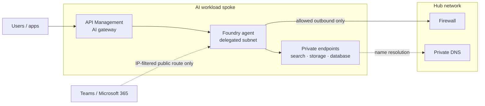

# Pillar 3: Cloud and Networking

> Part of the [six pillars](README.md). **Our stance:** private networking is where deployments break. Learn it properly, because "it works in my subscription" means nothing at the customer.

**Last verified:** 8 October 2026. Microsoft facts here are a summary of the [technical reference](../microsoft-technical-reference.md); if the two disagree, trust the reference and Microsoft Learn.

## In plain words

Enterprise customers don't run AI on the open internet. Their cloud is split into controlled zones, traffic goes through firewalls, services talk over private connections, and policies block anything that doesn't follow the rules. An FDE has to design within those rules, or the security team will (rightly) stop the project.

## Our stance 💬

1. **Assume private-only until told otherwise.** Designing for public endpoints and retrofitting privacy costs weeks.
2. **Private DNS is the most common failure.** When something "can't connect", check name resolution first.
3. **Put a gateway in front of every model.** It's where you enforce cost limits, logging and content safety.
4. **Design IP address space before deploying anything.** Some services can't change subnets after deployment.
5. **Fit into the customer's landing zone; don't build your own.** Their platform team owns the network. Make them allies.

## What you need to know

### Landing zones

A **landing zone** is the pre-built, policy-controlled area of a cloud where workloads go. A **platform landing zone** holds shared things (networking hub, identity, monitoring); **application landing zones** hold individual workloads. Learn what policies the customer's landing zone enforces before you design.

### Hub-and-spoke networks

Most enterprises use a central **hub** network (firewall, connections to on-premises, shared services) with **spoke** networks for workloads. Traffic between spokes and out to the internet goes through the hub's firewall. Your AI workload is one spoke.

### Private endpoints and private DNS

A **private endpoint** gives a cloud service (storage, search, AI models) an address inside your private network, so traffic never crosses the internet. For it to work, the service's name must resolve to that private address, which needs **private DNS** configured correctly across the hub, the spokes and on-premises resolvers. When this is wrong, connections fail with confusing errors.

### Controlling outbound traffic (egress)

Agents that browse the web or call external APIs need outbound access. Decide explicitly which destinations are allowed, and route the traffic through the firewall so it's logged.

### The gateway pattern

An **AI gateway** sits between applications and models. It handles authentication, per-team token limits, caching of repeated answers, content-safety checks, logging and routing between model deployments.

### Regions and data residency

Know where each component runs and where data is processed. Regulated customers often require data to stay in a country or region.

## On Microsoft

| Concept | Microsoft tool | Key facts | More |
|---|---|---|---|
| Landing zones | **Azure Landing Zone accelerator** | Azure Verified Modules (AVM) are the default starter; ⚠️ ALZ-Bicep "Classic" was removed from the accelerator on 16 Feb 2026 ([repo](https://github.com/Azure/ALZ-Bicep)) | [Phase 2](../microsoft-technical-reference.md#phase-2-azure-architecture--ai-landing-zones) |
| AI workload zone | **AI Landing Zones** | An application landing zone with an Agent Landing Zone and an AI Gateway Landing Zone, in Bicep and Terraform; may use preview services ([repo](https://github.com/Azure/AI-Landing-Zones)) | [Phase 2](../microsoft-technical-reference.md#phase-2-azure-architecture--ai-landing-zones) |
| Private agents | **Foundry Agent Service, standard setup with private networking** | Uses a delegated subnet, no public egress, and your own storage, search and database ([Learn](https://learn.microsoft.com/en-us/azure/foundry/agents/how-to/virtual-networks)). ⚠️ Resources must be in the VNet's region (models excepted), and the standard template doesn't route agent tools through the VNet ([template](https://github.com/microsoft-foundry/foundry-samples/blob/main/infrastructure/infrastructure-setup-bicep/15-private-network-standard-agent-setup/README.md)) | [Phase 2](../microsoft-technical-reference.md#phase-2-azure-architecture--ai-landing-zones) |
| Teams with private agents | **`enable_m365_public_endpoint`** | ⚠️ Microsoft 365 doesn't support private connectivity to agents. With public access disabled, you open only a source-IP-filtered route for the Activity Protocol ([Learn](https://learn.microsoft.com/en-us/azure/foundry/agents/how-to/publish-copilot-virtual-network)) | [Phase 2](../microsoft-technical-reference.md#phase-2-azure-architecture--ai-landing-zones) |
| AI gateway | **Azure API Management** | Governs model APIs, remote MCP servers and agent-to-agent APIs ([Learn](https://learn.microsoft.com/en-us/azure/api-management/genai-gateway-capabilities)). ⚠️ Semantic caching uses an external Redis cache connected by connection string, so access keys must be enabled ([Docs](https://docs.azure.cn/en-us/api-management/api-management-howto-cache-external)) | [Phase 2](../microsoft-technical-reference.md#phase-2-azure-architecture--ai-landing-zones) |

## Mistakes we keep seeing 💬

- Testing from a laptop on the corporate VPN, where DNS behaves differently from the workload's network.
- Discovering on go-live week that Teams publishing needs a public route the security team never approved.
- No gateway, so nobody can answer "which team spent US$40,000 on tokens last month?"
- A subnet too small for the agent service, which can't be resized later.

## Prove it

| Level | Project |
|---|---|
| Beginner | Deploy a web app and a database that talk only over a private endpoint, from code |
| Intermediate | Hub-and-spoke network with a firewall and private DNS; prove a service resolves to its private address from the spoke |
| Advanced | Deploy the AI Landing Zone with a private Foundry agent and API Management in front, with token limits and logging, then document the Teams publishing exception for a security review |

## Interview questions

1. A private endpoint is deployed but the app still can't connect. Walk through your troubleshooting.
2. The bank wants the agent in Teams but "nothing public". What do you tell them?
3. Why put a gateway in front of models, even for a prototype?
4. How do you plan IP address space for an AI workload?

## Skills for this pillar

[`access-request`](../../skills/access-request/SKILL.md) · [`adr`](../../skills/adr/SKILL.md) · [`go-live-readiness`](../../skills/go-live-readiness/SKILL.md) · [Regulated, private-only pack](../../skills/scenario-regulated-private/SKILL.md)

---

← [Pillar 2: Data](02-data.md) · Next: [Pillar 4: Security and identity](04-security-and-identity.md) →
