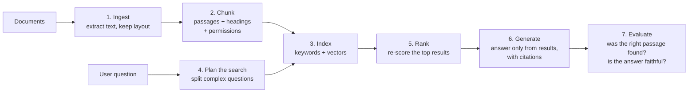
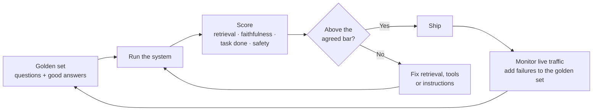

# Pillar 5: AI Applications

> Part of the [six pillars](README.md). **Our stance:** retrieval quality and evaluation matter more than which model you pick. Write the tests before you tune the prompt.

**Last verified:** 8 October 2026. Microsoft facts here are a summary of the [technical reference](../microsoft-technical-reference.md); if the two disagree, trust the reference and Microsoft Learn.

## In plain words

Most enterprise AI applications are one of three things: an assistant that **answers questions from company knowledge**, an agent that **takes actions** in company systems, or an agent that **answers questions about company data**. Building a demo of any of these takes a day. Making it right often enough, safe enough and cheap enough for daily use takes the rest of the engagement.

## Our stance 💬

1. **Start with one agent.** Multi-agent designs are fashionable, but most problems don't need them. Split into several agents only when one agent's instructions or tools become unmanageable.
2. **Fix retrieval before blaming the model.** When answers are wrong, the right document usually wasn't found.
3. **A golden set of test questions comes first.** Write 50–200 questions with the customer, agree what "good" means, and run them on every change.
4. **Narrow tools beat clever prompts.** A tool that can only do one specific thing is safer and easier for the model to use correctly.
5. **Measure cost and latency from day one.** A brilliant answer that takes 40 seconds and costs a dollar won't survive contact with users.

## What you need to know

### Choosing the shape

| Shape | What it does | Hardest part |
|---|---|---|
| **Knowledge assistant** | Answers questions from documents and cites them | Retrieval quality and permissions |
| **Action agent** | Updates records, sends messages, triggers workflows | Safety, approvals, error recovery |
| **Data agent** | Turns questions into queries over business data | Data modelling and correct numbers |

Each has a [scenario pack](../../skills/README.md#scenario-packs).

### Retrieval-augmented generation (RAG) in depth

- **Hybrid search** (keywords plus vector similarity) beats either alone for most enterprise content. Keywords catch product codes and names; vectors catch meaning.
- **Re-ranking** re-scores the top results with a stronger model and usually gives the biggest quality jump for the least effort.
- **Agentic retrieval** splits a complex question into several searches and merges the results. It's better for multi-part questions and slower for simple ones.
- **Citations** let users check answers and let you debug them.

### Agents and tools

An agent decides which tool to call, with what arguments, and what to do with the result. Design each tool like a public API: one clear purpose, typed inputs, validated arguments, a useful error message, and a required approval for anything that writes.

### Multi-agent patterns

| Pattern | Use when |
|---|---|
| **Sequential** | Each step builds on the last (extract → check → file) |
| **Concurrent** | Several independent views run in parallel and are combined |
| **Handoff** | A front-door agent passes the conversation to a specialist |
| **Group chat** | Agents work together in a shared, managed conversation |
| **Manager-led ("Magentic")** | A manager agent plans, assigns work to specialists and re-plans when stuck |

### Evaluation

Measure retrieval and generation separately. If the right passage wasn't retrieved, no prompt will fix the answer.

### Protocols

- **MCP (Model Context Protocol):** connects an agent to tools and data.
- **A2A (agent-to-agent):** lets agents built on different platforms call each other.
- **AG-UI:** streams an agent's progress, approvals and state to a user interface.

## On Microsoft

| Concept | Microsoft tool | Key facts | More |
|---|---|---|---|
| Building agents | **Microsoft Foundry Agent Service** | Four ways to build: prompt agents (no code), voice agents, hosted agents (your code in a container) and the Responses API for agents running elsewhere ([Learn](https://learn.microsoft.com/en-us/azure/foundry/agents/overview)). Hosted agents became generally available on 9 Jul 2026 ([Foundry blog](https://devblogs.microsoft.com/foundry/whats-new-in-microsoft-foundry-july-august-2026/)) | [Phase 4](../microsoft-technical-reference.md#microsoft-foundry-agent-service) |
| Agent code | **Microsoft Agent Framework** | 1.0 released 2 Apr 2026, combining Semantic Kernel and AutoGen; all five orchestration patterns above are 1.0 in Python and .NET ([MAF blog](https://devblogs.microsoft.com/agent-framework/agent-frameworks-orchestration-patterns-reach-1-0/)) | [Phase 4](../microsoft-technical-reference.md#microsoft-agent-framework-maf) |
| Document knowledge | **Foundry IQ** on Azure AI Search | Knowledge bases are generally available and permission-aware; built on agentic retrieval ([Foundry blog](https://devblogs.microsoft.com/foundry/build-smarter-agents-faster-with-foundry-iq/), [Learn](https://learn.microsoft.com/en-us/azure/search/agentic-retrieval-overview)) | [RAG blueprint](../microsoft-technical-reference.md#enterprise-rag-blueprint-azure) |
| Microsoft 365 knowledge | **Work IQ APIs** | Generally available 16 Jun 2026: grounds any agent in mail, meetings, files and Teams with the user's permissions; billed in Copilot Credits, 0.1 credit per tool call ([Learn](https://learn.microsoft.com/en-us/microsoft-365/copilot/extensibility/work-iq/api-overview), [licensing](https://www.microsoft.com/en-us/licensing/news/work-iq-general-availability)) | [Phase 4](../microsoft-technical-reference.md#work-iq-m365-context-for-any-agent) |
| Low code | **Copilot Studio** | Billed in Copilot Credits: generative answer = 2, agent action = 5, tenant graph grounding = 10 ([Learn](https://learn.microsoft.com/en-us/microsoft-copilot-studio/requirements-messages-management)). ⚠️ Agents using the GitHub Copilot harness consume credits that a Microsoft 365 Copilot licence doesn't cover ([Learn](https://learn.microsoft.com/en-us/power-platform/admin/manage-usage-github-copilot-harness)) | [Phase 4](../microsoft-technical-reference.md#copilot-studio--m365-copilot-extensibility) |
| Evaluation | **Foundry evaluators** | Agent evaluators work like pass/fail unit tests; Microsoft's example release bar is an 85% Task Adherence pass rate ([Learn](https://learn.microsoft.com/en-us/azure/foundry/observability/how-to/evaluate-agent)). ⚠️ When the agent uses the Azure AI Search tool, avoid the tool-call and groundedness evaluators and put retrieved content in the dataset as `context` instead ([Learn](https://learn.microsoft.com/en-us/azure/foundry/concepts/evaluation-evaluators/agent-evaluators)) | [Evaluation](../microsoft-technical-reference.md#evaluation--agentops) |

## Mistakes we keep seeing 💬

- Changing the model to fix answers that were wrong because retrieval failed.
- A five-agent design for a problem one agent with three tools would solve.
- No golden set, so every change is judged by "it feels better".
- Tools with vague descriptions, so the model picks the wrong one.
- Ignoring cost until the first monthly bill arrives.

## Prove it

| Level | Project |
|---|---|
| Beginner | A RAG chatbot over 50 PDFs that cites sources, plus a 50-question golden set with a score |
| Intermediate | Add hybrid search and re-ranking; show the retrieval score before and after |
| Advanced | An action agent with two read tools and one approved write tool, traced end to end, with an evaluation gate in the deployment pipeline |

## Interview questions

1. An answer is wrong. How do you tell whether retrieval or generation failed?
2. When would you use several agents instead of one?
3. How do you choose the threshold for releasing an AI system?
4. Copilot Studio or Foundry for this use case? Defend your answer on cost, ownership and skills.

## Skills for this pillar

[`eval-plan`](../../skills/eval-plan/SKILL.md) · [`ai-use-case-canvas`](../../skills/ai-use-case-canvas/SKILL.md) · [`cost-model`](../../skills/cost-model/SKILL.md) · [Knowledge assistant pack](../../skills/scenario-knowledge-assistant/SKILL.md)

---

← [Pillar 4: Security and identity](04-security-and-identity.md) · Next: [Pillar 6: Consulting and delivery](06-consulting-and-delivery.md) →
