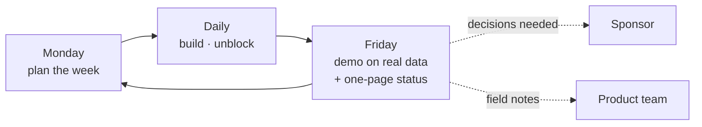

# Pillar 6: Consulting and Delivery

> Part of the [six pillars](README.md). **Our stance:** discovery and handover decide success more than the build does. The best code in the world fails if it solves the wrong problem or nobody owns it after you leave.

## In plain words

An FDE works with executives who sponsor the project, security and architecture teams who can block it, platform teams who'll run it, and end users who'll decide whether it's any good. The consulting pillar is the set of habits that keeps all of them pulling in the same direction: finding the real problem, agreeing what success looks like, showing progress, managing risk, and leaving the customer able to run it alone.

## Our stance 💬

1. **"We want an AI agent" is not a requirement.** Keep asking why until you reach a number the sponsor cares about.
2. **Agree exit criteria before you build.** Quality bar, security sign-off and a named owner, in writing.
3. **Demo every week, on real data.** Weekly demos replace status reports and surface problems early.
4. **Say no to scope early and kindly.** Every "small extra" competes with the thing that matters.
5. **Be honest about trade-offs, including your employer's products.** Customers remember the engineer who told them the truth.
6. **Write your field notes for the product team.** A clear "this broke, here's why, here's what customers need" is the most valuable thing you produce.

## What you need to know

### Discovery

- **The five whys:** ask "why?" until you reach a business outcome. "We want a chatbot" → "to answer policy questions" → "because the help desk is overloaded" → "because wait times cost us customer complaints" → **target: cut policy tickets by 30%**.
- **Interview users, not just sponsors.** Watch someone do the task today. The workarounds tell you more than the requirements document.
- Use [`discovery-interview.md`](../../templates/discovery-interview.md).

### The stakeholder map

| Role | Typically | What they need from you |
|---|---|---|
| **Sponsor** | Chief information, data or digital officer, or a business leader | Evidence of business value, no surprises |
| **Likely blocker** | Security, risk, architecture review board | Early involvement, a threat model, clear answers |
| **Operator** | Platform or IT operations team | Something they can run: runbooks, monitoring, code they understand |
| **End users** | The people doing the work | Something that actually saves them time |

Use [`stakeholder-map.md`](../../templates/stakeholder-map.md).

### Scoping and success measures

A good scope fits on one page: the problem, who it's for, the success measure, what's in, what's explicitly out, and the exit criteria. The [`ai-use-case-canvas.md`](../../templates/ai-use-case-canvas.md) is that page.

### Cadence

Use [`weekly-status.md`](../../templates/weekly-status.md): what we showed, what changed, risks, decisions needed. Keep it to one page.

### Commercials

You don't negotiate contracts, but you must explain running costs simply. Customers cancel projects late over cost surprises. Be able to show, on one slide, what the solution will cost per month at expected usage, and what drives it. Use [`cost-model.md`](../../templates/cost-model.md).

### Managing risk

Keep a short risk list with an owner and a mitigation for each. Common FDE risks: access delays, data quality, preview features, security review timing, a missing owner after handover.

### Handover

Handover starts in week one, not the last week. By the end, the customer needs:

- a **runbook** for operating and fixing the system;
- a **RACI** (who is Responsible, Accountable, Consulted, Informed);
- the **evaluation baseline**, so they can tell if quality drops;
- a **backlog** of next steps, ranked;
- **a named owner** who has already operated the system without you.

Use [`runbook.md`](../../templates/runbook.md) and [`handover.md`](../../templates/handover.md).

### Feeding back to the product

Write field notes as product feedback: what the customer tried, what broke, the workaround, how often you've seen it, and what would fix it. This is what turns one engagement's pain into every future customer's improvement.

## On Microsoft

| Concept | Microsoft angle | Key facts | More |
|---|---|---|---|
| Outcome focus | **Microsoft Frontier Company** | Describes its engagements as co-designing and continuously improving AI systems "based on measurable business outcomes" ([Microsoft](https://blogs.microsoft.com/blog/2026/07/02/microsoft-frontier-company-ai-engineering-that-amplifies-and-protects-your-intelligence/)) | [Role research](../fde-role-and-market.md#-the-microsoft-fde-persona) |
| Planning documents | **HVE Core project-planning agents** | Agents that draft business and product requirements, architecture decision records and meeting analyses; backlog agents for Azure DevOps, GitHub and Jira with a dry-run mode ([HVE catalog](https://microsoft.github.io/hve-core/docs/agents/)) | [Phase 5](../microsoft-technical-reference.md#phase-5-hyper-velocity-engineering-hve--rpi) |
| Cost conversations | **Licences and meters** | Explain Fabric capacity, Copilot Credits, Agent 365 (per user) and Foundry consumption together; each is billed differently ([Agent 365 FAQ](https://www.microsoft.com/licensing/faqs/122), [Copilot Studio billing](https://learn.microsoft.com/en-us/microsoft-copilot-studio/requirements-messages-management)) | [Phase 6](../microsoft-technical-reference.md#phase-6-the-consulting-mindset) |

## Mistakes we keep seeing 💬

- Starting to build before anyone agreed what success means.
- Meeting the security team for the first time in the go-live week.
- A handover document written in the last two days, which nobody reads.
- Hiding a slipping deadline instead of raising it with options.
- Promising a preview feature will be ready by go-live.

## Prove it

| Level | Project |
|---|---|
| Beginner | Interview someone about a task they find tedious, and write a one-page problem statement with a measurable target |
| Intermediate | Run a mock two-week engagement: discovery, weekly demo, status note, risk list |
| Advanced | Hand a system to someone who didn't build it, and watch them fix a simulated incident using only your runbook |

## Interview questions

1. The sponsor says "we need an AI agent". What do you ask next?
2. Your project will miss its date by two weeks. How do you tell the sponsor?
3. The architecture board rejects your design in week eight. What would you have done differently?
4. How do you know a handover has succeeded?

## Templates for this pillar

[`discovery-interview.md`](../../templates/discovery-interview.md) · [`stakeholder-map.md`](../../templates/stakeholder-map.md) · [`weekly-status.md`](../../templates/weekly-status.md) · [`cost-model.md`](../../templates/cost-model.md) · [`handover.md`](../../templates/handover.md)

---

← [Pillar 5: AI applications](05-ai-applications.md) · [Pillars index](README.md)
