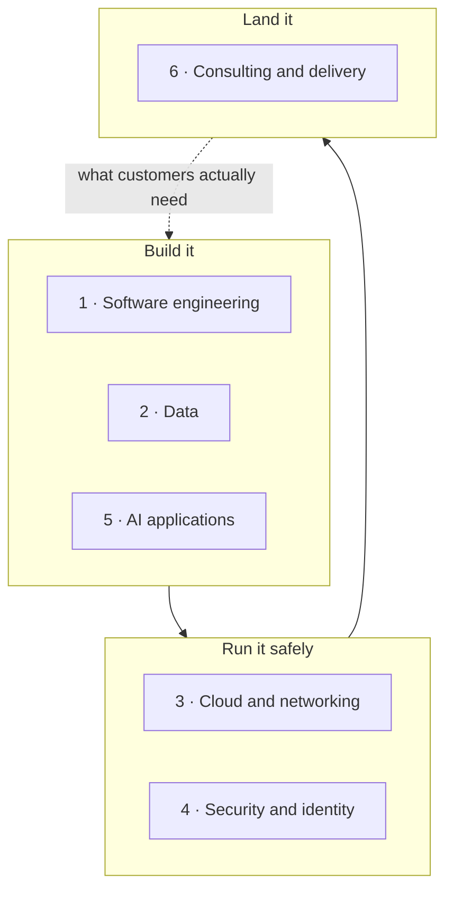

# The Six Pillars

> Part of the [Awesome Microsoft FDE](../../README.md) guide. Each page goes deep on one skill area. Every page has the same layout: the idea in plain words, **our stance**, the concepts you must understand, how it works on Microsoft, the mistakes we keep seeing, projects to prove the skill, interview questions, and the templates that go with it.

Facts link to their sources. Anything marked 💬 is opinion.

| # | Pillar | Our stance in one line |
|---|---|---|
| 1 | [Software engineering](01-software-engineering.md) | Production habits beat clever code |
| 2 | [Data](02-data.md) | Every AI project is a data project in disguise |
| 3 | [Cloud and networking](03-cloud-and-networking.md) | Private networking is where deployments break, so learn it properly |
| 4 | [Security and identity](04-security-and-identity.md) | Every agent gets its own identity and the least access it needs |
| 5 | [AI applications](05-ai-applications.md) | Retrieval and evaluation matter more than which model you pick |
| 6 | [Consulting and delivery](06-consulting-and-delivery.md) | Discovery and handover decide success more than the build does |

💬 **Go deep in one or two, be competent in all six.** The FDEs customers ask for by name usually pair AI applications with one "hard" pillar: security, data or networking.
