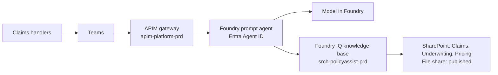

# Runbook: Harbourline Policy Assistant

> **Worked example.** A filled-in [`runbook`](../../skills/runbook/SKILL.md) for a fictional engagement; see [examples](../README.md). Everything below, including names, resources and scripts, is invented. Microsoft product facts follow the [technical reference](../../docs/microsoft-technical-reference.md); check it before relying on them.

**Owner:** S. Adeyemi (Platform team lead) · **On-call / support group:** Platform on-call rota, Teams channel "Platform – On-call" · **Last tested:** week 8 walkthrough by a platform engineer, simulated bad re-index (see [go-live readiness](go-live-readiness.md)); full on-call drill scheduled for week 10 ([handover](handover.md)) · **Repository:** `policy-assistant`

## What it is

The Policy Assistant answers claims handlers' questions about current claims and underwriting policies in Teams, citing the policy it used. About 900 Motor and Property handlers use it. It only reads; it changes nothing ([ADR-004](adr-004-read-only.md)). If it's down, handlers go back to searching SharePoint and the file share by hand: slower (a median of 22 minutes per complex claim before go-live), but nothing breaks. **A wrong answer is worse than no answer:** if in doubt, use the kill switch.

## Where things are

| Component | Resource / location | Dashboard | Logs |
|---|---|---|---|
| Gateway | `apim-platform-prd`, API `policy-assistant` | "Policy Assistant – Gateway" workbook | Log Analytics `log-platform-prd`, gateway logs |
| Agent and model | Foundry project `fp-policyassist-prd` | Foundry tracing view | Application Insights `appi-policyassist-prd` |
| Knowledge base and index | `srch-policyassist-prd` (production), `srch-policyassist-tst` (test) | Indexer run history in the portal; "Policy Assistant – Index" workbook | Search diagnostic logs to `log-platform-prd` |
| Teams publishing | Bot registration `bot-policyassist-prd` | n/a | Gateway logs |
| Pipelines | `deploy`, `reindex`, `evaluate`, `kill-switch` in the repository | Pipeline run history | Pipeline logs |
| Golden set and evaluation | `eval/golden-set.jsonl`, `eval/pricing-lowpriv.jsonl` | Results log in [eval-plan.md](eval-plan.md#results-log) | Pipeline artefacts |
| Saved log queries | `ops/queries/` (also saved in `log-platform-prd`) | n/a | n/a |

## Routine operations

| Task | How often | Steps / command | Who |
|---|---|---|---|
| Deploy a new version | On merge to `main` | Run pipeline `deploy`. It runs the full evaluation and the pricing test in test, and stops if either is below the bar | Platform engineer |
| Run the evaluation set | Before each release and after each re-index | Pipeline `evaluate`, `env=test` or `env=prd`. Pass bar in [eval-plan.md](eval-plan.md#metrics-and-release-bar) | Automatic; on-call reads the result |
| Refresh / re-index knowledge | Nightly incremental (automatic); monthly full | [Re-index procedure](#re-index-procedure) below. **Never re-index production first** | Platform on-call |
| Rotate or review access | Quarterly | Export role assignments for the agent identity and indexer; compare with [threat model](threat-model.md#3-identities-and-permissions) section 3; J. Tan signs | Platform engineer, J. Tan |
| Review cost against budget | Monthly | Compare the budget report with the [cost model](cost-model.md); send to K. Brennan | S. Adeyemi |
| Add production failures to the golden set | Weekly, Tuesday | Triage the Teams feedback-button reports; real failures become cases through a pull request approved by M. Costa | Platform engineer, M. Costa |
| Red-team scan | Monthly and after every full re-index | Pipeline `redteam` against test ([red-team.md](red-team.md)) | Platform engineer |

## Re-index procedure

Added after the week-6 incident, when a scheduled re-index went straight into the pilot index and brought in five legacy Motor copies ([incident review](incident-review.md)). Every step must pass before the next.

1. Run pipeline `reindex` with `env=test` and the source (`claims`, `underwriting`, `pricing`, `fileshare` or `all`).
2. **Indexer health:** zero failed documents; document count within 5% of the last run. A bigger jump means a folder was added or permissions changed: stop and ask the source owner.
3. **Duplicate-version check:** `python scripts/check_duplicate_versions.py --env test`. It lists any policy reference with more than one indexed document, and any file-share document that matches a SharePoint document by policy reference or normalised title and isn't on A. Novak's allow-list (`ingestion/fileshare-allowlist.csv`). **It must report zero.** If not, send the list to A. Novak; don't edit the allow-list yourself. File-share documents with neither a policy reference nor a title match are held out of the index for A. Novak's review. The rule is in [ADR-003](adr-003-current-version-only.md), amendment 1 (week 6).
4. **Evaluation:** pipeline `evaluate`, `env=test`. All metrics at or above the bar, including the eight incident cases GS-121 to GS-128.
5. **Low-privilege pricing test:** pipeline `evaluate`, `suite=pricing-lowpriv`. Runs 25 pricing questions as `svc-eval-lowpriv`. **Zero Pricing-site document IDs** in any retrieved set. Any hit: stop, keep production on the old index, and call L. Moreau and G. Patel. This is the oversharing finding coming back.
6. Approve the `prd` stage of the pipeline. It won't start without the run ID of a passing evaluation from step 4: re-indexing is gated like a release. It re-indexes production and repeats steps 2, 3 and 5 there automatically.
7. Record the run in the results log in [eval-plan.md](eval-plan.md#results-log).

## Urgent document removal

For a document that must stop being used now: a superseded version, something shared by mistake, or hostile text. This is how the week-6 incident was contained: five legacy Motor copies removed at 08:15 on the Wednesday, about 40 hours after the re-index that added them.

1. Find the document IDs: [reconstruct a request](#reconstruct-a-request-from-logs) that cited it, or `python scripts/show_document.py --search "<title>"`.
2. Remove them from the production index straight away: `python scripts/remove_document.py --env prd --doc-id <id>` (repeat per ID). Run the same on test.
3. Fix the source, or the next nightly run adds it back: the file-share owner moves it to the excluded `archive` folder; L. Moreau removes or restricts it on SharePoint; A. Novak sets `Status` if it's a version problem.
4. Run saved query `answers-citing-document` with the IDs to list every answer that cited them, and who got it. Send the list to D. Whitfield and M. Costa so the quality team can check affected claims (in week 6: 14 answers, one claim corrected before settlement).
5. Run the evaluation and the low-privilege pricing test on production. Add a golden-set case if the document caused a wrong answer.
6. Tell the users who got affected answers, through their team leader.

## Health checks

| Signal | Normal | Alert threshold | Dashboard |
|---|---|---|---|
| Error rate (gateway 5xx) | Under 0.5% | Over 2% for 10 minutes | Gateway workbook |
| p95 latency | 6.5 to 7.5 s | Over 8 s for 30 minutes (the release bar) | Gateway workbook |
| Token spend per day | About 1/21 of the monthly budget on working days | **Spend above 80% of the monthly budget** | Cost Management budget |
| Content-safety blocks | Under 5 an hour | **More than 20 an hour** | Gateway workbook |
| Requests from outside the allowed IP ranges | Zero | **Any** | Gateway workbook |
| Evaluation score (scheduled weekly on 50 production questions) | Correctness about 89% | Below the [handover baseline](handover.md#evaluation-baseline) alert line | Results log |
| Nightly indexer | Succeeds by 03:00 | Failed or not finished by 06:00 | Index workbook |

## Incidents

| Symptom | Likely cause | Check | Fix |
|---|---|---|---|
| Users get errors | Per-user token limit hit, model quota, expired Bot Service or role assignment | Gateway logs by status code; Foundry project quota | 429 for one user: expected throttling, tell them. 429 for many: raise quota or check for a loop. 401/403: compare role assignments with the last access review |
| **Answer cites a superseded policy** (week 6) | A re-index added a legacy duplicate with no `Status`; a source owner changed `Status`; a new duplicate outside the allow-list | [Reconstruct the request](#reconstruct-a-request-from-logs): are two versions in the retrieved set? Run the duplicate-version check on production | [Urgent document removal](#urgent-document-removal) for the superseded copy; A. Novak confirms the current version. Kill switch only if many policies are affected. Add the question to the golden set |
| Answers suddenly worse across the board | Failed or partial index refresh; changed source documents; model version change | Scheduled evaluation; indexer run history; model deployment version | Roll back the last change ([rollback](#rollback)); if it was a re-index, re-run the [re-index procedure](#re-index-procedure) from step 1 |
| **More than 20 content-safety blocks an hour** | One user testing the limits; a document whose text trips the filter; a filter change | Saved query `content-safety-by-user`: blocks grouped by caller and by retrieved document | One user: tell security operations and their team leader. One document: ask the source owner; remove it if it's hostile. Many users and no pattern: check for a gateway policy change |
| **Request from outside the allowed IP ranges** | Microsoft changed its published ranges; a misconfigured test; someone probing the route ([ADR-006](adr-006-teams-public-route.md)) | Source address against the current published ranges | If Microsoft's ranges changed: update the allow list through the pipeline. Otherwise treat it as a security event: raise it with security operations and R. Okafor |
| **Spend above 80% of the monthly budget** | Traffic growth, a script calling the API, a loop | Saved query `tokens-by-caller`, last 7 days | One caller: lower their limit and find out why. Real growth: tell K. Brennan and update the [cost model](cost-model.md). Never switch off for cost alone without S. Adeyemi and K. Brennan agreeing |
| Pricing content appears for a non-pricing user | Pricing site permissions reverted | Low-privilege test; site permission report | **Kill switch immediately.** Call L. Moreau and G. Patel. Don't re-enable until step 5 of the re-index procedure passes |

## Reconstruct a request from logs

Needed when a handler or executive asks "where did this answer come from?" (it was the first question in week 6).

1. Get the time, the user and the Teams message, or the conversation ID from the feedback report.
2. Run saved query `reconstruct-request` in `log-platform-prd` with the user's Entra object ID and a 10-minute window. It returns the gateway correlation ID, the prompt, the response and the token counts.
3. Open the trace in `appi-policyassist-prd` using the correlation ID. The knowledge-base span lists the retrieved document IDs and their scores.
4. Look up each document ID in the index (`python scripts/show_document.py --doc-id <id>`): source path, `Status`, last modified date and version.
5. Write down which document was cited, whether it's the current version, and whether it should have been retrievable for that user. Retention follows what H. Ito agreed; after that, the request can't be rebuilt.

## Kill switch

Disable the API on the gateway. Handlers see "The Policy Assistant is paused. Please search the policy sites directly." in Teams.

- **Who may use it:** anyone on the platform on-call rota, S. Adeyemi, R. Okafor. No approval needed first; tell S. Adeyemi and D. Whitfield within 30 minutes.
- **How:** run pipeline `kill-switch` with `state=off`. It applies the maintenance policy (a fixed 503 response with the message above) to the `policy-assistant` API. If the pipeline is unavailable, paste `ops/policies/maintenance.xml` into the API's inbound policy in the portal and record the manual change.
- **Turn it back on:** `kill-switch` with `state=on`, only after the evaluation and the low-privilege pricing test pass on production. S. Adeyemi decides; for a pricing exposure, R. Okafor too.
- **Tested:** in the week-8 walkthrough (off and on again in under 10 minutes); again in the week-10 drill. Not needed in week 6: only five documents were wrong, so [urgent document removal](#urgent-document-removal) was faster and kept the pilot running.

## Rollback

- **Agent, instructions or gateway policy:** re-run pipeline `deploy` on the previous release tag. The evaluation still runs; if the previous tag no longer passes (because the index changed), use the kill switch and fix the index.
- **Index:** the test index holds the last passing state. Re-index production from the same source snapshot or remove the offending documents with `remove_document.py`. There's no instant index swap: that's why re-indexing goes through test first.

## Escalation

| Level | Who | When | Contact |
|---|---|---|---|
| 1 | Platform on-call | Any alert; any wrong-answer report | On-call rota |
| 2 | S. Adeyemi (Platform team lead) | Kill switch used; any incident lasting over 2 hours | Teams, then phone on the rota |
| Content | A. Novak (policy versions), L. Moreau (SharePoint permissions), G. Patel (any pricing exposure) | Wrong or overshared source document | Teams |
| Security | Security operations, then R. Okafor | IP alert, pricing exposure, suspected abuse | Security operations queue |
| Business | D. Whitfield; M. Costa for the handler message | Kill switch used, or a wrong answer reached a customer decision | Teams |
| Vendor | E. Marsh and T. Osei until handover (week 10); then a Microsoft support case | Product fault suspected | Engagement channel; support portal |
