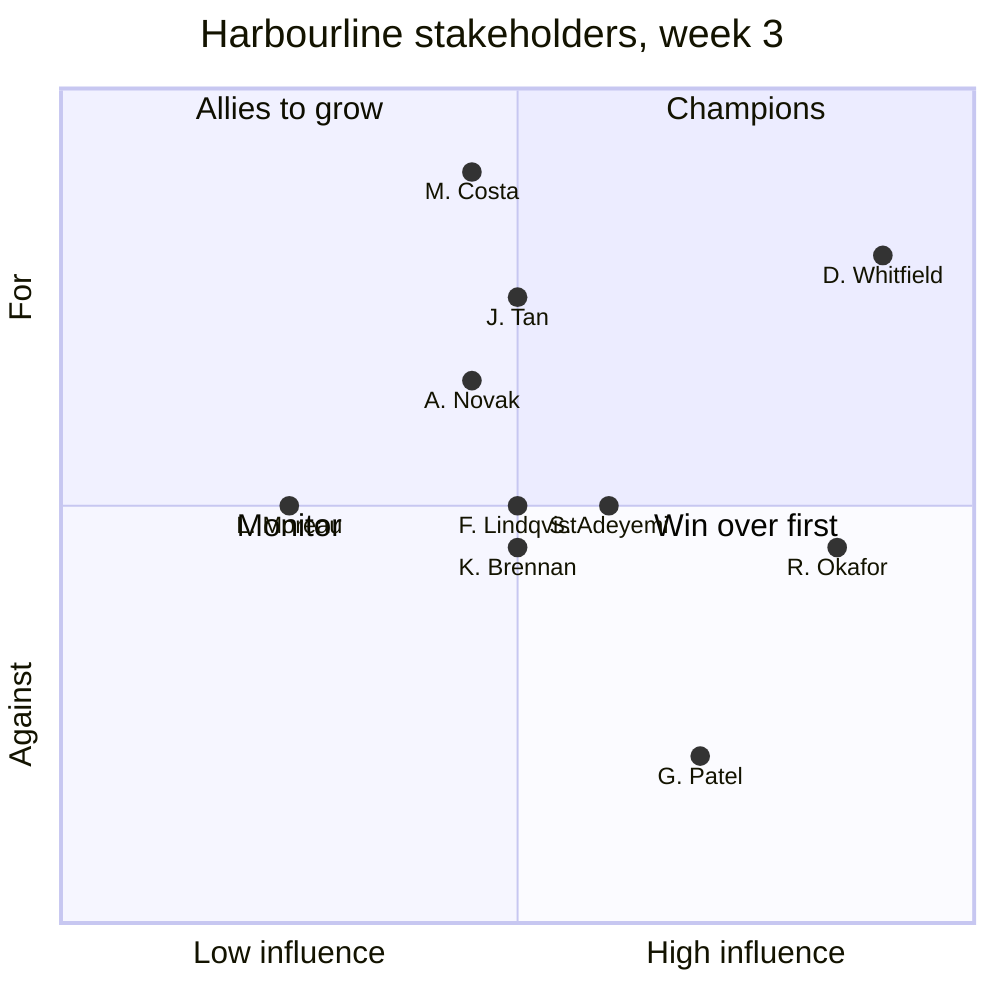

# Stakeholder Map: Harbourline Insurance / Policy Assistant

> **Worked example.** A filled-in [`stakeholder-map`](../../skills/stakeholder-map/SKILL.md) for a fictional engagement; see [examples](../README.md). Everything below, including names and systems, is invented. The skill produces two documents that live in different places. Both are shown here so you can see the difference in tone and content.

**Last updated:** week 3, day 5 (after the [scope reset](scope-reset.md)) · **Built from:** the [discovery interviews](discovery-interview.md) and the [kickoff](engagement-kickoff.md)

## Part 1: Customer repository (`docs/engagement/decisions-and-approvals.md`)

Shared with Harbourline. Anyone in the claims, security or platform teams can read it.

### Decisions and Approvals: Harbourline Insurance / Policy Assistant

| Decision | Who decides | Who must be consulted | Lead time |
|---|---|---|---|
| Scope and success measure | D. Whitfield (Head of Claims Operations) | M. Costa, A. Novak | Same week; signed in the [canvas](ai-use-case-canvas.md) |
| Architecture approval | R. Okafor (Security Architect), at the architecture review board | S. Adeyemi, J. Tan | Board meets fortnightly; papers due five working days before |
| Security sign-off and residual-risk acceptance | R. Okafor | J. Tan; D. Whitfield for the data-leakage risk | Two weeks from a complete [threat model](threat-model.md) |
| Exception to "no public endpoints" | R. Okafor | S. Adeyemi | One board cycle; recorded in [ADR-006](adr-006-teams-public-route.md) |
| Which policy version is current | A. Novak (Underwriting policy manager) | M. Costa for Motor claims | Next working day; the rule is in [ADR-003](adr-003-current-version-only.md) |
| Anything that indexes or exposes Pricing content | G. Patel (Head of Pricing) | L. Moreau (SharePoint administrator) | One week; conditional on the oversharing fix |
| SharePoint site permissions | L. Moreau | Site owners | Three working days per change |
| Entra roles and agent identity | J. Tan (Identity Lead) | R. Okafor | Two working days through the request form |
| Responsible AI and privacy sign-off | F. Lindqvist (Data Protection Officer) | D. Whitfield | Two weeks from a draft [impact assessment](responsible-ai-impact-assessment.md) |
| Log retention | H. Ito (Records manager) | F. Lindqvist, R. Okafor | One week |
| Production change | S. Adeyemi (Platform team lead), pipeline approval | R. Okafor for changes to the gateway or network | Weekly change window, Thursday |
| Budget for running costs | K. Brennan (IT Finance) | D. Whitfield | Monthly finance review; needs the [cost model](cost-model.md) |
| Go-live | D. Whitfield | R. Okafor, F. Lindqvist, S. Adeyemi | At the [go-live readiness](go-live-readiness.md) review |
| Customer-facing release (portal) | Compliance lead, with D. Whitfield | R. Okafor, F. Lindqvist | Not in release 1; see the [scope reset](scope-reset.md) |
| Owner after handover | S. Adeyemi (technical), D. Whitfield (business) | K. Brennan | Agreed in week 1; confirmed in the [handover](handover.md) |

The regulated and disconnected rows from the template are deleted: neither applies.

## Part 2: Internal only. Lives in the vendor's own engagement workspace

> ⚠️ **Not in Harbourline's repository or tenant.** This block is written to the delivery team's internal engagement notes, never to the customer's repository. It's reproduced here only to show what the internal half looks like. Written so it could be read aloud to the people in it: what each person needs, not opinions of their character.

### Stakeholder Map: Harbourline Insurance / Policy Assistant (internal)

> Internal to the delivery team. Don't copy into the customer's repository or tenant.

#### The map

| Name | Role | Type | Influence (H/M/L) | Support today (for / neutral / against) | What they need from us | How often we meet |
|---|---|---|---|---|---|---|
| D. Whitfield | Head of Claims Operations | Sponsor | H | For, but pushing for more scope than one quarter can carry | Evidence the audit number will move; a clear "not yet" on the portal with reasons they can take upwards | Weekly demo; 15 minutes before each status |
| R. Okafor | Security Architect | Likely blocker (security) | H | Neutral. Supportive of the design, wary of the Teams public route after a previous rejected chatbot | The threat model early and often; compensating controls they can test themselves; no surprises at the board | Fortnightly review, plus ad hoc |
| G. Patel | Head of Pricing | Likely blocker (data owner) | H for Pricing, L otherwise | Against until the Pricing oversharing is fixed; not interested in the assistant itself | Proof that no pricing draft reaches a non-pricing user, re-run after every re-index | As needed; results sent after each run |
| J. Tan | Identity Lead | Approver | M | For. Keen to use Entra Agent ID as a pattern for other teams | A clean identity design they can reuse; credit for it | Fortnightly |
| S. Adeyemi | Platform team lead | Operator | M, rising to H at handover | Neutral. Supportive, but carries the on-call load afterwards and has been left with unmaintainable systems before | Bicep, Python, tests, a runbook; pairing from week 4 so nothing is new at handover | Fortnightly; weekly from week 6 |
| M. Costa | Motor claims team leader | End user and subject-matter expert | M (credible with handlers) | For. Our strongest champion | Their 20 questions answered correctly; recognition as co-author of the golden set | Weekly demo |
| A. Novak | Underwriting policy manager | Data owner | M | For, cautiously. Worried the assistant will expose how messy Claims Policy versioning is | A version rule they agree with and own; nothing indexed as current without their say | Weekly during weeks 2–6 |
| L. Moreau | SharePoint administrator | Approver | L | Neutral. Busy; the Pricing fix is one of many tickets | A precise, small change request with a test we run for them | As needed |
| F. Lindqvist | Data Protection Officer | Approver | M | Neutral. Wants specifics, not reassurance | Retention periods in writing; where Teams stores responses | Weeks 2, 5 and 7 |
| K. Brennan | IT Finance | Budget owner | M | Neutral. Has seen AI pilots with no running-cost estimate | A cost model with a range and the levers that change it | Weeks 2 and 8 |
| Compliance lead | Compliance (met week 3) | Approver for any customer-facing release | M | Neutral. Clear that a policyholder-facing answer is customer communication | Early sight of anything that could reach policyholders; informed only for release 1 | Informed fortnightly; approver for the portal backlog item |
| H. Ito | Records manager | Approver | L | Neutral | A retention period to approve | Once, week 3 |
| Product engineer | Vendor product team | Product team (our side) | L at Harbourline | For | [Field feedback](field-feedback.md) on the Teams citation gap and indexing behaviour | Fortnightly |

**Moves since week 1.** D. Whitfield dropped from 0.9 to 0.8 on support after the [scope reset](scope-reset.md) took the portal and all-staff access out of release 1; they agreed, but it cost goodwill. Plan: show the Motor pilot numbers in week 5 so the reset reads as a sequence, not a refusal. G. Patel is the only "against", and the reason is specific and fixable. Once L. Moreau's fix is confirmed and the low-privilege test passes, expect neutral.

**People we haven't met.** The architecture review board chair (who signs the ADR-006 exception alongside R. Okafor) and the quality team lead who runs the audit. The audit is our success measure, so we need them before go-live. Owner: E. Marsh, by week 4.

## Scenario add-ons

- **Regulated / disconnected:** don't apply. there's no sovereignty requirement, and "no public endpoints" is Harbourline's own security standard rather than a regulatory mandate. The one exception to it is handled in [ADR-006](adr-006-teams-public-route.md).
