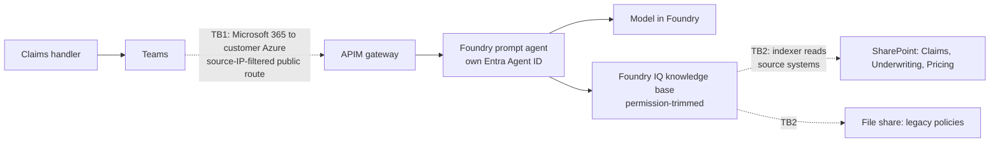

# Threat Model: Harbourline Policy Assistant

> **Worked example.** A filled-in [`threat-model`](../../skills/threat-model/SKILL.md) for a fictional engagement; see [examples](../README.md). Everything below, including names and systems, is invented. Microsoft product facts follow the [technical reference](../../docs/microsoft-technical-reference.md); check it before relying on them.

**Version:** 0.3 (draft for the second security review) · **Date:** week 2, day 4 · **Reviewed with (security):** R. Okafor (Security Architect), J. Tan (Identity Lead)

## 1. What are we protecting?

| Asset | Why it matters | Classification |
|---|---|---|
| Customer data the agent reads | Claims and underwriting policies. One site also holds draft pricing guidance that only the pricing team may see | Internal; pricing drafts Confidential |
| Systems the agent can change | None. The assistant only reads. Recorded in ADR-004 | n/a |
| The agent's identity and credentials | An Entra Agent ID with read access to the search index; if stolen, it could query every indexed document | Confidential |
| Cost (model and tool usage) | 4,000 potential users; an unbounded loop or abuse could exhaust the monthly AI budget | Internal |

## 2. How the system works

Handlers ask in Teams. Requests go through the APIM gateway to a Foundry prompt agent, which queries a Foundry IQ knowledge base built on Azure AI Search. The index is filled from three SharePoint sites and one file share. Trust boundaries are the dashed lines.

- **TB1:** Teams publishing needs a source-IP-filtered public route, because Microsoft 365 can't connect to agents privately. Security accepted this in ADR-006 with the compensating controls in section 4.
- **TB2:** the indexer reads source documents with their access-control lists, so search results are trimmed to what the asking user can open.

## 3. Identities and permissions

| Tool / data source | Acts as itself or on behalf of user? | Permissions granted | Least privilege? | Approval needed? |
|---|---|---|---|---|
| Knowledge base query | On behalf of the user: results trimmed to the user's document permissions | Search index read | Yes | No (read only) |
| Indexer to SharePoint | Itself (managed identity) | Read on the three sites, including permissions metadata | Yes; site-scoped, not tenant-wide (ADR-005) | Granted once by the SharePoint admin |
| Indexer to file share | Itself (managed identity) | Read on the `published` folder only | Yes; the `drafts` folder is excluded | Granted once by the file-share owner |
| Model call | Itself (Entra Agent ID, keyless) | Foundry Agent Consumer on the project | Yes | No |
| Write tools | None | None | n/a | n/a |

## 4. Threats

| Threat | Applies? | How it could happen here | Defence | Tested how | Residual risk |
|---|---|---|---|---|---|
| Direct prompt injection (user tries to override rules) | Yes | A handler asks the agent to ignore its rules and reveal pricing drafts | Instructions refuse; permission trimming means pricing content is never retrieved for non-pricing users anyway | 40 jailbreak prompts in the red-team run; pass bar is zero pricing-draft content returned | Low. Accepted by R. Okafor |
| Indirect prompt injection (hostile text inside documents, emails or web pages) | Yes | Someone with edit rights adds hidden instructions to a policy document | Only the three published sites and the published folder are indexed; content safety on the gateway; no write tools, which limits the blast radius | Seeded test document with hidden instructions in the test index; the agent must ignore them | Low. Accepted by R. Okafor |
| Excessive agency (more tools or permissions than needed) | No | The agent has no write tools | Doesn't apply: recorded in ADR-004. Revisit if an action is ever added | Tool list checked in the go-live review | None |
| Data leakage (answers include data the user shouldn't see) | Yes, **highest risk** | The oversharing assessment found the Pricing site open to "Everyone except external users" | Pricing site permissions fixed **before** indexing (owner: SharePoint admin); permission-trimmed retrieval | Low-privilege test user runs 25 pricing questions; pass bar is zero pricing content. Repeated after every re-index | Medium until the permission fix is confirmed, then low. Accepted by the Head of Claims Operations |
| Tool misuse (harmful arguments to a tool) | No | The only tool is a read-only search | Doesn't apply: no tool takes arguments that change anything | n/a | None |
| Unbounded cost (loops, abuse) | Yes | A script or a user sends thousands of requests | Per-user token limit and a monthly budget alert on the gateway | Load test at 10× expected traffic; confirm throttling and the alert fire | Low. Accepted by IT Finance |
| Identity misuse (stolen or over-privileged credentials) | Yes | Agent credentials used outside the agent | Keyless Entra sign-in only, with keys disabled; Entra Agent ID with one role | A call with an API key fails; access review in the runbook | Low. Accepted by J. Tan |
| Missing audit trail (can't reconstruct what happened) | Yes | A wrong answer reaches an executive and nobody can say which documents were used | Gateway logs every request; tracing records retrieved document IDs; retention agreed with records management | Pick one request from the test run and reconstruct it end to end from the logs | Low |
| Supply chain (untrusted models, packages, MCP servers) | Partly | A third-party package in the ingestion script | Model from the Foundry catalogue only; no MCP servers; packages pinned and scanned in CI | CI dependency scan passes | Low |

## 5. Detection and response

- **Where security signals go:** gateway and Foundry logs to the customer's Log Analytics workspace, read by their security operations team. Agent coverage in Defender depends on Agent 365 licensing, which is still being confirmed (open action, owner J. Tan).
- **What triggers an alert:** more than 20 content-safety blocks an hour; any request from outside the allowed IP ranges; spend above 80% of the monthly budget.
- **Kill switch:** disable the API on the gateway. Platform on-call can do it, and the runbook has the steps.

## 6. Red-team plan

- **Before launch:** the AI Red Teaming Agent against the test deployment, plus the 40 manual jailbreak prompts and 25 low-privilege pricing questions above. Success measure: zero pricing-draft content returned, and an attack success rate below the bar agreed with R. Okafor.
- **After launch:** a scheduled scan every month and after every re-index. Owner after handover: Platform team lead.

## Scenario add-ons

- **Knowledge assistant:** oversharing review done for all three sites. Pricing site permissions are being fixed before indexing. The low-privilege test user has no access to Pricing; the test results are attached to the go-live readiness review.
