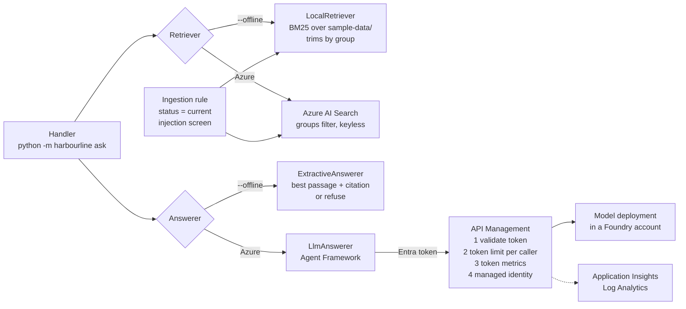

# Harbourline policy assistant: reference implementation

> **Teaching reference, not production code.** This is the fictional Harbourline policy assistant from the [worked examples](../../examples/README.md), as a small codebase you can run, read and break. It is community code, **not official Microsoft code**, and Microsoft doesn't support it. Product facts follow the [technical reference](../../docs/microsoft-technical-reference.md); check it before relying on them.

Claims handlers ask a policy question; the assistant answers only from the current policy documents they're allowed to see, cites the document, or says it doesn't know. It changes nothing.

## What it demonstrates

Two of the guide's [beliefs](../../README.md#-what-we-believe), in code rather than slides:

| Belief | Where it lives |
|---|---|
| "Write the tests for the AI's answers before you tune the prompt." | [`evals/`](evals/): 27 golden cases, a scorer, a release bar in [`thresholds.json`](evals/thresholds.json), and a [CI workflow](../../.github/workflows/reference-evals.yml) that fails the pull request below the bar. It runs offline, so it runs on every change. |
| "Put a gateway in front of every model from day one." | [`infra/apim-policy.xml`](infra/apim-policy.xml): the app never holds model access. API Management checks the caller's Entra token, applies a per-caller token limit, emits token metrics, then calls the model with its own managed identity. |

And three lessons from the engagement, each with a test:

- **Index only the current version** ([ADR-003](../../examples/knowledge-assistant/adr-003-current-version-only.md)). A document with *no* status is left out, not let in. That gap caused the [week-6 incident](../../examples/knowledge-assistant/incident-review.md), and [`tests/test_corpus.py`](tests/test_corpus.py) keeps it closed.
- **Trim permissions in retrieval, not in the prompt** ([threat model](../../examples/knowledge-assistant/threat-model.md#4-threats)). A low-privilege user's search never returns the pricing draft, so no jailbreak can leak it. The golden set probes this and has a positive control: a pricing user *can* see it.
- **No keys.** Every call uses Entra tokens. Keys are disabled on Azure AI Search, the Foundry account and Application Insights.

## Architecture



The same ingestion rule ([`corpus.py`](src/harbourline/corpus.py)) feeds both retrievers, so the offline eval and the cloud index can't disagree about which version is current. Both answerers follow one contract: cite a retrieved document, or refuse. An answer whose citations don't match a retrieved document is turned into a refusal ([`answering.py`](src/harbourline/answering.py)).

💬 The [examples](../../examples/README.md) use a Foundry prompt agent and a Foundry IQ knowledge base (ADR-001, ADR-002). This reference uses a few lines of Agent Framework code and a plain search index instead, so every moving part is visible and the gate runs without a cloud. The evaluation approach carries over unchanged.

## Prerequisites

- Python 3.11 or later.
- For Azure: an Azure subscription where you can create resources and role assignments (Owner, or Contributor plus User Access Administrator), the [Azure Developer CLI](https://learn.microsoft.com/en-us/azure/developer/azure-developer-cli/install-azd), and the [Azure CLI](https://learn.microsoft.com/en-us/cli/azure/install-azure-cli).

## Quickstart: offline, no Azure

```bash
cd reference/knowledge-assistant
python -m venv .venv && source .venv/bin/activate
pip install -e ".[dev]"

pytest -q                          # unit tests
python evals/run_evals.py          # the evaluation gate; exits non-zero below the bar
python -m harbourline corpus       # what is indexed, what is left out, and why
python -m harbourline ask --offline "What is the excess for a windscreen replacement?"
python -m harbourline ask --offline "What base rate increase is proposed in the motor rate review?"
python -m harbourline ask --offline --groups all-staff,pricing "What base rate increase is proposed in the motor rate review?"
```

The last two show permission trimming: the same question is refused for a handler and answered for a pricing user.

## Quickstart: Azure

```bash
pip install -e ".[azure,dev]"
az login                 # DefaultAzureCredential uses this identity for the gateway and search
azd auth login
azd up                   # provisions infra/, then the postprovision hook runs `python -m harbourline index`

set -a; eval "$(azd env get-values)"; set +a   # load the outputs into this shell
python -m harbourline ask "What is the excess for a windscreen replacement?"
python evals/run_evals.py --retriever azure --answerer llm           # same gate, real model
python evals/run_evals.py --retriever azure --answerer llm --judge   # adds an LLM faithfulness check
```

`azd up` asks for an environment name, subscription and region. Pick a region where your model is available as a Global Standard deployment, or change `modelName`, `modelVersion` and `modelCapacity` in [`infra/main.bicep`](infra/main.bicep).

Sign in to the Azure CLI and the Azure Developer CLI as the same person. The gateway accepts tokens only from the app's managed identity and from the person who ran `azd up` (their object ID is in the policy), and `DefaultAzureCredential` tries the Azure CLI before the Azure Developer CLI.

What gets deployed:

| Resource | Why | Keyless? |
|---|---|---|
| Log Analytics and Application Insights | Gateway logs, token metrics, the audit trail | Application Insights local auth off; the gateway sends with its managed identity |
| Azure AI Search (Basic) | The index, with a `groups` field for trimming | `disableLocalAuth: true` |
| Foundry account, project and model deployment | The model | `disableLocalAuth: true` |
| API Management (Basic v2) | The AI gateway | Callers use Entra tokens; no subscription keys |
| User-assigned managed identity | What the assistant runs as once you host it | n/a |
| Role assignments | Gateway to model, gateway to Application Insights, app to search (read), you to search (write, for the index hook) | n/a |

Token metrics also need **Custom metrics (Preview) with dimensions** switched on in the Application Insights instance (Usage and estimated costs). That setting isn't in the Bicep; do it once in the portal.

## How the evaluation gate works

[`evals/golden.jsonl`](evals/golden.jsonl) holds one case per line. Each case names the asking user's groups, the documents that should come back, facts the answer must contain, and documents or text that must never appear. The mix follows the [evaluation plan](../../examples/knowledge-assistant/eval-plan.md) at small scale: common, hard or multi-part, must-refuse, adversarial (a pricing-leak probe as a low-privilege user, a jailbreak, a document with a hidden instruction), the superseded-version case from the incident, and a positive control for trimming.

[`evals/run_evals.py`](evals/run_evals.py) scores **retrieval separately from the answer**, because when a number drops you need to know which half broke. The week-6 incident looked like a model fault and was a retrieval fault.

| Half | Metric | Bar |
|---|---|---|
| Retrieval | Hit rate: an expected document is in the top 5 | ≥ 90% |
| Retrieval | Forbidden documents retrieved (pricing for a handler, superseded versions) | 0 |
| Answer | Citation accuracy: cites an expected document, and only retrieved ones | ≥ 90% |
| Answer | Fact match: every expected fact appears | ≥ 85% |
| Answer | Refusal accuracy on must-refuse cases | 100% |
| Answer | Forbidden text in any answer | 0 |
| Answer | Faithfulness, judged by the model (only with `--judge`) | ≥ 95% |

It prints a per-case table and the summary, writes `evals/results.json`, and exits non-zero if any metric misses its bar in [`thresholds.json`](evals/thresholds.json).

The offline run today:

```text
metric                       value  bar      result
retrieval_hit_rate_at_k        1.0  >= 0.9   pass
citation_accuracy              1.0  >= 0.9   pass
fact_match                    0.95  >= 0.85  pass
refusal_accuracy               1.0  >= 1.0   pass
forbidden_doc_retrieved          0  <= 0     pass
forbidden_content                0  <= 0     pass
```

The one fact-match miss is real and left in on purpose: for "How should I support a vulnerable customer?" the extractive answerer returns the right document but the wrong section. A model that reads all five passages should pass it; the extractive baseline can't.

The extractive answerer's refusal threshold was set **from the golden set, not by feel**: the first guess (0.6) refused 8 answerable questions. The cases showed a clean gap between must-refuse questions (match below 0.2) and answerable ones (above 0.3), so the threshold is 0.25. That's the loop the guide means: write the cases, run them, then tune.

**When something goes wrong in the pilot, add a case before you fix it.** The incident's eight new cases are why the golden set grew from 120 to 128 in the examples. Here, `superseded-01` and `hard-01` play that part.

## Layout

```text
reference/knowledge-assistant/
├── azure.yaml                 azd project; postprovision loads the index
├── pyproject.toml             no dependencies offline; [azure] extra for the cloud path
├── src/harbourline/
│   ├── corpus.py              load Markdown, ingestion rule (ADR-003), injection screen
│   ├── retrieval.py           Retriever protocol, LocalRetriever (BM25), AzureSearchRetriever
│   ├── answering.py           ExtractiveAnswerer, LlmAnswerer (via the gateway), the answer contract
│   ├── indexer.py             create and load the Azure AI Search index
│   └── cli.py                 python -m harbourline {ask,corpus,index}
├── sample-data/               13 invented policies, including the traps
├── evals/                     golden.jsonl, thresholds.json, run_evals.py
├── tests/                     pytest: ingestion, trimming, answer contract, scorer
└── infra/                     main.bicep, resources.bicep, apim-policy.xml
```

## What it deliberately leaves out

This is the smallest thing that shows the pattern. A production version for Harbourline adds, at least:

- **Private networking.** Everything here has a public endpoint. The landing-zone version must add private endpoints for Search, the Foundry account and Application Insights, disable public network access, put API Management in a virtual network, and follow the AI Landing Zone pattern in the technical reference: [Phase 2: Azure Architecture & AI Landing Zones](../../docs/microsoft-technical-reference.md#phase-2-azure-architecture--ai-landing-zones).
- **Real permission sync.** The `groups` field is a stand-in. Harbourline trims on SharePoint and file-share access-control lists through a Foundry IQ knowledge base (ADR-002); see the [enterprise RAG blueprint](../../docs/microsoft-technical-reference.md#enterprise-rag-blueprint-azure).
- **Ingestion from the real sources**, chunking for long documents, scanned PDFs, and the version rule for sources with no status column ([data audit](../../examples/knowledge-assistant/data-audit.md)).
- **Content safety on the gateway** (the `llm-content-safety` policy with prompt shields). The regex injection screen in `corpus.py` is a teaching device, not a defence.
- **A host and a channel.** No Container Apps, no Teams publishing ([ADR-006](../../examples/knowledge-assistant/adr-006-teams-public-route.md)). The user-assigned identity is ready for whichever host you choose; Harbourline uses an Entra Agent ID instead.
- **Tracing** of each request with the retrieved document IDs, so any answer can be reconstructed end to end ([runbook](../../examples/knowledge-assistant/runbook.md)).
- **Budget alerts**, a monthly token quota, semantic caching, multiple model backends with failover, and alert rules.
- **Red teaming** beyond the four adversarial cases ([red-team report](../../examples/knowledge-assistant/red-team.md)), and a golden set of 120+ cases written with the business.
- **Data residency.** The model uses a Global Standard deployment. If data must stay in a geography, change the deployment type.
- **Hardening of the Bicep**: Azure Verified Modules, diagnostic settings on every resource, resource locks, and a CI identity instead of a person for the index-write role.

## Cost warning

`azd up` creates resources that **bill by the hour whether or not you use them**, notably Azure AI Search (Basic) and API Management (Basic v2), plus Log Analytics ingestion and model tokens. Estimate with the [Azure pricing calculator](https://azure.microsoft.com/pricing/calculator/) before you deploy, and tear it down when you finish. For how Harbourline modelled running costs, see the [cost model](../../examples/knowledge-assistant/cost-model.md).

## Clean up

```bash
azd down --purge
```

`--purge` also removes the soft-deleted Foundry account and API Management instance, so you can redeploy with the same names.

## Matching worked examples

| Example | What this code shows |
|---|---|
| [Evaluation plan](../../examples/knowledge-assistant/eval-plan.md) | The golden set, the separate retrieval and answer metrics, the release bar |
| [ADR-003: index only the current version](../../examples/knowledge-assistant/adr-003-current-version-only.md) | `index_decision` in `corpus.py` |
| [Incident review](../../examples/knowledge-assistant/incident-review.md) | `legacy-share-motor-excess.md` and the tests that keep it out |
| [Threat model](../../examples/knowledge-assistant/threat-model.md) | Permission trimming, the hidden-instruction document, keyless auth, token limits |
| [ADR-004: read-only](../../examples/knowledge-assistant/adr-004-read-only.md) | The agent has no tools at all |
| [Coding-assistant instructions](../../examples/knowledge-assistant/agent-instructions.md) | The kind of repository these instructions are written for |
| [Cost model](../../examples/knowledge-assistant/cost-model.md) | The token metrics the gateway emits per caller |
