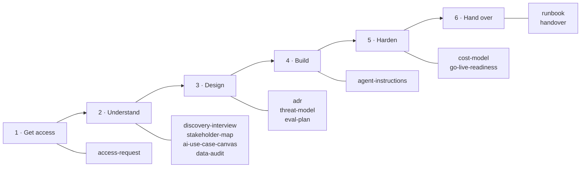

# Skills

> Part of the [Awesome Microsoft FDE](../README.md) guide. One skill for every document an FDE writes, organised by **engagement step**, tagged by **pillar**, with **scenario packs** that tell you which skills to use and what to add.
>
> This is an independent community project, not official Microsoft guidance. See the [disclaimer](../README.md#disclaimer).

## What a skill is

Each skill is one folder holding one self-contained Markdown file, `SKILL.md`, with:

1. A short header (`name` and `description`) saying what the skill does and when to use it.
2. When to use it, the rules, numbered steps and scenario notes.
3. **Template:** the document to write into the customer's repository and fill in, in a fenced block at the end.

The files use the open [Agent Skills](https://agentskills.io/) format, but they're plain Markdown with no tool-specific syntax, so any agent can follow them:

- **Agents that support skills** (for example GitHub Copilot or Claude Code): copy the skill folders to where your agent reads skills from, such as `.github/skills/` or `.claude/skills/`. Check your tool's documentation for the current path.
- **Any other agent or chat assistant:** paste or attach the `SKILL.md` and ask it to follow the steps, or reference it from your agent's instructions file.
- **A person:** read it and follow the same steps.

**How to use them** 💬

1. Pick the [scenario pack](#scenario-packs) closest to your engagement. It lists the skills you need and the questions specific to that scenario.
2. Follow each skill's steps and write its template into the customer's repository (for example `docs/engagement/`), not your own drive. The work you deliver belongs to the customer.
3. Delete sections that don't apply. A short, filled-in document beats a long, empty one.

**What stays internal** 💬

A few notes are for your own team, not the customer: candid assessments of named people, and feedback to the product team about what broke. Anyone at the customer can read their repository, including the security lead you've marked as "against". Keep these in your own organisation's engagement workspace, never in the customer's tenant:

- The support and influence assessment in [`stakeholder-map`](stakeholder-map/SKILL.md). The decisions and approvals table can go in the customer's repository.
- Field notes for the product team from [`weekly-status`](weekly-status/SKILL.md) and [`handover`](handover/SKILL.md). Tell the customer about known product issues and workarounds that affect them, in the handover.

Each of these skills marks which part goes where.

**Microsoft facts go stale** ⚠️

Some skills name Microsoft services, roles, licences and preview features. These change monthly. The skills point to the [technical reference](../docs/microsoft-technical-reference.md), which carries a "Last verified" date. Check the fact there, then on Microsoft Learn, before you put it in front of a customer. Skills deliberately leave out prices and dates, because a copied skill is never updated.

## By engagement step

| Step | Skill | What it's for | Pillars |
|---|---|---|---|
| 1. Get access | [`access-request`](access-request/SKILL.md) | Every account, role, network path and dataset you need, requested on day one | 3, 4 |
| 2. Understand | [`discovery-interview`](discovery-interview/SKILL.md) | Questions for sponsors, users, security and operators | 6 |
| 2. Understand | [`stakeholder-map`](stakeholder-map/SKILL.md) | Who sponsors, who can block, who operates, who uses | 6 |
| 2. Understand | [`ai-use-case-canvas`](ai-use-case-canvas/SKILL.md) | The one-page scope: problem, measure, shape, platform, exit criteria | 5, 6 |
| 2. Understand | [`data-audit`](data-audit/SKILL.md) | Where the data is, how good it is, how you'll get it | 2 |
| 3. Design | [`adr`](adr/SKILL.md) | One page per important decision, with options and consequences | All |
| 3. Design | [`threat-model`](threat-model/SKILL.md) | AI-specific threats and defences, for the security review | 4 |
| 3. Design | [`eval-plan`](eval-plan/SKILL.md) | Golden set, metrics and the bar for release | 5 |
| 4. Build | [`agent-instructions`](agent-instructions/SKILL.md) | Rules for AI coding assistants in the customer's repository | 1 |
| Every week | [`weekly-status`](weekly-status/SKILL.md) | One-page status after each Friday demo | 6 |
| 5. Harden | [`cost-model`](cost-model/SKILL.md) | Monthly running cost at expected usage, and what drives it | 6 |
| 5. Harden | [`go-live-readiness`](go-live-readiness/SKILL.md) | Core checklist plus scenario add-ons | 3, 4, 5 |
| 6. Hand over | [`runbook`](runbook/SKILL.md) | How to operate and fix the system without you | 1 |
| 6. Hand over | [`handover`](handover/SKILL.md) | RACI, named owner, evaluation baseline, backlog, sign-off | 6 |

## Scenario packs

| Pack | Typical engagement | Hardest pillar |
|---|---|---|
| [Knowledge assistant](scenario-knowledge-assistant/SKILL.md) | "Answer questions from our policies, manuals and documents" | 2 Data, 5 AI |
| [Action-taking agent](scenario-action-agent/SKILL.md) | "Update the ticket, draft the email, file the claim" | 4 Security |
| [Data and analytics agent](scenario-data-agent/SKILL.md) | "Ask our sales data questions in plain English" | 2 Data |
| [Regulated, private-only](scenario-regulated-private/SKILL.md) | Banks, government, healthcare: nothing public, strict review | 3 Networking, 4 Security |
| [Disconnected or sovereign](scenario-disconnected-sovereign/SKILL.md) | Defence, remote sites, classified: little or no internet | 3 Networking |

Packs combine: a bank's knowledge assistant uses both the knowledge-assistant and regulated packs.

## Which skills each scenario uses

| Skill | Knowledge | Action | Data | Regulated | Disconnected |
|---|:-:|:-:|:-:|:-:|:-:|
| access-request | ● | ● | ● | ●● | ●● |
| discovery-interview | ● | ● | ● | ● | ● |
| stakeholder-map | ● | ● | ● | ●● | ●● |
| ai-use-case-canvas | ● | ● | ● | ● | ● |
| data-audit | ●● | ● | ●● | ● | ● |
| adr | ● | ● | ● | ●● | ●● |
| threat-model | ● | ●● | ● | ●● | ●● |
| eval-plan | ●● | ●● | ●● | ● | ● |
| agent-instructions | ● | ● | ● | ● | ● |
| cost-model | ● | ● | ● | ● | ●● |
| go-live-readiness | ● | ●● | ● | ●● | ●● |
| runbook | ● | ●● | ● | ● | ●● |
| handover | ● | ● | ● | ● | ● |

● use it · ●● it's critical in this scenario; the pack says what to add
