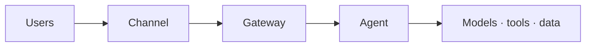

# Runbook

> Part of the [skills](https://github.com/mjtpena/awesome-microsoft-fde/blob/main/skills/README.md) in the [Awesome Microsoft FDE](https://github.com/mjtpena/awesome-microsoft-fde/blob/main/README.md) guide. **Step:** 6 Hand over (start writing in step 4) · **Pillar:** [1 Software engineering](https://github.com/mjtpena/awesome-microsoft-fde/blob/main/docs/pillars/01-software-engineering.md)

How to operate and fix the system without you.

## When to use

- Start in the build phase, as soon as there is something deployed.
- Update after every incident or operational change.

## Rules

- Write for the person on call at 2 a.m. who didn't build this.
- Test it by having someone else fix a simulated incident using only the runbook. If they need to ask you anything, it isn't finished.
- The kill switch and rollback sections are never empty.

## Steps

1. Write the [template](#template) to `docs/operations/runbook.md` in the customer's repository.
2. Fill "Where things are" from the infrastructure-as-code, not from memory.
3. Turn every past incident into a row in the incidents table.
4. Keep the scenario section for this engagement and delete the rest.
5. Schedule a runbook drill and record it in the [handover](../handover/SKILL.md).

Write everything into the customer's repository, not your own drive. Everything you write belongs to the customer. Delete sections that don't apply: a short, filled-in document beats a long, empty one.

## Scenarios

Used in every scenario. **Critical** in: [action-taking agent](../scenario-action-agent/SKILL.md), [disconnected or sovereign](../scenario-disconnected-sovereign/SKILL.md). Those packs say what to add.

## Template

Write everything inside the block below to the file named in the steps, then fill it in.

````markdown
# Runbook: <Agent / System name>

**Owner:** · **On-call / support group:** · **Last tested:** · **Repository:**

## What it is

One paragraph: what the system does, who uses it, and what happens to them if it's down.



## Where things are

| Component | Resource / location | Dashboard | Logs |
|---|---|---|---|

## Routine operations

| Task | How often | Steps / command | Who |
|---|---|---|---|
| Deploy a new version | | Run pipeline `<name>` | |
| Run the evaluation set | Before each release | | |
| Refresh / re-index knowledge | | | |
| Rotate or review access | | | |
| Review cost against budget | Monthly | | |
| Add production failures to the golden set | Weekly | | |

## Health checks

| Signal | Normal | Alert threshold | Dashboard |
|---|---|---|---|
| Error rate | | | |
| p95 latency | | | |
| Token spend per day | | | |
| Evaluation score (scheduled) | | | |

## Incidents

| Symptom | Likely cause | Check | Fix |
|---|---|---|---|
| Users get errors | Gateway limits, model quota, expired permission | Gateway and agent logs | |
| Answers suddenly worse | Stale or failed index refresh; changed source documents; model version change | Evaluation run, index status | |
| Can't connect after a network change | Private DNS or firewall rule | Name resolution from the workload network | |
| Spend spike | Loop, abuse or traffic growth | Token usage by caller | |
| Agent took a wrong action (action agents) | | Audit log | Use the kill switch, then roll back |

## Kill switch

How to disable the agent immediately, who's allowed to, and how to turn it back on:

## Rollback

How to return to the previous version:

## Scenario sections

- **Knowledge assistant:** how to re-index one source; how to remove a document urgently (for example, one that was shared by mistake).
- **Action agent:** how to find and reverse every action from a given time window.
- **Data agent:** how to check whether a wrong number is a data problem or an agent problem.
- **Disconnected:** offline update procedure step by step; how to collect diagnostics without internet; local contacts.

## Escalation

| Level | Who | When | Contact |
|---|---|---|---|
````
