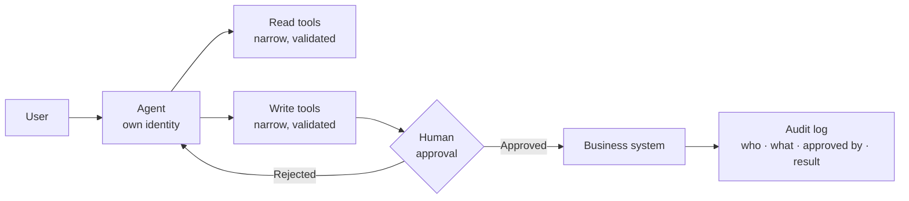

# Scenario Pack: Action-Taking Agent

> Part of the [skills](../README.md) in the [Awesome Microsoft FDE](../../README.md) guide. **The engagement:** "Update the ticket, draft and send the email, file the claim, trigger the workflow." **Hardest pillar:** [4 Security and identity](../../docs/pillars/04-security-and-identity.md).

## Our default design 💬

- **Read tools first, write tools later.** Ship value with read-only tools, then add writes once evaluation shows the agent picks tools reliably.
- **Every write needs human approval** until you have evidence and a signed risk acceptance to remove it.
- **One tool, one purpose.** "Update ticket status" is a tool; "call the ticketing API" isn't.
- **Design for failure:** every write tool has a dry-run mode, a clear error and a documented rollback.

## Skill kit

| Skill | What to add for this scenario |
|---|---|
| [`ai-use-case-canvas`](../ai-use-case-canvas/SKILL.md) | List every action, whether it's reversible, and its approval point |
| [`threat-model`](../threat-model/SKILL.md) | **Critical.** Fill the action-agent add-on: blast radius, approval and rollback per action |
| [`adr`](../adr/SKILL.md) | Approval design, tool design, audit trail |
| [`eval-plan`](../eval-plan/SKILL.md) | Tool-call accuracy, approval requested, failure handling, requests that must be declined |
| [`go-live-readiness`](../go-live-readiness/SKILL.md) | Core + action-agent add-ons |
| [`runbook`](../runbook/SKILL.md) | Kill switch; finding and reversing actions from a time window |

## Discovery questions

1. Which actions are reversible? What does a wrong action cost?
2. Who approves these actions today, and how long does it take?
3. Should the agent act as itself or with the requesting user's permissions?
4. What's the audit requirement: who must be able to see what, and for how long?
5. What should the agent do when a system is down?

## Top risks

| Risk | What we do |
|---|---|
| Wrong or harmful action | Narrow tools, validation, approval, rollback, rate limits |
| Indirect prompt injection triggers an action | Treat retrieved text as data; approval on writes; least-privilege tools |
| Over-privileged identity | Separate identities for read and write; scope to specific resources |
| Approval fatigue (users click "approve" without reading) | Show a clear summary of the action; batch low-risk actions; monitor approval rates |

## On Microsoft

| Need | Our default | Source |
|---|---|---|
| Agent code | Microsoft Agent Framework with tool approval; hosted in Foundry | [Phase 4](../../docs/microsoft-technical-reference.md#microsoft-agent-framework-maf) |
| Approvals in the UI | AG-UI supports human-in-the-loop approvals | [Phase 4](../../docs/microsoft-technical-reference.md#microsoft-agent-framework-maf) |
| Agent identity | Entra Agent ID; register in Agent 365 | [Phase 3](../../docs/microsoft-technical-reference.md#phase-3-identity-security--governance-for-agents) |
| Shared tools | Foundry Toolboxes: curated tools behind one governed MCP endpoint | [Phase 4](../../docs/microsoft-technical-reference.md#microsoft-foundry-agent-service) |
| Low-code actions | Copilot Studio agent actions (billed at 5 Copilot Credits each) | [Phase 4](../../docs/microsoft-technical-reference.md#copilot-studio--m365-copilot-extensibility) |

## Practise

The agent closed 40 support tickets overnight that it shouldn't have. Walk through the first hour, then the fix.
