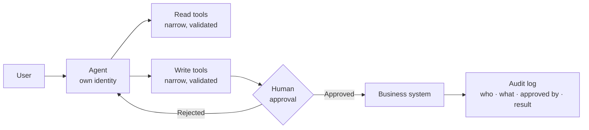

# Scenario Pack: Action-Taking Agent

> Part of the [skills](https://github.com/mjtpena/awesome-microsoft-fde/blob/main/skills/README.md) in the [Awesome Microsoft FDE](https://github.com/mjtpena/awesome-microsoft-fde/blob/main/README.md) guide. **The engagement:** "Update the ticket, draft and send the email, file the claim, trigger the workflow." **Hardest pillar:** [4 Security and identity](https://github.com/mjtpena/awesome-microsoft-fde/blob/main/docs/pillars/04-security-and-identity.md).

## When to use

- The agent will update records, send messages, file requests or trigger workflows: anything that writes or changes something.
- Usually combined with the [knowledge-assistant](../scenario-knowledge-assistant/SKILL.md) or [data-agent](../scenario-data-agent/SKILL.md) pack, and with the [regulated](../scenario-regulated-private/SKILL.md) pack when it applies.

## Steps

1. List every action the agent would take. For each, record with the sponsor whether it's reversible, what a wrong action costs and who approves it today. Load any pack you need to combine with this one.
2. Plan the first release with read tools only. Add write tools one at a time, each with approval, dry run, audit log and rollback, once evaluation shows the agent picks tools reliably.
3. Add the discovery questions below to each [discovery interview](../discovery-interview/SKILL.md), alongside the role questions.
4. Run each skill in the skill kit in engagement-step order, adding what the table says. Do the ones marked **Critical** first.
5. Compare the default design with the customer's constraints. Record every departure, and every design choice the skill kit lists, in an [ADR](../adr/SKILL.md).
6. Copy the top risks into the [threat model](../threat-model/SKILL.md) and the next [weekly status](../weekly-status/SKILL.md).
7. Before quoting anything from "On Microsoft" to the customer, check it against the technical reference and Microsoft Learn.

## Our default design 💬

- **Read tools first, write tools later.** Ship value with read-only tools, then add writes once evaluation shows the agent picks tools reliably.
- **Every write needs human approval** until you have evidence and a signed risk acceptance to remove it.
- **One tool, one purpose.** "Update ticket status" is a tool; "call the ticketing API" isn't.
- **Design for failure:** every write tool has a dry-run mode, a clear error and a documented rollback.

## Skill kit

| Skill | What to add for this scenario |
|---|---|
| [`engagement-kickoff`](../engagement-kickoff/SKILL.md) | Fill the action-agent add-on: every action in or out of scope, and who must approve an action before go-live |
| [`ai-use-case-canvas`](../ai-use-case-canvas/SKILL.md) | List every action, whether it's reversible, and its approval point |
| [`scope-reset`](../scope-reset/SKILL.md) | Re-sequence to read-only or draft-only when write actions can't yet be approved or reversed safely |
| [`threat-model`](../threat-model/SKILL.md) | **Critical.** Fill the action-agent add-on: blast radius, approval and rollback per action |
| [`responsible-ai-impact-assessment`](../responsible-ai-impact-assessment/SKILL.md) | Fill the action-agent add-on: harm if each action is wrong, reversibility, approval step |
| [`adr`](../adr/SKILL.md) | Approval design, tool design, audit trail |
| [`eval-plan`](../eval-plan/SKILL.md) | Tool-call accuracy, approval requested, failure handling, requests that must be declined |
| [`red-team`](../red-team/SKILL.md) | **Critical.** Tool misuse and indirect prompt injection that tries to trigger a write; confirm every write still asks for approval |
| [`go-live-readiness`](../go-live-readiness/SKILL.md) | Core + action-agent add-ons |
| [`runbook`](../runbook/SKILL.md) | Kill switch; finding and reversing actions from a time window |
| [`incident-review`](../incident-review/SKILL.md) | **Critical.** List every action taken, whether it was reversed and who approved it; a wrong action that reached a customer goes to executives |

## Discovery questions

1. Which actions are reversible? What does a wrong action cost?
2. Who approves these actions today, and how long does it take?
3. Should the agent act as itself or with the requesting user's permissions?
4. What's the audit requirement: who must be able to see what, and for how long?
5. What should the agent do when a system is down?

## Top risks

| Risk | What we do |
|---|---|
| Wrong or harmful action | Narrow tools, validation, approval, rollback, rate limits |
| Indirect prompt injection triggers an action | Treat retrieved text as data; approval on writes; least-privilege tools |
| Over-privileged identity | Separate identities for read and write; scope to specific resources |
| Approval fatigue (users click "approve" without reading) | Show a clear summary of the action; batch low-risk actions; monitor approval rates |

## On Microsoft

⚠️ Facts below match the [technical reference](https://github.com/mjtpena/awesome-microsoft-fde/blob/main/docs/microsoft-technical-reference.md) as last verified there. Microsoft services, licences and preview status change monthly: check the reference and Microsoft Learn before quoting any of these to a customer.

| Need | Our default | Source |
|---|---|---|
| Agent code | Microsoft Agent Framework with tool approval; hosted in Foundry | [Phase 4](https://github.com/mjtpena/awesome-microsoft-fde/blob/main/docs/microsoft-technical-reference.md#microsoft-agent-framework-maf) |
| Approvals in the UI | AG-UI supports human-in-the-loop approvals | [Phase 4](https://github.com/mjtpena/awesome-microsoft-fde/blob/main/docs/microsoft-technical-reference.md#microsoft-agent-framework-maf) |
| Agent identity | Entra Agent ID; register in Agent 365 | [Phase 3](https://github.com/mjtpena/awesome-microsoft-fde/blob/main/docs/microsoft-technical-reference.md#phase-3-identity-security--governance-for-agents) |
| Shared tools | Foundry Toolboxes: curated tools behind one governed MCP endpoint | [Phase 4](https://github.com/mjtpena/awesome-microsoft-fde/blob/main/docs/microsoft-technical-reference.md#microsoft-foundry-agent-service) |
| Low-code actions | Copilot Studio agent actions (billed at 5 Copilot Credits each) | [Phase 4](https://github.com/mjtpena/awesome-microsoft-fde/blob/main/docs/microsoft-technical-reference.md#copilot-studio--m365-copilot-extensibility) |

## Practise

The agent closed 40 support tickets overnight that it shouldn't have. Walk through the first hour, then the fix.
