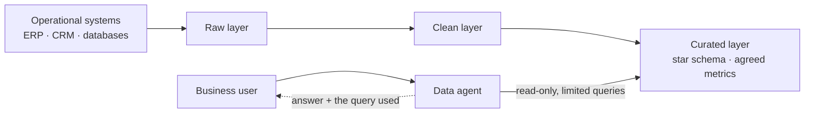

# Scenario Pack: Data and Analytics Agent

> Part of the [skills](https://github.com/mjtpena/awesome-microsoft-fde/blob/main/skills/README.md) in the [Awesome Microsoft FDE](https://github.com/mjtpena/awesome-microsoft-fde/blob/main/README.md) guide. **The engagement:** "Let people ask our sales, finance or operations data questions in plain English." **Hardest pillar:** [2 Data](https://github.com/mjtpena/awesome-microsoft-fde/blob/main/docs/pillars/02-data.md).

## When to use

- Users want to ask questions of sales, finance or operations data in plain English.
- Combine with the [regulated](../scenario-regulated-private/SKILL.md) pack when it applies, and with the [action-agent](../scenario-action-agent/SKILL.md) pack if the agent will also change data.

## Steps

1. Collect the 20 questions people ask analysts most often, and the trusted report each answer must match. Load any pack you need to combine with this one.
2. Before building, get the disputed metric definitions settled by a named owner, and confirm a curated layer exists for the agent to query. If it doesn't, building it is the first piece of work.
3. Add the discovery questions below to each [discovery interview](../discovery-interview/SKILL.md), alongside the role questions.
4. Run each skill in the skill kit in engagement-step order, adding what the table says. Do the ones marked **Critical** first.
5. Compare the default design with the customer's constraints. Record every departure, and every design choice the skill kit lists, in an [ADR](../adr/SKILL.md).
6. Copy the top risks into the [threat model](../threat-model/SKILL.md) and the next [weekly status](../weekly-status/SKILL.md).
7. Before quoting anything from "On Microsoft" to the customer, check it against the technical reference and Microsoft Learn.

## Our default design 💬

- **The agent queries only the curated layer.** Never point it at raw tables with cryptic column names.
- **Agree metric definitions before building.** "Revenue" means three different things in most companies.
- **Show the query or calculation with every answer,** so users can check it.
- **Match a trusted report.** If the agent's number differs from the finance report, users will trust neither.

## Skill kit

| Skill | What to add for this scenario |
|---|---|
| [`discovery-interview`](../discovery-interview/SKILL.md) | Which reports people trust; which metric definitions are disputed |
| [`data-audit`](../data-audit/SKILL.md) | **Critical.** Fill the business-data section: questions → tables → trusted report → definition owner |
| [`adr`](../adr/SKILL.md) | Data layer the agent queries; metric definitions; query limits |
| [`eval-plan`](../eval-plan/SKILL.md) | Numbers compared to the trusted report; ambiguous questions that need clarification |
| [`cost-model`](../cost-model/SKILL.md) | Query compute on the data platform |
| [`go-live-readiness`](../go-live-readiness/SKILL.md) | Core + data-agent add-ons |

## Discovery questions

1. What are the 20 questions people ask analysts most often?
2. Which report is the source of truth for each metric?
3. Which definitions are disputed, and who settles disputes?
4. Who may see which rows (for example, by region or business unit)?
5. How fresh must the data be: real time, daily or monthly?

## Top risks

| Risk | What we do |
|---|---|
| Plausible but wrong numbers | Curated layer only; golden set checked against trusted reports; show the query |
| Ambiguous questions answered confidently | Teach the agent to ask which definition the user means |
| Row-level permissions bypassed | Agent runs with the user's identity; test with restricted users |
| Expensive queries | Read-only, time-limited and row-limited queries; capacity monitoring |

## On Microsoft

⚠️ Facts below match the [technical reference](https://github.com/mjtpena/awesome-microsoft-fde/blob/main/docs/microsoft-technical-reference.md) as last verified there. Microsoft services, licences and preview status change monthly: check the reference and Microsoft Learn before quoting any of these to a customer.

| Need | Our default | Source |
|---|---|---|
| Getting data in | Mirroring for operational databases; shortcuts for open-format data | [Phase 1](https://github.com/mjtpena/awesome-microsoft-fde/blob/main/docs/microsoft-technical-reference.md#phase-1-data-engineering-on-microsoft-fabric) |
| The agent | Fabric data agent (generally available; F2 capacity or higher; runs with the user's identity and data permissions, including row- and column-level security). ⚠️ Needs the tenant settings for cross-geo processing and storing for AI, so check data residency first | [Phase 4](https://github.com/mjtpena/awesome-microsoft-fde/blob/main/docs/microsoft-technical-reference.md#copilot-studio--m365-copilot-extensibility) |
| Where users meet it | Fabric data agent added as a tool in Copilot Studio | [Phase 4](https://github.com/mjtpena/awesome-microsoft-fde/blob/main/docs/microsoft-technical-reference.md#copilot-studio--m365-copilot-extensibility) |
| Business context | Fabric IQ semantic models and ontology | [Stack](https://github.com/mjtpena/awesome-microsoft-fde/blob/main/docs/microsoft-technical-reference.md#-the-microsoft-fde-stack-oct-2026) |
| Deployment | `fabric-cicd` with an explicit `token_credential` | [Phase 1](https://github.com/mjtpena/awesome-microsoft-fde/blob/main/docs/microsoft-technical-reference.md#phase-1-data-engineering-on-microsoft-fabric) |

## Practise

The CFO says the agent's quarterly revenue is 4% higher than the board report. Walk through how you find out why.
