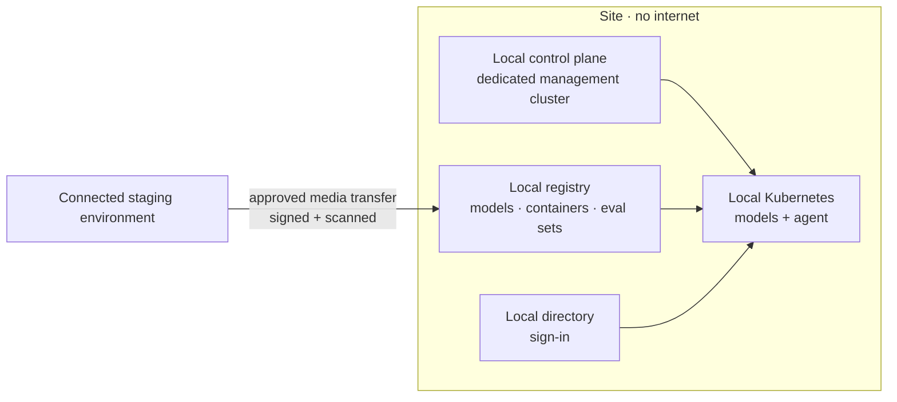

# Scenario Pack: Disconnected or Sovereign

> Part of the [skills](https://github.com/mjtpena/awesome-microsoft-fde/blob/main/skills/README.md) in the [Awesome Microsoft FDE](https://github.com/mjtpena/awesome-microsoft-fde/blob/main/README.md) guide. **The engagement:** defence, classified government, remote industrial sites, ships. Little or no internet connection, and data that must never leave the site or country. **Hardest pillar:** [3 Cloud and networking](https://github.com/mjtpena/awesome-microsoft-fde/blob/main/docs/pillars/03-cloud-and-networking.md).

## When to use

- The site has little or no internet (defence, classified government, remote industrial sites, ships), or data must never leave the site or country.
- Always combined with the knowledge-assistant, action-agent or data-agent pack: this pack adds constraints, not a use case.

## Steps

1. Load the pack for the use case (knowledge, action or data) as well as this one. Ask how connected the site is and how software gets onto it today.
2. In week one, get the site hardware specification and start the media-transfer approval. Plan to benchmark candidate models on the real hardware in week two.
3. Add the discovery questions below to each [discovery interview](../discovery-interview/SKILL.md), alongside the role questions.
4. Run each skill in the skill kit in engagement-step order, adding what the table says. Do the ones marked **Critical** first.
5. Compare the default design with the customer's constraints. Record every departure, and every design choice the skill kit lists, in an [ADR](../adr/SKILL.md).
6. Copy the top risks into the [threat model](../threat-model/SKILL.md) and the next [weekly status](../weekly-status/SKILL.md).
7. Before quoting anything from "On Microsoft" to the customer, check it against the technical reference and Microsoft Learn.

## Our default design 💬

- **Everything the system needs must already be on site:** models, containers, evaluation sets, documentation and updates.
- **Choose models for the hardware you have,** not the benchmark leaderboard. Test on the actual site hardware early.
- **The update process is a product.** Design, document and rehearse the offline update before go-live.
- **Preview features carry extra risk here,** because you can't patch quickly. Get written acceptance for each one.

## Skill kit

| Skill | What to add for this scenario |
|---|---|
| [`access-request`](../access-request/SKILL.md) | **Critical.** Physical access, media-transfer approval, local directory accounts |
| [`stakeholder-map`](../stakeholder-map/SKILL.md) | Site manager, media-transfer approver, local operations lead |
| [`adr`](../adr/SKILL.md) | Model choice for local hardware; update and transfer process; local identity |
| [`threat-model`](../threat-model/SKILL.md) | Physical threats, removable media, patching without internet |
| [`eval-plan`](../eval-plan/SKILL.md) | Evaluation must run on site with local models |
| [`cost-model`](../cost-model/SKILL.md) | **Critical.** Hardware, power, support and on-site people instead of consumption |
| [`go-live-readiness`](../go-live-readiness/SKILL.md) | Core + disconnected add-ons |
| [`runbook`](../runbook/SKILL.md) | **Critical.** Offline updates, diagnostics without internet, local contacts |

## Discovery questions

1. Is the site always disconnected, sometimes connected, or connected through a one-way link?
2. How do software and updates get in today? Who approves them, and how long does it take?
3. What hardware is available on site (CPU, GPU, memory, power)?
4. Who operates the system on site, and what skills do they have?
5. What happens to the system if it can't be updated for six months?

## Top risks

| Risk | What we do |
|---|---|
| Model too large or slow for site hardware | Benchmark candidate models on the real hardware in week two |
| Updates can't get in | Rehearse the media-transfer process before go-live; keep a known-good rollback |
| No remote support | Runbook tested on site by local staff; diagnostics bundle that works offline |
| Preview components change or break | Written acceptance per preview dependency; pin versions |

## On Microsoft

⚠️ Facts below match the [technical reference](https://github.com/mjtpena/awesome-microsoft-fde/blob/main/docs/microsoft-technical-reference.md) as last verified there. Microsoft services, licences and preview status change monthly: check the reference and Microsoft Learn before quoting any of these to a customer.

| Need | Fact to know | Source |
|---|---|---|
| Local cloud control plane | Azure Local disconnected operations (available since February 2026) runs the control plane on site. Production needs a **dedicated three-node management cluster**, minimum 24 physical cores per node, and 128 GB RAM per node in the standard configuration (512 GB for the datacenter configuration) | [Sovereign section](https://github.com/mjtpena/awesome-microsoft-fde/blob/main/docs/microsoft-technical-reference.md#-sovereign-air-gapped--tactical-edge-deployment) |
| Local AI | 🧪 Foundry Local on Azure Local is in preview: models come from a local registry filled by expansion packs, sign-in uses local Active Directory, and no telemetry goes to Microsoft | [Sovereign section](https://github.com/mjtpena/awesome-microsoft-fde/blob/main/docs/microsoft-technical-reference.md#-sovereign-air-gapped--tactical-edge-deployment) |
| Local productivity | Microsoft 365 Local: Exchange Server, SharePoint Server and Skype for Business Server on Azure Local | [Sovereign section](https://github.com/mjtpena/awesome-microsoft-fde/blob/main/docs/microsoft-technical-reference.md#-sovereign-air-gapped--tactical-edge-deployment) |
| Local database | SQL Server on Azure Local, generally available 28 Sep 2026. ⚠️ The SQL Server Arc extension isn't supported when disconnected | [Sovereign section](https://github.com/mjtpena/awesome-microsoft-fde/blob/main/docs/microsoft-technical-reference.md#-sovereign-air-gapped--tactical-edge-deployment) |

## Practise

A defence site wants a document assistant with no internet connection, and updates can only arrive by approved media once a month. Size the management cluster, choose a model approach and design the update process.
