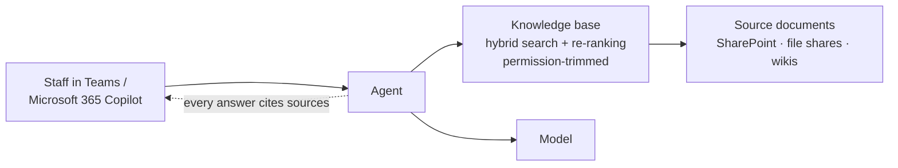

# Scenario Pack: Knowledge Assistant

> Part of the [skills](https://github.com/mjtpena/awesome-microsoft-fde/blob/main/skills/README.md) in the [Awesome Microsoft FDE](https://github.com/mjtpena/awesome-microsoft-fde/blob/main/README.md) guide. **The engagement:** "Answer questions from our policies, manuals and documents." The most common first AI project. **Hardest pillars:** [2 Data](https://github.com/mjtpena/awesome-microsoft-fde/blob/main/docs/pillars/02-data.md) and [5 AI applications](https://github.com/mjtpena/awesome-microsoft-fde/blob/main/docs/pillars/05-ai-applications.md).

## When to use

- The customer wants answers from policies, manuals, wikis or other documents, and the agent doesn't change anything.
- Combine with the [regulated](../scenario-regulated-private/SKILL.md) or [disconnected](../scenario-disconnected-sovereign/SKILL.md) pack when those apply. If the assistant also takes actions, add the [action-agent](../scenario-action-agent/SKILL.md) pack.

## Steps

1. Confirm the shape with the sponsor: answers only, from which document collections, for which users. Load any pack you need to combine with this one.
2. Before indexing anything, ask for an oversharing review of every source. Collect the top 20 questions with the source-of-truth document for each: they're the first golden-set cases in the [evaluation plan](../eval-plan/SKILL.md).
3. Add the discovery questions below to each [discovery interview](../discovery-interview/SKILL.md), alongside the role questions.
4. Run each skill in the skill kit in engagement-step order, adding what the table says. Do the ones marked **Critical** first.
5. Compare the default design with the customer's constraints. Record every departure, and every design choice the skill kit lists, in an [ADR](../adr/SKILL.md).
6. Copy the top risks into the [threat model](../threat-model/SKILL.md) and the next [weekly status](../weekly-status/SKILL.md).
7. Before quoting anything from "On Microsoft" to the customer, check it against the technical reference and Microsoft Learn.

## Our default design 💬

- Start with **one agent, one knowledge base** and the top 20 questions users actually ask.
- **Hybrid search with re-ranking** by default. Add agentic retrieval only for multi-part questions.
- **Permission-trimmed retrieval is non-negotiable.** Run an oversharing review before indexing anything.
- **Every answer cites its sources**, and "I don't know" is an acceptable answer.

## Skill kit

| Skill | What to add for this scenario |
|---|---|
| [`discovery-interview`](../discovery-interview/SKILL.md) | Collect the top 20 questions and the source-of-truth documents for each |
| [`data-audit`](../data-audit/SKILL.md) | Fill the **documents** section: types, scans, tables, out-of-date content, oversharing |
| [`ai-use-case-canvas`](../ai-use-case-canvas/SKILL.md) | Scenario = knowledge assistant; actions = none |
| [`adr`](../adr/SKILL.md) | Ingestion, chunking, search type, permission trimming |
| [`threat-model`](../threat-model/SKILL.md) | Data leakage and indirect prompt injection from documents. See the [worked example](https://github.com/mjtpena/awesome-microsoft-fde/blob/main/examples/knowledge-assistant/threat-model.md) |
| [`eval-plan`](../eval-plan/SKILL.md) | Retrieval score, citation correctness, "I don't know" cases, low-privilege run |
| [`go-live-readiness`](../go-live-readiness/SKILL.md) | Core + knowledge-assistant add-ons |
| [`runbook`](../runbook/SKILL.md) | Re-indexing and urgent document removal |

## Discovery questions

1. What are the 20 questions people ask most? Where do they look today?
2. Which documents are authoritative, and which are drafts or out of date?
3. Who should **not** see which documents?
4. How often do the documents change, and how quickly must the assistant reflect changes?
5. What's the cost of a wrong answer: an annoyed employee, or a compliance breach?

## Top risks

| Risk | What we do |
|---|---|
| Oversharing exposed by the assistant | Oversharing review first; permission-trimmed retrieval; low-privilege tests |
| Wrong answers from stale documents | Agree sources of truth; refresh schedule; show document dates in citations |
| Poor extraction from scans and tables | Layout-aware extraction; test the hardest documents early |
| Users don't trust it | Citations on every answer; weekly demos with real users |

## On Microsoft

⚠️ Facts below match the [technical reference](https://github.com/mjtpena/awesome-microsoft-fde/blob/main/docs/microsoft-technical-reference.md) as last verified there. Microsoft services, licences and preview status change monthly: check the reference and Microsoft Learn before quoting any of these to a customer.

| Need | Our default | Source |
|---|---|---|
| Knowledge base | Foundry IQ knowledge base on Azure AI Search (generally available, permission-aware) | [Technical reference: RAG blueprint](https://github.com/mjtpena/awesome-microsoft-fde/blob/main/docs/microsoft-technical-reference.md#enterprise-rag-blueprint-azure) |
| Microsoft 365 content (mail, files, meetings) | Work IQ APIs instead of building your own index | [Phase 4](https://github.com/mjtpena/awesome-microsoft-fde/blob/main/docs/microsoft-technical-reference.md#work-iq-m365-context-for-any-agent) |
| Where users meet it | Copilot Studio or a declarative agent if business users own it; Foundry agent published to Teams otherwise. ⚠️ Foundry agents published to Teams and Microsoft 365 don't support citations or streaming: if cited answers are a requirement, test them in the channel users will actually use before you commit | [Phase 4](https://github.com/mjtpena/awesome-microsoft-fde/blob/main/docs/microsoft-technical-reference.md#copilot-studio--m365-copilot-extensibility) |
| Oversharing | Purview data security posture management and the SharePoint oversharing assessment | [Phase 3](https://github.com/mjtpena/awesome-microsoft-fde/blob/main/docs/microsoft-technical-reference.md#phase-3-identity-security--governance-for-agents) |
| Evaluation | ⚠️ With the Azure AI Search tool, use Retrieval / Document Retrieval evaluators and `context` in the dataset | [Evaluation](https://github.com/mjtpena/awesome-microsoft-fde/blob/main/docs/microsoft-technical-reference.md#evaluation--agentops) |

## Practise

The CEO asked the assistant about the parental-leave policy and got last year's version. Walk through how you find the cause and stop it happening again.
