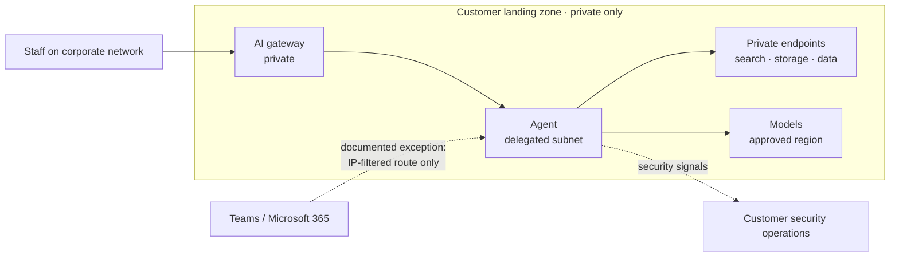

# Scenario Pack: Regulated, Private-Only

> Part of the [skills](https://github.com/mjtpena/awesome-microsoft-fde/blob/main/skills/README.md) in the [Awesome Microsoft FDE](https://github.com/mjtpena/awesome-microsoft-fde/blob/main/README.md) guide. **The engagement:** banks, insurers, government agencies, healthcare. "Nothing touches the public internet", a formal security review, and a regulator watching. Combine this pack with the knowledge, action or data pack. **Hardest pillars:** [3 Cloud and networking](https://github.com/mjtpena/awesome-microsoft-fde/blob/main/docs/pillars/03-cloud-and-networking.md) and [4 Security and identity](https://github.com/mjtpena/awesome-microsoft-fde/blob/main/docs/pillars/04-security-and-identity.md).

## When to use

- The customer is a bank, insurer, government agency, healthcare provider or anyone with "nothing public" rules, a formal security review or a regulator.
- Always combined with the knowledge-assistant, action-agent or data-agent pack: this pack adds constraints, not a use case.

## Steps

1. Load the pack for the use case (knowledge, action or data) as well as this one. Ask which regulator and control framework apply and who signs the risk acceptance.
2. In week one, book the security review and check each planned component's private-networking support and region. Bring a draft threat model to the review.
3. Add the discovery questions below to each [discovery interview](../discovery-interview/SKILL.md), alongside the role questions.
4. Run each skill in the skill kit in engagement-step order, adding what the table says. Do the ones marked **Critical** first.
5. Compare the default design with the customer's constraints. Record every departure, and every design choice the skill kit lists, in an [ADR](../adr/SKILL.md).
6. Copy the top risks into the [threat model](../threat-model/SKILL.md) and the next [weekly status](../weekly-status/SKILL.md).
7. Before quoting anything from "On Microsoft" to the customer, check it against the technical reference and Microsoft Learn.

## Our default design 💬

- **Book the security review in week one** and bring a draft threat model to it.
- **Design inside the customer's landing zone.** Their platform team owns the network.
- **Every exception to "nothing public" gets its own ADR** with compensating controls.
- **Check region and data-residency rules for every component,** including logs and model processing.
- **Plan for longer timelines:** in our experience, review cycles often add weeks. Put them in the plan from day one.

## Skill kit

| Skill | What to add for this scenario |
|---|---|
| [`access-request`](../access-request/SKILL.md) | **Critical.** Clearances, data-handling agreement, approved devices, log location |
| [`stakeholder-map`](../stakeholder-map/SKILL.md) | Risk owner, privacy officer, external assessor |
| [`adr`](../adr/SKILL.md) | Private networking; each exception; log retention and location |
| [`threat-model`](../threat-model/SKILL.md) | Map defences to the customer's control framework; record who accepts residual risk |
| [`go-live-readiness`](../go-live-readiness/SKILL.md) | Core + regulated add-ons |

## Discovery questions

1. Which regulator and control framework apply? Who signs the risk acceptance?
2. What's the data classification, and where may it be processed and stored?
3. What does the security review need from us, and how long does it take?
4. Are any public routes acceptable with compensating controls?
5. Where must logs go, and how long must they be kept?

## Top risks

| Risk | What we do |
|---|---|
| Late security rejection | Week-one review; draft threat model; fortnightly check-ins |
| A required feature isn't available privately | Check each component's private-networking support during design, not build |
| Data residency breach via a dependency | Map every component's region, including logs and model processing |
| A service needs a cross-region setting turned on (for example Fabric data agents need cross-geo processing for AI) | List every tenant-level AI setting each component needs and get the residency owner to approve it in an ADR |
| Preview features blocked by policy | Many regulated customers forbid preview services; have a generally-available fallback |

## On Microsoft

⚠️ Facts below match the [technical reference](https://github.com/mjtpena/awesome-microsoft-fde/blob/main/docs/microsoft-technical-reference.md) as last verified there. Microsoft services, licences and preview status change monthly: check the reference and Microsoft Learn before quoting any of these to a customer.

| Need | Fact to know | Source |
|---|---|---|
| Private agents | Foundry standard setup with private networking: delegated subnet, no public egress, bring your own storage, search and database. ⚠️ Resources must share the VNet's region (models excepted) | [Phase 2](https://github.com/mjtpena/awesome-microsoft-fde/blob/main/docs/microsoft-technical-reference.md#phase-2-azure-architecture--ai-landing-zones) |
| Teams exception | ⚠️ Microsoft 365 doesn't support private connectivity to agents; `enable_m365_public_endpoint` opens only an IP-filtered route. Microsoft 365 and Teams also process and store the agent's responses under their own data-residency terms, so the residency review must cover them | [Phase 2](https://github.com/mjtpena/awesome-microsoft-fde/blob/main/docs/microsoft-technical-reference.md#phase-2-azure-architecture--ai-landing-zones) |
| Reference implementation | AI Landing Zones (Bicep and Terraform); may use preview services | [Phase 2](https://github.com/mjtpena/awesome-microsoft-fde/blob/main/docs/microsoft-technical-reference.md#phase-2-azure-architecture--ai-landing-zones) |
| Government cloud gaps | ⚠️ Defender for AI Services isn't available in Azure Government | [Phase 3](https://github.com/mjtpena/awesome-microsoft-fde/blob/main/docs/microsoft-technical-reference.md#phase-3-identity-security--governance-for-agents) |
| Australian government | Azure in-scope services are IRAP-assessed up to PROTECTED; IRAP is risk-based, not a certification | [Phase 3](https://github.com/mjtpena/awesome-microsoft-fde/blob/main/docs/microsoft-technical-reference.md#phase-3-identity-security--governance-for-agents) |

## Practise

A bank wants the assistant in Teams, but its policy says "no public endpoints". Explain the options, the exception and the compensating controls to its architecture board.
