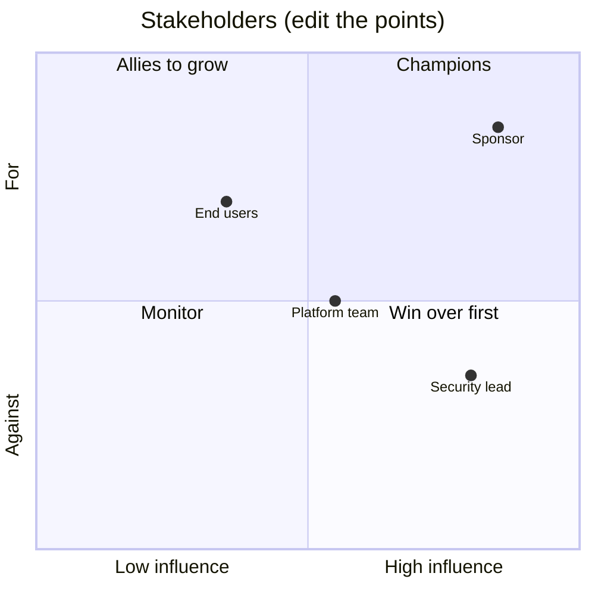

# Stakeholder Map

> Part of the [skills](https://github.com/mjtpena/awesome-microsoft-fde/blob/main/skills/README.md) in the [Awesome Microsoft FDE](https://github.com/mjtpena/awesome-microsoft-fde/blob/main/README.md) guide. **Step:** 2 Understand · **Pillar:** [6 Consulting and delivery](https://github.com/mjtpena/awesome-microsoft-fde/blob/main/docs/pillars/06-consulting-and-delivery.md)

Two documents. An **internal** assessment of the people who can make or break the engagement, and a **shared** list of who signs off on which decision.

## When to use

- Week one of an engagement.
- Every two weeks after that, or when someone new turns up in a meeting.

## Rules

- **The assessment of people stays internal.** Anyone at the customer can read their repository, including the security lead you've marked as "against". Keep it in your own organisation's engagement workspace, never in the customer's tenant. 💬
- Write the assessment as you'd be comfortable having it read aloud: what each person needs, not opinions of their character.
- The people most likely to block you are the ones you haven't met yet. Fill gaps by asking "who else needs to agree?"
- Note lead times for every approval: they decide your schedule.

## Steps

1. Ask where your team keeps internal engagement notes. Write the internal template there as `stakeholder-map.md`. If there's no internal location, stop and ask; don't fall back to the customer's repository.
2. Write the shared template to `docs/engagement/decisions-and-approvals.md` in the customer's repository.
3. Fill the internal map from the discovery interviews. Leave rows for roles you haven't met yet, and update the quadrant chart points to match.
4. Fill the shared decisions and approvals table, then add the regulated or disconnected roles if they apply.

Delete sections that don't apply: a short, filled-in document beats a long, empty one.

## Scenarios

Used in every scenario. **Critical** in: [regulated, private-only](../scenario-regulated-private/SKILL.md), [disconnected or sovereign](../scenario-disconnected-sovereign/SKILL.md). Those packs say what to add.

## Template

Two blocks. Write each to the location named in the steps, then fill it in.

### Internal: stakeholder assessment

````markdown
# Stakeholder Map: <Customer> / <Engagement>

> Internal to the delivery team. Don't copy into the customer's repository or tenant.

## The map

| Name | Role | Type | Influence (H/M/L) | Support today (for / neutral / against) | What they need from us | How often we meet |
|---|---|---|---|---|---|---|
| | | Sponsor | | | Evidence of value, no surprises | Weekly demo |
| | | Likely blocker (security / risk / architecture) | | | Threat model, early involvement | Fortnightly |
| | | Operator (platform / IT ops) | | | Runbooks, monitoring, maintainable code | Fortnightly |
| | | End user | | | Saves them time | Weekly demo |
| | | Data owner | | | Permissions respected | As needed |
| | | Product team (our side) | | | Field notes | Fortnightly |



## Scenario add-ons

- **Regulated:** add the risk owner who signs the risk acceptance, the privacy officer, and any external assessor.
- **Disconnected:** add the site commander or site manager, the person who approves media transfer, and the local operations lead.
````

### Customer repository: decisions and approvals

````markdown
# Decisions and Approvals: <Customer> / <Engagement>

| Decision | Who decides | Who must be consulted | Lead time |
|---|---|---|---|
| Architecture approval | | | |
| Security / risk sign-off | | | |
| Production change | | | |
| Budget for running costs | | | |
| Owner after handover | | | |
| Risk acceptance (regulated) | | | |
| Media transfer onto site (disconnected) | | | |
````
