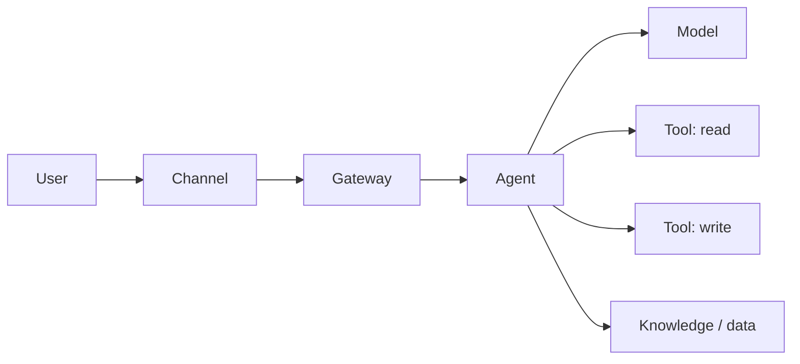

# Threat Model

> Part of the [skills](https://github.com/mjtpena/awesome-microsoft-fde/blob/main/skills/README.md) in the [Awesome Microsoft FDE](https://github.com/mjtpena/awesome-microsoft-fde/blob/main/README.md) guide. **Step:** 3 Design · **Pillar:** [4 Security and identity](https://github.com/mjtpena/awesome-microsoft-fde/blob/main/docs/pillars/04-security-and-identity.md)

The document you take to the security team as a conversation, not a finished verdict. See [Pillar 4](https://github.com/mjtpena/awesome-microsoft-fde/blob/main/docs/pillars/04-security-and-identity.md).

## When to use

- Week two, as soon as there is a rough architecture.
- Whenever a tool, data source or permission changes.

## Rules

- Meet the security team with a draft, early. Security review is a design input, not a final gate. 💬
- Mark every trust boundary on the diagram.
- For every threat, say how the defence is tested, not just what it is.
- Record who accepts any residual risk.

## Steps

1. Write the [template](#template) to `docs/security/threat-model.md` in the customer's repository.
2. List assets and draw the flow from the current architecture, marking trust boundaries.
3. Fill one row per tool and data source in the identities table.
4. Go through every threat row; mark "doesn't apply" with a reason rather than deleting it.
5. Add the scenario add-on and the red-team plan, then book the review with security.

Write everything into the customer's repository, not your own drive. Everything you write belongs to the customer. Delete sections that don't apply: a short, filled-in document beats a long, empty one.

## Scenarios

Used in every scenario. **Critical** in: [action-taking agent](../scenario-action-agent/SKILL.md), [regulated, private-only](../scenario-regulated-private/SKILL.md), [disconnected or sovereign](../scenario-disconnected-sovereign/SKILL.md). Those packs say what to add.

## Template

Write everything inside the block below to the file named in the steps, then fill it in.

````markdown
# Threat Model: <Agent / System name>

**Version:** · **Date:** · **Reviewed with (security):**

## 1. What are we protecting?

| Asset | Why it matters | Classification |
|---|---|---|
| Customer data the agent reads | | |
| Systems the agent can change | | |
| The agent's identity and credentials | | |
| Cost (model and tool usage) | | |

## 2. How the system works

Draw the flow: users → channel → gateway → agent → models / tools / data. Mark every trust boundary (where data crosses from one owner or network to another).



## 3. Identities and permissions

| Tool / data source | Acts as itself or on behalf of user? | Permissions granted | Least privilege? | Approval needed? |
|---|---|---|---|---|

## 4. Threats

| Threat | Applies? | How it could happen here | Defence | Tested how | Residual risk |
|---|---|---|---|---|---|
| Direct prompt injection (user tries to override rules) | | | | | |
| Indirect prompt injection (hostile text inside documents, emails or web pages) | | | | | |
| Excessive agency (more tools or permissions than needed) | | | | | |
| Data leakage (answers include data the user shouldn't see) | | | | | |
| Tool misuse (harmful arguments to a tool) | | | | | |
| Unbounded cost (loops, abuse) | | | | | |
| Identity misuse (stolen or over-privileged credentials) | | | | | |
| Missing audit trail (can't reconstruct what happened) | | | | | |
| Supply chain (untrusted models, packages, MCP servers) | | | | | |

## 5. Detection and response

- Where security signals go (for example the customer's security operations tooling):
- What triggers an alert:
- How to disable the agent quickly (kill switch) and who can do it:

## 6. Red-team plan

- Before launch: scope, tool, success measure (for example attack success rate below an agreed level)
- After launch: schedule and owner

<!-- Microsoft: AI Red Teaming Agent (PyRIT) supports scheduled post-deployment scans;
     Defender coverage for Foundry and Copilot Studio agents needs Agent 365 licences.
     See https://github.com/mjtpena/awesome-microsoft-fde/blob/main/docs/microsoft-technical-reference.md, Phase 3. -->

## Scenario add-ons

- **Action agent:** list every write action, whether it's reversible, its blast radius, the approval step and the rollback.
- **Knowledge assistant:** oversharing review result for each source; proof that a low-privilege user can't retrieve restricted content.
- **Regulated:** map each defence to the customer's control framework; record who accepts residual risk.
- **Disconnected:** physical threats, removable-media transfer, and how you patch without internet.
````
