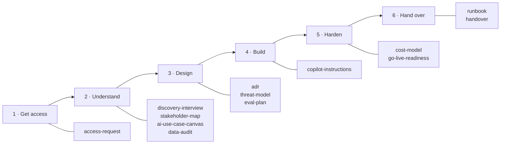

# Templates

> Part of the [Awesome Microsoft FDE](../README.md) guide. Copy-paste starting points for every document an FDE writes, organised by **engagement step**, tagged by **pillar**, with **scenario packs** that tell you which ones to use and what to add.

**How to use them** 💬

1. Pick the [scenario pack](#scenario-packs) closest to your engagement. It lists the templates you need and the questions specific to that scenario.
2. Copy the templates into the customer's repository (for example `docs/engagement/`), not your own drive. Everything you write belongs to the customer.
3. Delete sections that don't apply. A short, filled-in template beats a long, empty one.

## By engagement step

| Step | Template | What it's for | Pillars |
|---|---|---|---|
| 1. Get access | [`access-request.md`](access-request.md) | Every account, role, network path and dataset you need, requested on day one | 3, 4 |
| 2. Understand | [`discovery-interview.md`](discovery-interview.md) | Questions for sponsors, users, security and operators | 6 |
| 2. Understand | [`stakeholder-map.md`](stakeholder-map.md) | Who sponsors, who can block, who operates, who uses | 6 |
| 2. Understand | [`ai-use-case-canvas.md`](ai-use-case-canvas.md) | The one-page scope: problem, measure, shape, platform, exit criteria | 5, 6 |
| 2. Understand | [`data-audit.md`](data-audit.md) | Where the data is, how good it is, how you'll get it | 2 |
| 3. Design | [`adr.md`](adr.md) | One page per important decision, with options and consequences | All |
| 3. Design | [`threat-model.md`](threat-model.md) | AI-specific threats and defences, for the security review | 4 |
| 3. Design | [`eval-plan.md`](eval-plan.md) | Golden set, metrics and the bar for release | 5 |
| 4. Build | [`copilot-instructions.md`](copilot-instructions.md) | Rules for AI coding assistants in the customer's repository | 1 |
| Every week | [`weekly-status.md`](weekly-status.md) | One-page status after each Friday demo | 6 |
| 5. Harden | [`cost-model.md`](cost-model.md) | Monthly running cost at expected usage, and what drives it | 6 |
| 5. Harden | [`go-live-readiness.md`](go-live-readiness.md) | Core checklist plus scenario add-ons | 3, 4, 5 |
| 6. Hand over | [`runbook.md`](runbook.md) | How to operate and fix the system without you | 1 |
| 6. Hand over | [`handover.md`](handover.md) | RACI, named owner, evaluation baseline, backlog, sign-off | 6 |

## Scenario packs

| Pack | Typical engagement | Hardest pillar |
|---|---|---|
| [Knowledge assistant](scenarios/knowledge-assistant.md) | "Answer questions from our policies, manuals and documents" | 2 Data, 5 AI |
| [Action-taking agent](scenarios/action-agent.md) | "Update the ticket, draft the email, file the claim" | 4 Security |
| [Data and analytics agent](scenarios/data-agent.md) | "Ask our sales data questions in plain English" | 2 Data |
| [Regulated, private-only](scenarios/regulated-private.md) | Banks, government, healthcare: nothing public, strict review | 3 Networking, 4 Security |
| [Disconnected or sovereign](scenarios/disconnected-sovereign.md) | Defence, remote sites, classified: little or no internet | 3 Networking |

Packs combine: a bank's knowledge assistant uses both the knowledge-assistant and regulated packs.

## Which templates each scenario uses

| Template | Knowledge | Action | Data | Regulated | Disconnected |
|---|:-:|:-:|:-:|:-:|:-:|
| access-request | ● | ● | ● | ●● | ●● |
| discovery-interview | ● | ● | ● | ● | ● |
| stakeholder-map | ● | ● | ● | ●● | ●● |
| ai-use-case-canvas | ● | ● | ● | ● | ● |
| data-audit | ●● | ● | ●● | ● | ● |
| adr | ● | ● | ● | ●● | ●● |
| threat-model | ● | ●● | ● | ●● | ●● |
| eval-plan | ●● | ●● | ●● | ● | ● |
| copilot-instructions | ● | ● | ● | ● | ● |
| cost-model | ● | ● | ● | ● | ●● |
| go-live-readiness | ● | ●● | ● | ●● | ●● |
| runbook | ● | ●● | ● | ● | ●● |
| handover | ● | ● | ● | ● | ● |

● use it · ●● it's critical in this scenario; the pack says what to add
