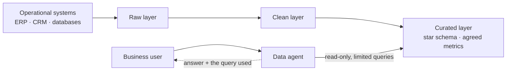

# Scenario Pack: Data and Analytics Agent

> Part of the [templates](../README.md). **The engagement:** "Let people ask our sales, finance or operations data questions in plain English." **Hardest pillar:** [2 Data](../../docs/pillars/02-data.md).

## Our default design 💬

- **The agent queries only the curated layer.** Never point it at raw tables with cryptic column names.
- **Agree metric definitions before building.** "Revenue" means three different things in most companies.
- **Show the query or calculation with every answer,** so users can check it.
- **Match a trusted report.** If the agent's number differs from the finance report, users will trust neither.

## Template kit

| Template | What to add for this scenario |
|---|---|
| [`discovery-interview.md`](../discovery-interview.md) | Which reports people trust; which metric definitions are disputed |
| [`data-audit.md`](../data-audit.md) | **Critical.** Fill the business-data section: questions → tables → trusted report → definition owner |
| [`adr.md`](../adr.md) | Data layer the agent queries; metric definitions; query limits |
| [`eval-plan.md`](../eval-plan.md) | Numbers compared to the trusted report; ambiguous questions that need clarification |
| [`cost-model.md`](../cost-model.md) | Query compute on the data platform |
| [`go-live-readiness.md`](../go-live-readiness.md) | Core + data-agent add-ons |

## Discovery questions

1. What are the 20 questions people ask analysts most often?
2. Which report is the source of truth for each metric?
3. Which definitions are disputed, and who settles disputes?
4. Who may see which rows (for example, by region or business unit)?
5. How fresh must the data be: real time, daily or monthly?

## Top risks

| Risk | What we do |
|---|---|
| Plausible but wrong numbers | Curated layer only; golden set checked against trusted reports; show the query |
| Ambiguous questions answered confidently | Teach the agent to ask which definition the user means |
| Row-level permissions bypassed | Agent runs with the user's identity; test with restricted users |
| Expensive queries | Read-only, time-limited and row-limited queries; capacity monitoring |

## On Microsoft

| Need | Our default | Source |
|---|---|---|
| Getting data in | Mirroring for operational databases; shortcuts for open-format data | [Phase 1](../../docs/microsoft-technical-reference.md#phase-1-data-engineering-on-microsoft-fabric) |
| The agent | Fabric data agent (generally available; F2 capacity or higher; runs with the user's identity and data permissions) | [Phase 4](../../docs/microsoft-technical-reference.md#copilot-studio--m365-copilot-extensibility) |
| Where users meet it | Fabric data agent added as a tool in Copilot Studio | [Phase 4](../../docs/microsoft-technical-reference.md#copilot-studio--m365-copilot-extensibility) |
| Business context | Fabric IQ semantic models and ontology | [Stack](../../docs/microsoft-technical-reference.md#-the-microsoft-fde-stack-oct-2026) |
| Deployment | `fabric-cicd` with an explicit `token_credential` | [Phase 1](../../docs/microsoft-technical-reference.md#phase-1-data-engineering-on-microsoft-fabric) |

## Practise

The CFO says the agent's quarterly revenue is 4% higher than the board report. Walk through how you find out why.
