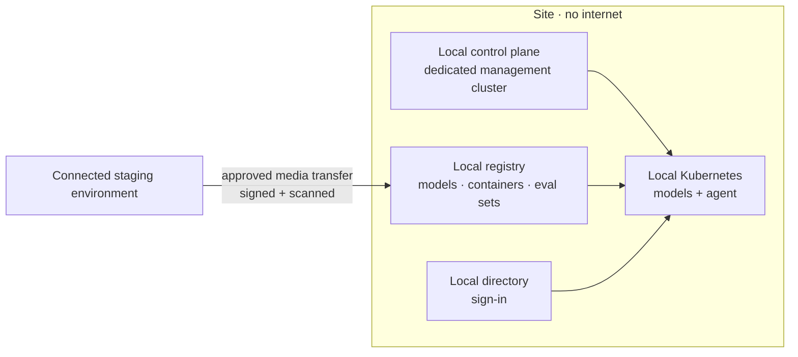

# Scenario Pack: Disconnected or Sovereign

> Part of the [templates](../README.md). **The engagement:** defence, classified government, remote industrial sites, ships. Little or no internet connection, and data that must never leave the site or country. **Hardest pillar:** [3 Cloud and networking](../../docs/pillars/03-cloud-and-networking.md).

## Our default design 💬

- **Everything the system needs must already be on site:** models, containers, evaluation sets, documentation and updates.
- **Choose models for the hardware you have,** not the benchmark leaderboard. Test on the actual site hardware early.
- **The update process is a product.** Design, document and rehearse the offline update before go-live.
- **Preview features carry extra risk here,** because you can't patch quickly. Get written acceptance for each one.

## Template kit

| Template | What to add for this scenario |
|---|---|
| [`access-request.md`](../access-request.md) | **Critical.** Physical access, media-transfer approval, local directory accounts |
| [`stakeholder-map.md`](../stakeholder-map.md) | Site manager, media-transfer approver, local operations lead |
| [`adr.md`](../adr.md) | Model choice for local hardware; update and transfer process; local identity |
| [`threat-model.md`](../threat-model.md) | Physical threats, removable media, patching without internet |
| [`eval-plan.md`](../eval-plan.md) | Evaluation must run on site with local models |
| [`cost-model.md`](../cost-model.md) | **Critical.** Hardware, power, support and on-site people instead of consumption |
| [`go-live-readiness.md`](../go-live-readiness.md) | Core + disconnected add-ons |
| [`runbook.md`](../runbook.md) | **Critical.** Offline updates, diagnostics without internet, local contacts |

## Discovery questions

1. Is the site always disconnected, sometimes connected, or connected through a one-way link?
2. How do software and updates get in today? Who approves them, and how long does it take?
3. What hardware is available on site (CPU, GPU, memory, power)?
4. Who operates the system on site, and what skills do they have?
5. What happens to the system if it can't be updated for six months?

## Top risks

| Risk | What we do |
|---|---|
| Model too large or slow for site hardware | Benchmark candidate models on the real hardware in week two |
| Updates can't get in | Rehearse the media-transfer process before go-live; keep a known-good rollback |
| No remote support | Runbook tested on site by local staff; diagnostics bundle that works offline |
| Preview components change or break | Written acceptance per preview dependency; pin versions |

## On Microsoft

| Need | Fact to know | Source |
|---|---|---|
| Local cloud control plane | Azure Local disconnected operations (available since February 2026) runs the control plane on site. Production needs a **dedicated three-node management cluster**, minimum 24 physical cores and 128 GB RAM per node | [Sovereign section](../../docs/microsoft-technical-reference.md#-sovereign-air-gapped--tactical-edge-deployment) |
| Local AI | 🧪 Foundry Local on Azure Local is in preview: models come from a local registry filled by expansion packs, sign-in uses local Active Directory, and no telemetry goes to Microsoft | [Sovereign section](../../docs/microsoft-technical-reference.md#-sovereign-air-gapped--tactical-edge-deployment) |
| Local productivity | Microsoft 365 Local: Exchange Server, SharePoint Server and Skype for Business Server on Azure Local | [Sovereign section](../../docs/microsoft-technical-reference.md#-sovereign-air-gapped--tactical-edge-deployment) |
| Local database | SQL Server on Azure Local, generally available 28 Sep 2026. ⚠️ The SQL Server Arc extension isn't supported when disconnected | [Sovereign section](../../docs/microsoft-technical-reference.md#-sovereign-air-gapped--tactical-edge-deployment) |

## Practise

A defence site wants a document assistant with no internet connection, and updates can only arrive by approved media once a month. Size the management cluster, choose a model approach and design the update process.
