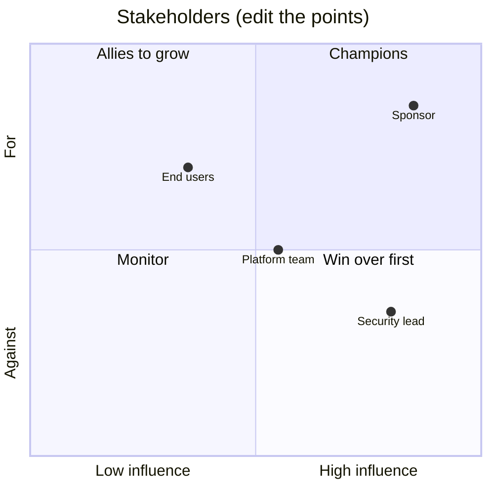

# Stakeholder Map: <Customer> / <Engagement>

> **Step:** 2 Understand · **Pillar:** 6 Consulting and delivery · **Scenarios:** all (critical for regulated and disconnected, where approvers multiply)
>
> **How to use:** fill this in during week one and revisit it every two weeks. The people most likely to block you are the ones you haven't met yet.

## The map

| Name | Role | Type | Influence (H/M/L) | Support today (for / neutral / against) | What they need from us | How often we meet |
|---|---|---|---|---|---|---|
| | | Sponsor | | | Evidence of value, no surprises | Weekly demo |
| | | Likely blocker (security / risk / architecture) | | | Threat model, early involvement | Fortnightly |
| | | Operator (platform / IT ops) | | | Runbooks, monitoring, maintainable code | Fortnightly |
| | | End user | | | Saves them time | Weekly demo |
| | | Data owner | | | Permissions respected | As needed |
| | | Product team (our side) | | | Field notes | Fortnightly |

## Decisions and approvals

| Decision | Who decides | Who must be consulted | Lead time |
|---|---|---|---|
| Architecture approval | | | |
| Security / risk sign-off | | | |
| Production change | | | |
| Budget for running costs | | | |
| Owner after handover | | | |

## Scenario add-ons

- **Regulated:** add the risk owner who signs the risk acceptance, the privacy officer, and any external assessor.
- **Disconnected:** add the site commander or site manager, the person who approves media transfer, and the local operations lead.
