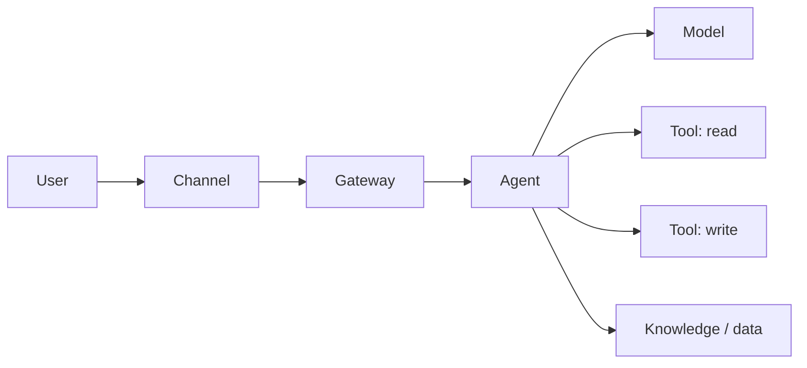

# Threat Model: <Agent / System name>

> **Step:** 3 Design · **Pillar:** 4 Security and identity · **Scenarios:** all (critical for action agent, regulated and disconnected)
>
> **How to use:** draft it in week two and take it to the security team as a conversation, not a finished verdict. Update it whenever a tool, data source or permission changes. See [Pillar 4](../docs/pillars/04-security-and-identity.md).

**Version:** · **Date:** · **Reviewed with (security):**

## 1. What are we protecting?

| Asset | Why it matters | Classification |
|---|---|---|
| Customer data the agent reads | | |
| Systems the agent can change | | |
| The agent's identity and credentials | | |
| Cost (model and tool usage) | | |

## 2. How the system works

Draw the flow: users → channel → gateway → agent → models / tools / data. Mark every trust boundary (where data crosses from one owner or network to another).

## 3. Identities and permissions

| Tool / data source | Acts as itself or on behalf of user? | Permissions granted | Least privilege? | Approval needed? |
|---|---|---|---|---|

## 4. Threats

| Threat | Applies? | How it could happen here | Defence | Tested how | Residual risk |
|---|---|---|---|---|---|
| Direct prompt injection (user tries to override rules) | | | | | |
| Indirect prompt injection (hostile text inside documents, emails or web pages) | | | | | |
| Excessive agency (more tools or permissions than needed) | | | | | |
| Data leakage (answers include data the user shouldn't see) | | | | | |
| Tool misuse (harmful arguments to a tool) | | | | | |
| Unbounded cost (loops, abuse) | | | | | |
| Identity misuse (stolen or over-privileged credentials) | | | | | |
| Missing audit trail (can't reconstruct what happened) | | | | | |
| Supply chain (untrusted models, packages, MCP servers) | | | | | |

## 5. Detection and response

- Where security signals go (for example the customer's security operations tooling):
- What triggers an alert:
- How to disable the agent quickly (kill switch) and who can do it:

## 6. Red-team plan

- Before launch: scope, tool, success measure (for example attack success rate below an agreed level)
- After launch: schedule and owner

<!-- Microsoft: AI Red Teaming Agent (PyRIT) supports scheduled post-deployment scans;
     Defender coverage for Foundry/Copilot Studio agents needs Agent 365 since 1 Jul 2026.
     See docs/microsoft-technical-reference.md, Phase 3. -->

## Scenario add-ons

- **Action agent:** list every write action, whether it's reversible, its blast radius, the approval step and the rollback.
- **Knowledge assistant:** oversharing review result for each source; proof that a low-privilege user can't retrieve restricted content.
- **Regulated:** map each defence to the customer's control framework; record who accepts residual risk.
- **Disconnected:** physical threats, removable-media transfer, and how you patch without internet.
